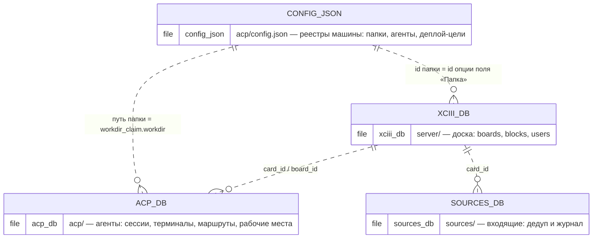
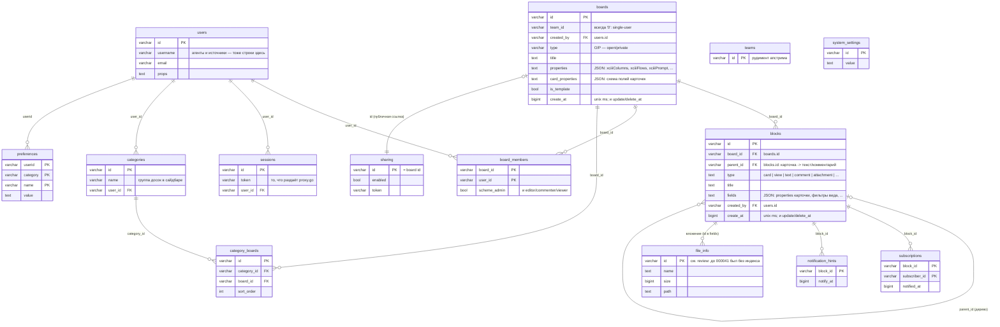
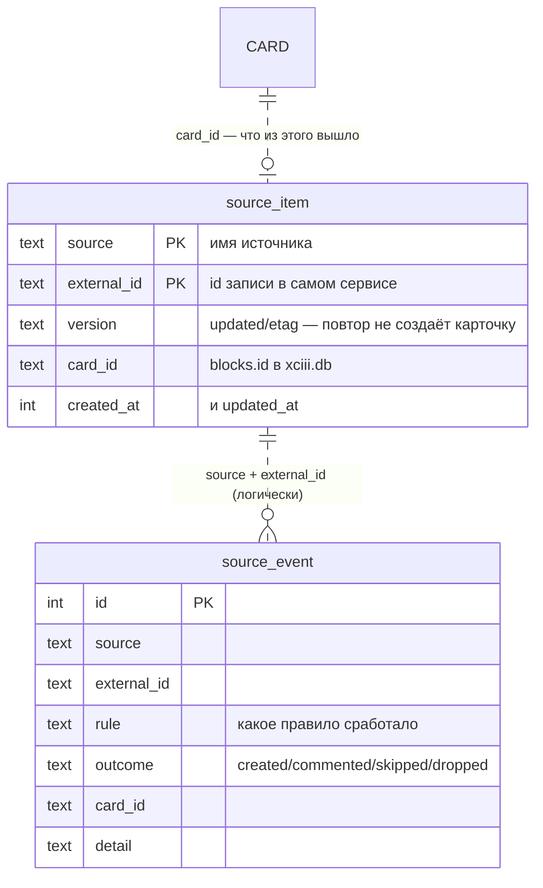

# ERD: три базы и файл настроек

Снято со схем 2026-08-16 (`server/services/store/sqlstore/migrations/` для
бордовой, `internal/acp/store.go` и `internal/sources/store.go` для двух
наших). Обзор словами — в
`docs/db-schema-review.md`; здесь картинка.

Ни в одной из баз нет физических FOREIGN KEY — бордовая унаследовала от
Focalboard стиль soft-delete с history-таблицами, а `card_id`/`board_id` в
наших базах указывают в **другой файл**, куда FK физически невозможен. Все
линии ниже — логические связи, которые держит код.

## Как базы смотрят друг на друга

**Четвёртое хранилище — не база, а файл**, и связей у него две. Реестр папок
(`config.json`, ключ `projects`) держит `id` каждой записи, и **под этим же id
доска заводит опцию поля «Папка»** — то есть карточка называет папку значением
обычного select'а, которое оказывается ссылкой в реестр машины. Вторая связь
идёт по пути: `workdir_claim.workdir` — это `path` записи реестра.

Карточка — это `blocks.id` (type=card) в бордовой базе; наши базы помнят её по
id и переживают её переезд между досками (`MoveCardToBoard` сохраняет id).
Агент и источник существуют в бордовой базе как строки `users` — под своими
именами, без отдельной таблицы.

## xciii.db — доска (форк Focalboard)

Сердце — две таблицы: `boards` (доска, её свойства и схема карточных полей как
JSON) и `blocks` (всё содержимое: карточки, виды, комментарии, вложения —
дерево через `parent_id`). Наша автоматика живёт в `boards.properties`
(`xciiiColumns`, `xciiiFlows`, `xciiiPrompt`, `xciiiBranchProperty`, …) и в
`blocks.fields` карточки — отдельных таблиц у неё нет.

Не нарисованы три **history-таблицы** — `blocks_history`, `boards_history`,
`board_members_history`: та же форма плюс `insert_at` в первичном ключе, каждая
правка дописывает строку. Это апстримный механизм undo/аудита, связей своих у
них нет.

## acp.db — агенты (`internal/acp/store.go`)

Всё крутится вокруг карточки (`card_id` — сквозная логическая ось) и ноды —
option id колонки, на которой карточка стоит: разговор, позиция на маршруте и
очередь колонки ключуются ими.

```mermaid
erDiagram
    agent_session ||--o{ session_event : "session_id"
    CARD ||..o{ agent_session : "card_id"
    CARD ||..o{ terminal_session : "card_id + node_id"
    CARD ||..o| flow_state : "card_id (позиция на маршруте)"
    CARD ||..o{ flow_event : "card_id (журнал переходов)"
    CARD ||..o| card_stall : "card_id (почему стоит)"
    CARD ||..o| stage_queue : "card_id (ждёт места в колонке)"
    CARD ||..o{ workdir_claim : "owner = card_id"

    agent_session {
        text id PK
        text card_id "blocks.id в xciii.db"
        text board_id
        text agent_kind
        text status "queued/running/done/failed/cancelled"
        text cwd "и worktree_path, branch"
        int started_at "unix ms; finished_at NULL = живая"
        text error_text
    }
    session_event {
        int id PK "autoincrement"
        text session_id FK
        int seq "порядок внутри сессии"
        text kind
        text payload_json
    }
    terminal_session {
        text id PK
        text card_id "пусто у планирования"
        text node_id "род разговора: option id колонки — работа; @none — работа над карточкой без колонки; @talk — «Обсуждение», разговор о карточке"
        text column_name "имя колонки, заморожено на момент разговора"
        text board_id
        text title "имя разговора: человек или name_conversation"
        text summary "строка от describe_conversation"
        text repo_path "папка (Go: WorkdirPath)"
        text cwd "и branch"
        text agent "и kind"
        int started_at "ended_at NULL = живой; exit_code"
    }
    flow_state {
        text card_id PK
        text flow "имя маршрута"
        text node_id "текущая нода"
        text branch "какую ветку опрашивает VCS"
        text repo_path
        int entered_at
    }
    flow_event {
        int id PK
        text card_id
        text from_node "и to_node"
        text on_kind "success/failure/branch.merged/..."
        text detail
        text said "слова агента на переходе — бриф возврата"
    }
    card_stall {
        text card_id PK
        text node_id "стадия, к которой причина относится"
        text kind "conversation — единственная, у которой есть куда пойти"
        text reason "одна текущая причина, не журнал"
    }
    stage_queue {
        text card_id PK
        text board_id
        text column_key "board|option — очередь колонки"
        text flow "и node_id"
        int queued_at
    }
    workdir_claim {
        text workdir PK "папка"
        text owner PK "card_id или board:<id>"
        text mode "worktree | branch | plain"
        text branch "ветка карточки"
        text path "где копия"
        text base "от чего отрезана — FROM main на штампе"
        int created_at "released_at NULL = живое рабочее место"
    }
    idempotency {
        text key PK "flow|card|node|событие"
        text session_id
        int created_at "окно дедупликации"
    }
    vcs_seen {
        text project PK "и branch, kind в PK"
        text marker "base:branch tip — событие уже отработано"
    }
    board_setup {
        text board_id PK "и step в PK"
        text status "шаги мастера настройки"
    }
```

`idempotency`, `vcs_seen` и `board_setup` стоят отдельно — это защёлки («это
событие уже обработано», «этот шаг уже пройден»), а не сущности со связями.
`PRAGMA user_version = 1` проштампован под будущую лестницу ALTER'ов.

## sources.db — входящие (`internal/sources/store.go`)

Две таблицы: дедуп и журнал. Сам реестр источников — не здесь, а в
`config.json`.

## Что здесь видно про устройство

- **Домены разнесены по файлам, а не по схемам.** Бордовая база не знает про
  агентов, агентская — про источники; общий язык — id карточки и id доски.
  Как эти id складываются в одну картину — `docs/model-graph.md`.
- **Ссылки между хранилищами идут по id, а не по именам.** Карточка называет
  папку id записи реестра, доска записывает, какое её поле — папка и какое —
  ветка (`xciiiProjectProperty`, `xciiiBranchProperty`), а не ищет по названию.
  Единственное, что ещё связывается путём, — `workdir_claim.workdir`.
- **Наша автоматика не добавила таблиц в бордовую базу.** Колонки, маршруты,
  промпты и запись «какое свойство — ветка» лежат в `boards.properties`, и
  потому едут с доской при экспорте/переезде; на этой же линии живёт и
  «позиция карточки на маршруте» — в `blocks.fields` карточки, а `flow_state`
  здесь — машинная копия.
- **Время везде unix-миллисекунды в INTEGER**, «живое» отличается от
  «закрытого» NULL'ом в `ended_at`/`released_at`/`finished_at`.
- **Журналы растут сознательно**: `session_event`, `flow_event`,
  `terminal_session` не чистятся (решение в `db-schema-review.md`).
