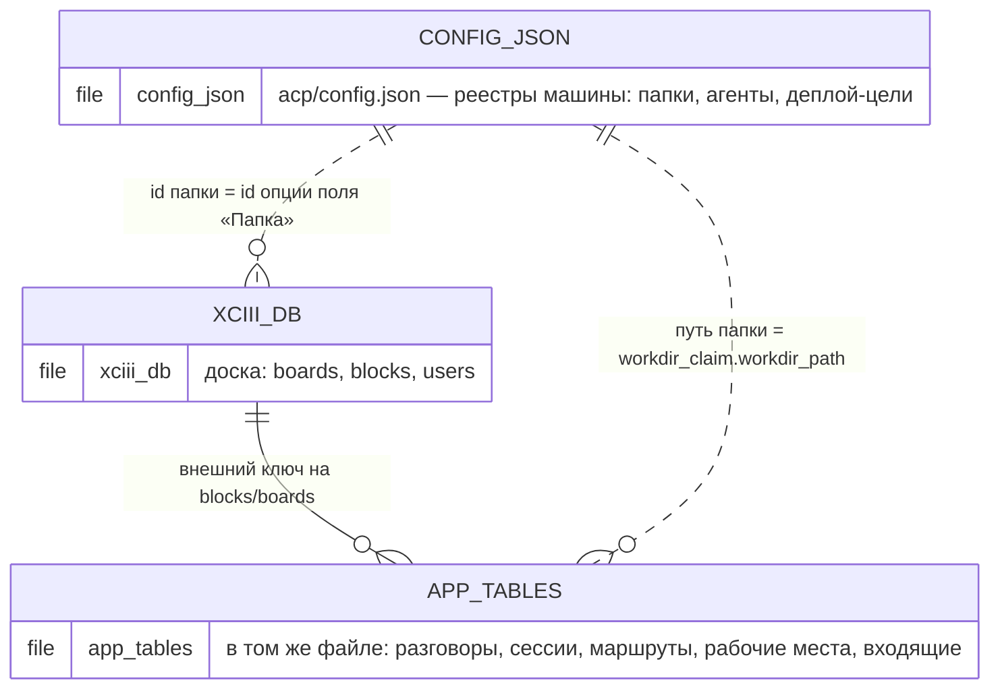
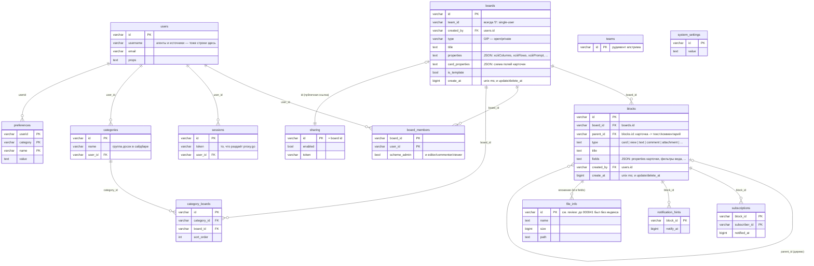
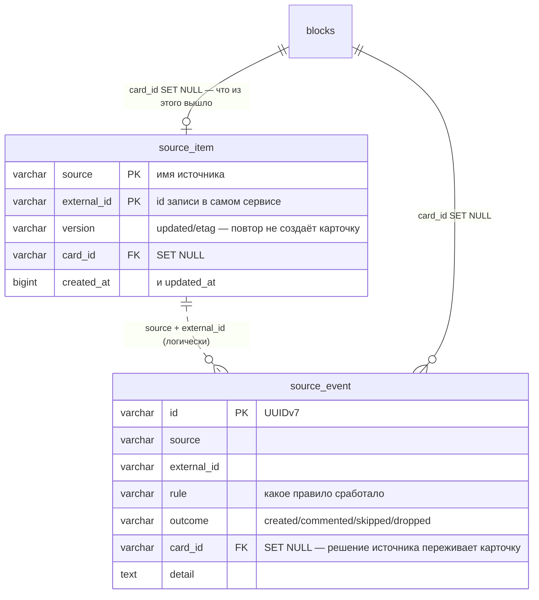

# ERD: одна база и файл настроек

Снято со схем 2026-08-17: `server/services/store/sqlstore/migrations/` — вся
схема, бордовая и наша, одним шагом `000001_init` (лестницы из восьмидесяти
одного файла больше нет). Наши таблицы
описаны один раз, как Go-данные, в `tools/schemagen`; SQL для трёх диалектов
рендерит atlas. Обзор словами — в `docs/db-schema-review.md`; здесь картинка.

**Было три базы.** `acp.db` и `sources.db` лежали рядом с бордовой, и всё, что
в них написано, — про карточку или доску, то есть про строку в **другом файле**,
куда внешний ключ физически невозможен. Что это стоило, видно было не сразу:
удаление карточки — настоящий `DELETE FROM blocks`, и наша сторона об этом не
узнавала никогда, так что удалённая карточка навсегда оставляла за собой
разговоры, позицию на маршруте, стоп-запись и место в очереди. Теперь таблицы в
одном файле, ключи написаны в `CREATE TABLE` (`docs/store-plan.md`, шаг 1), а
включение проверки — шаг 4. Старые файлы переливаются один раз при старте и
переименовываются в `*.migrated`.

В бордовых таблицах внешних ключей по-прежнему нет: там наследный от Focalboard
стиль soft-delete с history-таблицами, и переписать их можно только вместе с
типами (шаг 0).

## Что осталось снаружи базы

**Второе хранилище — не база, а файл**, и связей у него две. Реестр папок
(`config.json`, ключ `projects`) держит `id` каждой записи, и **под этим же id
доска заводит опцию поля «Папка»** — то есть карточка называет папку значением
обычного select'а, которое оказывается ссылкой в реестр машины. Вторая связь
идёт по пути: `workdir_claim.workdir_path` — это `path` записи реестра. Обе
исчезают на шаге 2, когда реестры станут таблицами.

Карточка — это `blocks.id` (type=card) в той же базе; наши таблицы помнят её по
id и переживают её переезд между досками (`MoveCardToBoard` сохраняет id).
Агент и источник существуют как строки `users` — под своими именами, без
отдельной таблицы.

## xciii.db — доска (форк Focalboard)

Сердце — две таблицы: `boards` (доска, её свойства и схема карточных полей как
JSON) и `blocks` (всё содержимое: карточки, виды, комментарии, вложения —
дерево через `parent_id`). Наша автоматика живёт в `boards.properties`
(`xciiiColumns`, `xciiiFlows`, `xciiiPrompt`, `xciiiBranchProperty`, …) и в
`blocks.fields` карточки — отдельных таблиц у неё нет.

Не нарисованы три **history-таблицы** — `blocks_history`, `boards_history`,
`board_members_history`: та же форма плюс `insert_at` в первичном ключе, каждая
правка дописывает строку. Это апстримный механизм undo/аудита, связей своих у
них нет.

## Агенты (`internal/acp/store.go`, схема — `tools/schemagen`)

Всё крутится вокруг карточки (`card_id` — сквозная ось, и теперь настоящий
внешний ключ) и ноды — option id колонки, на которой карточка стоит: разговор,
позиция на маршруте и очередь колонки ключуются ими.

```mermaid
erDiagram
    agent_session ||--o{ session_event : "session_id CASCADE"
    blocks ||--o{ agent_session : "card_id CASCADE"
    blocks ||--o{ conversation : "card_id CASCADE (+ node_id)"
    blocks ||--o| flow_state : "card_id CASCADE (позиция на маршруте)"
    blocks ||--o{ flow_event : "card_id CASCADE (журнал переходов)"
    blocks ||--o| card_stall : "card_id CASCADE (почему стоит)"
    blocks ||--o| stage_queue : "card_id CASCADE (ждёт места в колонке)"
    blocks ||..o{ workdir_claim : "owner = card_id (ключа ещё нет)"

    agent_session {
        varchar id PK
        varchar card_id FK "NULL — запуск не про карточку (именование ветки)"
        varchar board_id FK
        varchar agent_kind
        varchar status "queued/running/done/failed/cancelled"
        text cwd "и worktree_path, branch"
        bigint started_at "unix ms; finished_at NULL = живая"
        text error_text
    }
    session_event {
        varchar id PK "UUIDv7 — сортируется по времени, seq не нужен"
        varchar session_id FK "CASCADE"
        varchar kind
        text payload_json
    }
    conversation {
        varchar id PK "было terminal_session"
        varchar card_id FK "NULL у планирования"
        varchar node_id "род разговора: option id колонки — работа; @none — работа над карточкой без колонки; @talk — «Обсуждение», разговор о карточке"
        varchar column_name "имя колонки, заморожено на момент разговора"
        varchar board_id FK
        text title "имя разговора: человек или name_conversation"
        text summary "строка от describe_conversation"
        text workdir_path "папка (Go: WorkdirPath); было repo_path"
        text cwd "и branch"
        varchar agent "и kind"
        bigint started_at "ended_at NULL = живой; exit_code"
    }
    flow_state {
        varchar card_id PK "FK CASCADE"
        varchar flow "имя маршрута"
        varchar node_id "текущая нода"
        varchar branch "какую ветку опрашивает VCS"
        text workdir_path
        bigint entered_at
    }
    flow_event {
        varchar id PK "UUIDv7"
        varchar card_id FK "CASCADE"
        varchar from_node "и to_node"
        varchar on_kind "success/failure/branch.merged/..."
        text detail
        text said "слова агента на переходе — бриф возврата"
    }
    card_stall {
        varchar card_id PK "FK CASCADE"
        varchar node_id "стадия, к которой причина относится"
        varchar kind "conversation — единственная, у которой есть куда пойти"
        text reason "одна текущая причина, не журнал"
    }
    stage_queue {
        varchar card_id PK "FK CASCADE"
        varchar board_id FK
        varchar column_key "board|option — очередь колонки"
        varchar flow "и node_id"
        bigint queued_at
    }
    workdir_claim {
        varchar workdir_path PK "папка; было workdir"
        varchar owner PK "card_id или board:<id> — потому ключа и нет"
        varchar mode "worktree | branch | plain"
        varchar branch "ветка карточки; NULL у обычной папки"
        text path "где копия"
        varchar base "от чего отрезана — FROM main на штампе"
        bigint created_at "released_at NULL = живое рабочее место"
    }
    idempotency {
        varchar token PK "flow|card|node|событие; было key — слово MySQL"
        varchar session_id
        bigint created_at "окно дедупликации"
    }
    vcs_seen {
        varchar workdir_path PK "и branch, kind в PK; было project"
        varchar marker "base:branch tip — событие уже отработано"
    }
    board_setup {
        varchar board_id PK "FK CASCADE; и step в PK"
        varchar status "шаги мастера настройки"
        bigint changed_at "было at — ключевое слово в Postgres"
    }
```

`idempotency`, `vcs_seen` и `board_setup` стоят отдельно — это защёлки («это
событие уже обработано», «этот шаг уже пройден»), а не сущности со связями.

`workdir_claim` — единственная таблица здесь без ключа на карточку, и по
понятной причине: `owner` — это либо `card_id`, либо `board:<id>`, а одна
колонка не может смотреть на две таблицы. Расщепление на `card_id`/`board_id`
и ключ на папку — шаг 2.

## Входящие (`internal/sources/store.go`)

Две таблицы: дедуп и журнал. Сам реестр источников — не здесь, а в
`config.json`.

## Что здесь видно про устройство

- **Домены разнесены по пакетам, а не по файлам.** `internal/sources`
  по-прежнему не импортирует `internal/acp`; таблицы у каждого свои и просто
  лежат в одной базе. Как их id складываются в одну картину —
  `docs/model-graph.md`.
- **Ссылки между хранилищами идут по id, а не по именам.** Карточка называет
  папку id записи реестра, доска записывает, какое её поле — папка и какое —
  ветка (`xciiiProjectProperty`, `xciiiBranchProperty`), а не ищет по названию.
  Единственное, что ещё связывается путём, — `workdir_claim.workdir_path`.
- **Наша автоматика не добавила таблиц в бордовую базу.** Колонки, маршруты,
  промпты и запись «какое свойство — ветка» лежат в `boards.properties`, и
  потому едут с доской при экспорте/переезде; на этой же линии живёт и
  «позиция карточки на маршруте» — в `blocks.fields` карточки, а `flow_state`
  здесь — машинная копия.
- **Время везде unix-миллисекунды в BIGINT**, «живое» отличается от
  «закрытого» NULL'ом в `ended_at`/`released_at`/`finished_at`. Настоящим
  timestamp'ом это становится в шаге 0 — вместе с бордовыми тридцатью колонками,
  не раньше.
- **Отсутствие — это NULL** там, где на колонку смотрит ключ: у разговора без
  карточки `card_id` пуст по-настоящему. Читается через `COALESCE(...,'')`,
  потому что в Go отсутствие здесь — нулевое значение.
- **Журналы растут сознательно**: `session_event`, `flow_event`,
  `terminal_session` не чистятся (решение в `db-schema-review.md`).
