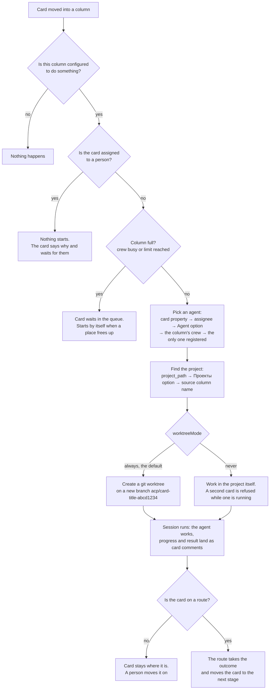
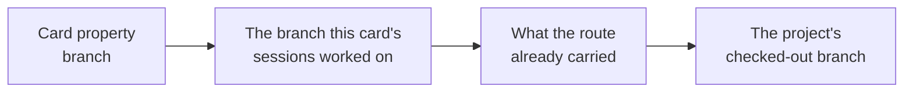
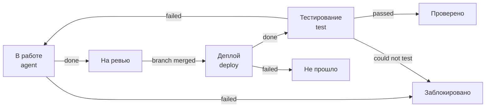
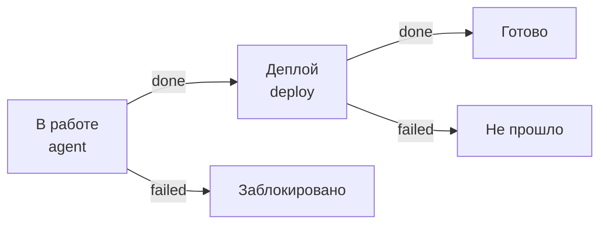
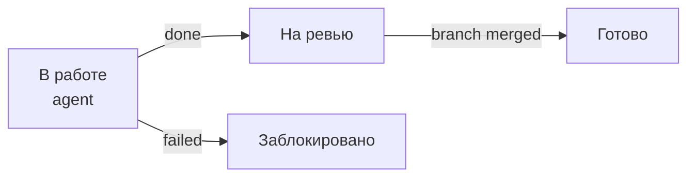

# How a card gets worked on

What happens between dropping a card into a column and getting a comment back:
which agent takes it, where it writes, which branch it commits to, and what
moves the card on. Written for a person using the board; the code is in
`internal/acp`.

## The three things that decide everything

| | Where it lives | What it answers |
|---|---|---|
| **Column** | column menu → *Agents in this column…* | what happens when a card lands here, who works it, how many at once |
| **Flow (route)** | board menu → *Workflows…* | where the card goes next, and on what event |
| **Registries** | board menu → *Agent projects…*, *Agents…*, *Deploy targets…* | the machine: which agents exist, which projects, where to deploy |

The split is worth holding onto: a **column says what is done**, a **route says
where the card goes afterwards**. A board with columns but no route still works
— cards are worked on where they stand and moved by hand. A board with routes
but no columns moves cards around without doing anything.

The registries live on the machine, the columns and routes belong to a board. A
board made from any of the offered templates brings its own columns and routes;
the first time it is opened on a machine with empty registries, the setup wizard
asks for the rest.

A **project** is the exception, and deliberately: it belongs to the board it was
added on, and only that board offers it. The folder of household notes has no
business on the board about code, and vice versa — before this, opening
*Проекты…* anywhere copied every project anybody had ever added into that
board's «Проекты» field. One checkout worked from several boards is a real case,
so the add form has **«На всех досках»** for it, and such a project is marked as
everyone's in the list. Projects registered before this stay visible everywhere:
taking one away from a board that has been using it would be the worse mistake.

Four templates are offered. «Разработка» is the one written for code, with
the «Фича», «Хотфикс» and «Только ревью» routes across «В работе», «Деплой»
and «Тестирование». The other three are the same machinery pointed at ordinary life
— «Домашние дела», «Покупки и меню», «Дом и техника» — and they are worth
reading as examples, because they show what is left when deploys and browser
tests are taken away: one column where an agent works, and a route that waits
for a person. There the agent writes into a folder of household notes — an
ordinary folder, added under *Проекты…*, with nothing to set up in it and no
git anywhere near it: a plan for the cleaning, a menu and a shopping list for
the week, what to ask the plumber. When it is done the card moves itself to the
stage where somebody looks, and no further: «На проверке», «Проверить список»,
«Ждём мастера» are all ends of the automatic part, and you move the card on
yourself. The short routes («Сделать сразу», «Быстрый список») skip even that
and close the card as soon as the agent is done.

Git is asked for by what a board does, not by which template it came from. A
board that publishes a branch or waits for one — a deploy or test stage, or a
transition the VCS watcher has to poll for — needs its project under git, and
the setup wizard says so and refuses a folder that is not. A board that does
neither takes any folder, gets no worktree (the agent works in the folder
itself, one card at a time) and has no branch-driven transitions to miss.

## What happens when a card lands in a column

Two things about that first step. The trigger is a **change** of the column
property on an existing card — a card created directly in a column starts
nothing. And a card dragged out of a column while its session runs cancels it.

## When a worktree appears, and what becomes of it

With `worktreeMode: "always"` (the default) every card-triggered coding session
gets its own git worktree:

- **created** when the session starts, under `~/Library/Application Support/XCIII/acp/worktrees`, on a new
  branch named `acp/<card title>-<session id>` — so the branch reads like the
  task and the preview address built from it does too;
- **based on** the card's `branch` property if it has one, otherwise on `HEAD`;
- **kept** when the session finishes successfully — the work is in it;
- **removed** when the session failed or was cancelled *and* the worktree is
  clean: no uncommitted changes and no commits ahead of its base. Anything the
  agent actually wrote survives even a failed session. `keepFailedWorktrees`
  keeps them all.

Three kinds of session never get a worktree, and run in the project itself: a
**deploy** (it publishes an existing branch), a **test** (it reads the code it
is checking), and a **planning** session (it changes nothing).

## Which branch is followed

The card rarely names its branch, and with worktrees the agent's branch is
invented by us — so anything that watches a project asks in this order:

The second one is what makes worktrees and routes work together: without it a
stage waiting for a merge would watch whatever happened to be checked out. The
deploy column resolves its branch the same way, so it publishes what the agent
wrote — the same branch as the **Deploy** button next to it on the card.

## Waiting for the project

A stage can wait for something that happens outside the board:

| Trigger | Where it comes from | Needs |
|---|---|---|
| `branch.pushed`, `branch.merged` | local git | nothing |
| `pr.opened`, `pr.merged`, `pr.closed`, `review.approved`, `checks.passed`, `checks.failed` | GitHub API | a token in `githubToken` or `GITHUB_TOKEN` for private projects |

There is nowhere for a webhook to arrive on a laptop, so this is polling —
`vcsPollSeconds`, 60 by default — and **only for the branches a parked card is
actually waiting on**. An idle board makes no requests at all.

## The routes the template ships

### «Фича» — the long way round

The loop is the point: a failed check sends the card back to the agent rather
than to a person, and the next session opens a new branch which the route then
follows.

### «Хотфикс» — written and published

### «Только ревью» — never deployed from here

A card takes a route by naming it in its **«Сценарий»** field. A card that names
none is still worked on by the columns it passes through — it just does not move
by itself.

## Doing it by hand

Nothing here takes the board away from you:

- **assign a card to yourself** and no agent starts on it — deploy and test still
  run, since that is machine work. Assign an agent, or nobody, to hand it back;
- **drag a card anywhere** at any time: a running session is cancelled, and the
  stage you dropped it on starts as if the route had moved it;
- **open a console** on a card (*Open session*) to talk to an agent directly —
  that is asking for one outright, so the assignee rule does not apply;
- **Deploy** next to the branch publishes it without moving the card.

## Settings an agent has of its own

Agents differ in what they can be told beyond the task: Claude has **Fast mode**,
an **effort** level and a permission **mode**; Codex has a mode and a model and
neither of the other two. Nothing about that is written down on our side — the
*Agents…* dialog starts the agent you are editing, asks it what it supports and
shows exactly that. So an agent without Fast mode has no Fast mode switch, and an
agent that gains a setting shows it after *Recheck* without an update here.

- the answer is remembered per agent, so opening the form is instant; **Recheck**
  asks again, which is what to press after changing an account or updating an
  adapter;
- a setting left at *As the agent has it* is not sent at all;
- a setting is applied after the model and the mode this app would have chosen,
  so what you pick here wins;
- "Could not ask the agent…" means the agent would not start — the adapter is
  missing or the account is not logged in. Everything else on the form still
  saves.

### When the agent asks you something

An agent that needs a decision — which database, which of two approaches, may it run a command it
was not given — asks, and waits: the question, the options with their explanations, and a box for
an answer in your own words if none of them fits. Answer it and the turn carries on from where it
stopped.

You do not have to be watching for it to reach you. The card grows a small amber dot on the
board, and the question itself arrives as a notification with its options on it — answer there,
or open the card and answer on it, whichever you happen to be looking at. Both are the same
question, and answering either one lets the agent go on.

Two things are worth knowing about the wait:

- only the thing that asked is waiting. The agent keeps working on everything else, and the card
  stays in its column, marked as waiting for you rather than done;
- nothing is decided for you by a timer. A question with no answer is answered when the session
  is cancelled or the app is closed, and "no answer" reaches the agent as a refusal — it then
  finishes without whatever it asked for, and the card's comments say what that was.

If a particular tool should never be asked about, put it in the column's allow list instead — the
agent stops asking and stops waiting.

### What the protocol has no word for

Remote control — driving an agent's sessions from claude.ai or the Claude app —
is not on that list: it is a flag of the CLI itself rather than a setting of the
protocol, so the agent cannot be asked about it. It is therefore named by hand:
a Claude agent has a **Remote control** checkbox in the same dialog and, if you
want one, a prefix for the session name it will appear under in claude.ai. It
works through a door the adapter documents for itself — the arguments reach the
real `claude` process when the session starts.

Next to it is **Arguments for the CLI behind the adapter**, where anything else
goes (`--fallback-model sonnet`). We keep no list of those flags: it is somebody
else's CLI and it changes without us. Getting one wrong is cheap — an argument
the CLI does not know fails the session start in its own words (`unknown option
'--nonsense'`), and you see it when the agent is rechecked rather than later on
a card.

For the other kinds the agent *is* the CLI, so its flags go in the ordinary
**Extra CLI args** field and there is no remote control checkbox — their
adapters have no such channel.

## When nothing happens

| What you see | Why |
|---|---|
| Card sits, no comment | The column is not configured, or the property that changed is not the one the columns are on |
| "Агент не запускается" | Somebody is assigned to the card |
| "Колонка занята" | The crew is busy or the limit is reached; it starts by itself later |
| "не задан ни project_path…" | The card matched no project: check the **Проекты** field against the registry |
| Card never leaves *In Review* | Nobody is watching its branch — see [which branch is followed](#which-branch-is-followed), or the route has no edge for what happened |
| Test stage refuses to start | The agent has no browser MCP server (*Agents…* → MCP servers) |

Everything a session does is written to the card as comments, and the card shows
its route, the stage it is on and what that stage is waiting for.

## The knobs

`~/Library/Application Support/XCIII/acp/config.json`, all of it editable
by hand:

| | |
|---|---|
| `worktreeMode` | `always` (default) or `never` |
| `maxConcurrent` | how many sessions run at once on this machine (3) |
| `sessionTimeoutMinutes` / `testTimeoutMinutes` | one turn (15) and one browser pass (30) |
| `sessionIdleMinutes` | how long a console session sits between turns (30) |
| `vcsPollSeconds` / `gitRemote` / `githubToken` | watching projects |
| `autoAllowTools` | what an agent may do without asking. A card-triggered session has nobody to ask, so anything not on the list is refused |
| `artifactsDir` | screenshots and verdicts of test runs |

See also [README.md](../README.md) for building and running the app.
