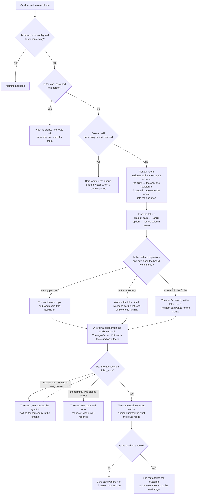
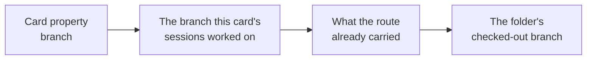
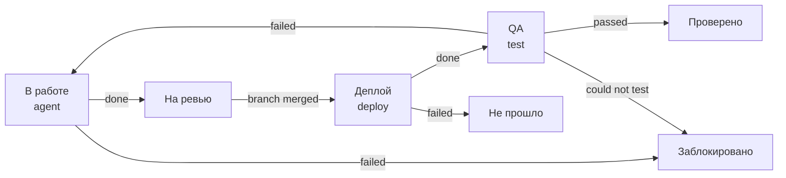
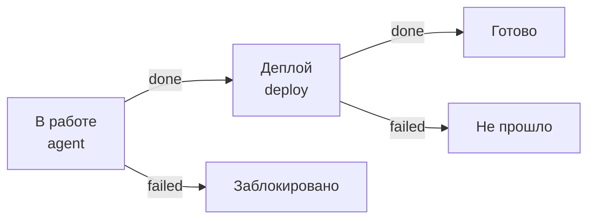
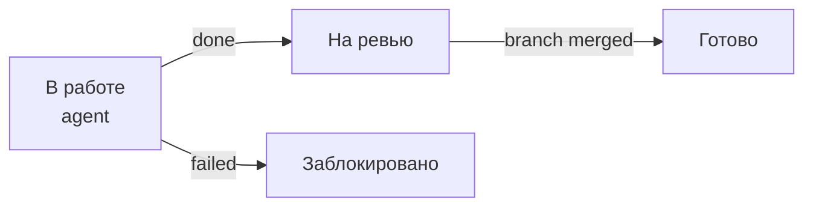

# How a card gets worked on

What happens between dropping a card into a column and getting the work back:
which agent takes it, where it writes, which branch it commits to, and what
moves the card on. Written for a person using the board; the code is in
`internal/acp`.

## The three things that decide everything

| | Where it lives | What it answers |
|---|---|---|
| **Column** | board menu → *«Колонки и маршруты…»*, or the column's own menu | what happens when a card lands here, who works it, how many at once |
| **Flow (route)** | the same editor, a route tab | where the card goes next, and on what event |
| **Registries** | sidebar → *«Настройки → Эта машина…»*; folders in the board's own screen | the machine: which agents exist, where to deploy, how they reach the network |

The split is worth holding onto: a **column says what is done**, a **route says
where the card goes afterwards**. A board with columns but no route still works
— cards are worked on where they stand and moved by hand. A board with routes
but no columns moves cards around without doing anything.

The registries live on the machine, the columns and routes belong to a board. A
board made from any of the offered templates brings its own columns and routes;
the first time it is opened on a machine with empty registries, the setup wizard
asks for the rest — starting with the board's own name, which is the one
question that is about the board rather than about the machine, and the one
step that cannot be passed over. Board names are unique, so the second board
made from a template cannot keep the template's name.

**What it asks is read off the board's stages**, not off the template it came
from, and it is re-read every time: a board that grows a deploy stage a month
later starts asking for somewhere to deploy to, and offers «Куда деплоить…» in
its ⋯ menu, which is the same plan. A board that loses one stops. None of it is
an obligation — a stage nobody configured runs nothing by itself, and a person
works the card there by hand, which is a way of using a column. The one thing
that is said out loud is the stage that cannot start at all: a test stage with
no browser anywhere gets a note in the editor saying so, and saying what happens
instead.

## Where a setting lives

Three kinds of thing get set up, and each is edited where it belongs:

| What | Where | Why there |
|---|---|---|
| Which agents are installed, where they deploy, how they reach the network, whether the board is on your tailnet | *«Настройки → Эта машина…»* in the sidebar | none of it is about a board, so none of it needs one open |
| What each column does, where a card goes next, which folders this board's agents work in, what they are told first | *«Колонки и маршруты…»* in the board's ⋯ menu | all of it is this board's, and changing it changes only this board |
| Which folder and which agent *this card* uses | the card itself | asked when a terminal is opened and the answer is not already known |

Карточка называет своего агента **исполнителем** — каждый зарегистрированный
агент становится участником доски под своим именем, так что «Кто занимается»
отвечает на этот вопрос тем же полем, которым доска и так пользуется. Отдельного
поля «Agent» больше нет: два поля на один вопрос — это два ответа, и правило о
том, какой из них главнее. Доска, у которой это поле ещё осталось, теряет его
при первом же открытии.

The board's menu holds nothing else: export, this screen, and saving the board
as a template. Registering an agent or a folder does not need the settings —
both are offered where the choice is made, on a card and in the column's «Кем
делается», and take a name and a kind. Everything more about an agent — model,
environment, MCP servers, proxy, CLI arguments — is in the machine's settings
and has a working default until you go there.

Folders are part of *running an agent*, not part of having a board. A board with
no agent column is never asked for one, gets no «Папка» field, and shows no
«Папки» section.

## Where both halves are edited

*«Колонки и маршруты…»* is one screen for the two of them, and the picture on
it is the board itself: **every column is a box on the canvas**, whatever
happens in it. Along the top are the routes; **«Колонки»** is the same canvas
with no route chosen, which is where you say what each column does.

- **choose a column** on «Колонки» and the panel on the right is about it: what
  happens when a card lands there, who works it, how many at once, where it
  deploys — and **what the agent is told here** («Что сказать агенту здесь»):
  the column's own instructions, put in front of the card's task for anybody
  working a card in this column — the reviewer's brief on «Ревью», the
  builder's on «В работе». That answer holds for every route at once, because
  it is the column's;
- **choose a route** and its arrows are drawn over the same boxes. The columns
  the route does not use stay on the canvas, faded — **clicking one puts it on
  the route**, and so does drawing an arrow to it. There is no separate "add a
  stage and then pick its column": a stage a card can stand on *is* a column;
- **choose a stage of a route** and the panel is about *the stage*: what happens
  at it, who works it here, where it works, what the agent is told at this
  stage, where the card goes next. Each of
  those falls back to the column's answer, which is named in the control rather
  than left to be guessed — «— как в колонке: агент работает над карточкой —»,
  and under the crew boxes «Никто не отмечен — работают агенты колонки: …».
  That is what puts a different agent on each node of one route. It was a fold
  called «Только в этом маршруте…» under a second list of the same agents, and
  two crews for one question read as a bug rather than as an override;
- **draw a transition** by pulling from a box's right edge — the upper point is
  "when this succeeded", the lower "when it failed" — or from the bottom point
  for something to wait for, like a merged branch. Click an arrow to change what
  it waits for or where it leads;
- **«Добавить колонку»**, the row above the canvas — «Агент», «Деплой», «Тест»
  or a plain column: click a kind and a new column of the board appears already
  doing what it says, drag it onto the canvas to say where it stands. Rename it
  in the panel; the routes and specs follow the option, not the name.

## Properties are the dataflow

A stage can **declare what it writes onto the card and what it reads off it**,
and that is what makes a transition on a property deterministic rather than
hopeful: the edge that asks about «Вердикт» points at the stage that must
produce it.

- **«Записывает на карточку»** (on the column, overridable per route stage) —
  the stage's outputs. An agent stage delivers the values through
  `finish_work` (`properties`), and a **required** one is refused without: the
  stage cannot end until the value stands. A **deploy** stage writes its
  preview address into the declared property, a **test** stage its verdict
  (`pass`/`fail`/`blocked`) — facts that used to live only in a comment, where
  no transition could reach them. Values land on the card *before* the outcome
  moves it, so the edges read them reliably; the write is silent, because the
  outcome is the one event the route acts on. A select property takes one of
  its option names, anything else takes the text as written; a wrong value
  comes back as the tool call's own error, to the agent — the one party that
  can fix it. The column property itself is refused: the card moves by the
  outcome, or by `move_card`.
- **«Получает с карточки»** — the stage's inputs: the named properties are
  valued and put at the top of its brief («From the card: Превью: https://…»),
  instead of hoping the agent asks `get_card`. A person's conversation opened
  on that column gets the same block.
- **the check** — a route whose conditional edge reads a property no stage of
  the route writes gets a warning naming it in the editor. Not an error: the
  value may be a person's own click (the `card.changed` wait); but a route
  built on a property nothing produces is a route that quietly never moves.

## Tools a column brings

A column can hand its agent **MCP servers of its own** («MCP-серверы этой
колонки», in the same panel), in the JSON block any MCP client takes:

```json
{"mcpServers": {"playwright": {"command": "npx", "args": ["-y", "@playwright/mcp@latest"]}}}
```

They are **added to whatever that agent carries in the registry**, and they are
the column's rather than the agent's on purpose: «QA» needs a browser and «В
работе» does not, and the alternative was registering one agent twice under two
names to give it two configurations. A route stage may replace the whole set for
itself («MCP-серверы на этой стадии»), the same way it overrides the crew and
the prompt — the fold names the column's answer while the stage has none of its
own.

Two rules. Wiring a server to a column is **consent to use it**: its tools run
without a confirmation prompt, exactly as the agent's own do, because a
card-triggered run has nobody to ask. And the name **`board` is taken** — the
board's own tools travel in the same file, and a server that shadowed them would
put out `finish_work`, which is how a stage ends.

A test column is the case this was built for: the browser can now live on the
column, and a test stage is refused for having no browser only when neither the
column nor the agent brings one.

## Rules: when one event is not one arrow

A transition can ask about the card before it moves it. The condition sits on
the arrow, in the panel and on its caption, and there are exactly two questions
it can ask — both about the card, neither a script:

- **«только если на карточке…»** — a select property carries a value. Two
  arrows out of one event make a fork: «шаг прошёл» ведёт срочную карточку в
  «Деплой», остальные — в «На ревью». The first condition that holds wins, and
  the arrow without one is the fallback;
- **«только если агент написал…»** — the agent's closing words contain a
  text. This is how the agent itself routes the card: попросите его закончить
  словами «ГОТОВО К ДЕПЛОЮ», и ветка с этим условием поедет, только когда он
  сам так решил. Только на исходах шага — там, где агент вообще говорил.

And one more thing a stage can wait for, beside the project's events:

- **«на карточке выбрано»** — a person (or an agent through the board's tools)
  sets an option on the card: «Одобрено = Да», скажем. The stage moves the card
  the moment the option is set — no polling, the board pushes. Setting any
  other option does nothing: the arrow names exactly what it waits for.

A card's own strip shows these waits with their conditions spelled out, so a
parked card always answers "what are you waiting for" precisely.

Two things are saved at different moments, and it is worth knowing which. A
**column of the board** — adding one, renaming one — is a change to the board and
lands at once, for everybody looking at it. **What happens in a column, and the
routes** are saved when you press *«Сохранить»*, because the engine checks the
whole picture before it takes it: a transition leading nowhere, two stages on one
column, an agent that is not registered are all refused with a sentence saying
which.

The editor also checks the one thing that silently costs an afternoon: a card
takes a route by **naming** it, so a route with no option of that name anywhere
on the board is a route no card can ever be put on. It says so where the route is
edited, and the button beside it adds the option.

A **folder** is the exception, and deliberately: it belongs to the board it was
added on, and only that board offers it. The folder of household notes has no
business on the board about code, and vice versa — before this, opening the
folders list anywhere copied every folder anybody had ever added into that
board's «Папка» field. One checkout worked from several boards is a real case,
so the add form has **«На всех досках»** for it, and such a folder is marked as
everyone's in the list. Such a folder is still not pushed onto a board that
knows nothing about folders: it joins the «Папка» field of a board that has
one already, and creates that field for nobody.

A folder registered before boards owned them belongs to none of them, so no
board offers it — that is the whole point, and "it used to be everywhere" is the
state being fixed. It is not lost either: the «Папки» section lists them under
**«Пока ни на одной доске»**, and one click makes them the board's. That click
is also the only way back in, since adding their folder again would be refused
as a duplicate path.

Three templates are offered. «Разработка» is the one written for code, with
the «Фича», «Хотфикс» and «Только ревью» routes across «В работе», «Деплой»
and «QA». The other two are the same machinery pointed at everything else —
«Контент» and «Домашние дела» — and they are worth reading as examples,
because they show what is left when deploys and browser tests are taken away:
one column where an agent works, and a route that waits for a person. There the
agent writes into an ordinary folder, added on the card or in «Папки», with
nothing to set up in it and no git anywhere near it: an inventory of what is in
the folder, a brief, a draft. When it is done the card moves itself to the
stage where somebody looks, and no further: «На проверке» and «Проверить список»
are ends of the automatic part, and you move the card on
yourself. The short routes («Сделать сразу», «Быстрый список») skip even that
and close the card as soon as the agent is done.

Git is asked for by what a board does, not by which template it came from. A
board that publishes a branch or waits for one — a deploy or test stage, or a
transition the VCS watcher has to poll for — needs its folder to be a git
repository, and the setup wizard says so and refuses a folder that is not. A
board that does neither takes any folder, gets no branch (the agent works in the
folder itself, one card at a time) and has no branch-driven transitions to miss.

## What happens when a card lands in a column



Two things about that first step. The trigger is a **change** of the column
property on an existing card — a card created directly in a column starts
nothing. And a card dragged out of a column while its session runs cancels it.

A stage that could not start says nothing about it in the card's history. The reason — no project
matched, the route has no edge for what arrived, the card belongs to a person —
is a **stall record** (`card_stall`), shown in amber on the card's route strip
while it is true and deleted by any progress. Route dead-ends write softly, so
the first reason (the root cause) is the one that stays visible.

### A stage is a terminal, and the agent says when it is over

An agent stage runs the agent's **own CLI**, in a terminal, with the card's task
already typed into it. Everything it asks — a choice, permission to run a
command, a question about the task — it asks in its own interface, and that is
where you answer: open the terminal from the card, the notification or «Ждут» on
a phone. Nothing of ours is drawn over that screen.

A terminal does not end by itself, so the agent declares the work over with
**finish_work**: done or not done, and one line about what it did. That line is
the event the route acts on, and it stays readable in the terminal it was said
in. If the terminal is closed
without it, the card stays where it is and says so — no verdict was given, so
none is invented.

**The conversation is the node's, and a returning card comes back to it.** A
person opening the card's terminal in a column joins the same conversation the
stage runs in — same agent, same workspace, same instructions — and a card sent
back (say, from «Ревью» to «В работе») resumes the conversation it had there.
It is not handed its task again: it is told why it is back, with what the stage
it returned from reported — the reviewer's own words are the new input the
resumed session works from.

Two things are still done the old way, without a terminal: a **deploy** and a
**test**. Nobody is watching those, and their result is read by the machine
rather than by a person. So is any agent whose CLI cannot be started here — an
agent registered as a plain ACP command, or one whose CLI is not installed on
this machine.

## Where the work happens, and what becomes of it

A card's work lives in **one place, and that place is the card's**: every stage
of its route, and every terminal somebody opens beside them, get the same
directory and the same branch. What that means depends on the folder and on
the answer given for it on this board, in «Папки…» in the board's menu:

| The folder | The board says | The card gets |
|---|---|---|
| an ordinary folder | — | the folder itself, no branch, one card at a time |
| a repository | «отдельная копия» (default) | a copy under `~/Library/Application Support/XCIII/acp/worktrees`, on `<card title>-<card id>` |
| a repository | «в самой папке» | that branch in the folder itself; the next card waits |

The branch is **cut from** the folder's own base branch — a setting, filled in
from the repository when the folder was added and editable beside it — and it is
written onto the card's «Ветка» field, so it travels with the card to another
board or another machine.

What becomes of the copy:

- **folded away** when the stage finished and nothing is uncommitted: the branch
  is the product, the directory is only where it was made, and the next terminal
  on that card remakes it from the branch;
- **kept** when anything is uncommitted, or a CLI is still running in it;
- **removed with its branch** when the session failed or was cancelled *and*
  nothing was written: no uncommitted changes, no commits ahead of the base.
  `keepFailedWorktrees` keeps those too.

In «в самой папке» the folder is **held** by one card until its branch is merged.
A second card does not fail — its route strip says the folder is held and what
will free it — and a folder with somebody's uncommitted work in it is never
switched under them. Uncommitted *tracked* work, that is: untracked files
survive a branch switch untouched, and every real checkout has some.

A **planning** session always runs in the folder itself: it changes nothing, so a
branch of its own would be a branch left behind by a conversation. A **deploy**
and a **test** run there too by default — one publishes a branch that already
exists, the other checks something already published — and a route that wants QA
on the card's own code before anything is merged says so on the stage («Стадия
работает» → «в ветке карточки»).

## Which branch is followed

The card rarely names its branch itself, and the agent's branch is invented by
us — so anything that watches a folder asks in this order:



The second one is what makes a card's own branch and its route work together:
without it a stage waiting for a merge would watch whatever happened to be
checked out. The
deploy column resolves its branch the same way, so it publishes what the agent
wrote — the same branch as the **Deploy** button next to it on the card.

## Waiting for the project

A stage can wait for something that happens outside the board:

| Trigger | Where it comes from | Needs |
|---|---|---|
| `branch.pushed`, `branch.merged` | local git | nothing |
| `pr.opened`, `pr.merged`, `pr.closed`, `review.approved`, `checks.passed`, `checks.failed` | GitHub API | для приватных проектов — токен в `GITHUB_TOKEN` или в хранилище секретов под `github.token` |

There is nowhere for a webhook to arrive on a laptop, so this is polling —
`vcsPollSeconds`, 60 by default — and **only for the branches a parked card is
actually waiting on**. An idle board makes no requests at all.

## The routes the template ships

### «Фича» — the long way round



The loop is the point: a failed check sends the card back to the agent rather
than to a person, and the next session opens a new branch which the route then
follows.

### «Хотфикс» — written and published



### «Только ревью» — never deployed from here



A card takes a route by naming it in its **«Сценарий»** field. A card that names
none is still worked on by the columns it passes through — it just does not move
by itself.

## Doing it by hand

Nothing here takes the board away from you:

- **assign a card to yourself** and no agent starts on it — deploy and test still
  run, since that is machine work. Assign an agent, or nobody, to hand it back;
- **drag a card anywhere** at any time: a running session is cancelled, and the
  stage you dropped it on starts as if the route had moved it;
- **open a console** on a card (*Open session*) to talk to an agent directly —
  that is asking for one outright, so the assignee rule does not apply;
- **Deploy** next to the branch publishes it without moving the card.

## What an agent can do to the board itself

An agent working in a terminal is given the board as tools, so the board is
something it can read and change rather than something it describes to you and
leaves you to do. Every one of them speaks in the names you see on the screen —
a column, a project, an agent, a route, an answer — and none of them takes a
board: an agent only ever reaches the board its terminal was opened on.

| What it can do | Tools |
|---|---|
| see the board | *list_columns* — the columns and what each one sets off; *list_flows* — the routes, their stages and what carries a card off each one |
| find a card | *list_cards*, optionally in one column; *get_card* for one card with its description and where it stands on its route |
| put work on the board | *create_card*, *create_cards* — how a planning conversation ends |
| change a card | *update_card* — its title, its project, its route, an answer a stage is waiting on; *comment_card* — a note in the card's own history |
| hand work on | *move_card* — the card goes into another column, **and the column starts** |
| finish a stage | *finish_work* — the work of this card is done, or could not be done; the route takes it from there. Carries the stage's declared property values (`properties`), written onto the card before it moves |
| say what it is doing | *describe_conversation* — one line about this conversation, shown under its name in «Открытые терминалы» and on «Терминалы» on a phone |
| name the conversation | *name_conversation* — what the row is called; the app asks for it in the conversation itself when somebody presses the wand button on the row |

That last row is the one to know about. A card an agent moves is a card moved:
the column it lands in does what it always does, and the route takes it from
there, exactly as if you had dragged it yourself. So an agent that finishes what
a card asked for can put it into review, and the route carries it the rest of the
way without you.

Two things are deliberately not there. An agent **cannot rewrite a card's
description** — that is what you wrote, and what an agent has to say about a card
goes into the card's own history rather than over your text. And a card an
agent asks about must be **on the same board**: a card id it read somewhere else
opens nothing.

The tools reach an agent you are talking to in a terminal. A session running a
card on its own does not get them — an agent moving its own card into the column
that starts it is a circle with nobody in it, and while that is worth having, it
is not worth having by accident.

## Settings an agent has of its own

Agents differ in what they can be told beyond the task: Claude has **Fast mode**,
an **effort** level and a permission **mode**; Codex has a mode and a model and
neither of the other two. Nothing about that is written down on our side — the
*«Эта машина…» → «Агенты»* panel starts the agent you are editing, asks it what it supports and
shows exactly that. So an agent without Fast mode has no Fast mode switch, and an
agent that gains a setting shows it after *Recheck* without an update here.

- the answer is remembered per agent, so opening the form is instant; **Recheck**
  asks again, which is what to press after changing an account or updating an
  adapter;
- a setting left at *As the agent has it* is not sent at all;
- a setting is applied after the model and the mode this app would have chosen,
  so what you pick here wins;
- "Could not ask the agent…" means the agent would not start — the adapter is
  missing or the account is not logged in. Everything else on the form still
  saves.

### When the agent asks you something

An agent that needs a decision — which database, which of two approaches, may it run a command it
was not given — asks, and waits: the question, the options with their explanations, and a box for
an answer in your own words if none of them fits. Answer it and the turn carries on from where it
stopped.

You do not have to be watching for it to reach you. The card grows a small amber dot on the
board, and the question itself arrives as a notification with its options on it — answer there,
or open the card and answer on it, whichever you happen to be looking at. Both are the same
question, and answering either one lets the agent go on.

Two things are worth knowing about the wait:

- only the thing that asked is waiting. The agent keeps working on everything else, and the card
  stays in its column, marked as waiting for you rather than done;
- nothing is decided for you by a timer. A question with no answer is answered when the session
  is cancelled or the app is closed, and "no answer" reaches the agent as a refusal — it then
  finishes without whatever it asked for, and says so when it closes.

If a particular tool should never be asked about, put it in the column's allow list instead — the
agent stops asking and stops waiting.

### What the protocol has no word for

Remote control — driving an agent's sessions from claude.ai or the Claude app —
is not on that list: it is a flag of the CLI itself rather than a setting of the
protocol, so the agent cannot be asked about it. It is therefore named by hand:
a Claude agent has a **Remote control** checkbox in the same dialog and, if you
want one, a prefix for the session name it will appear under in claude.ai. It
works through a door the adapter documents for itself — the arguments reach the
real `claude` process when the session starts.

Next to it is **Arguments for the CLI behind the adapter**, where anything else
goes (`--fallback-model sonnet`). We keep no list of those flags: it is somebody
else's CLI and it changes without us. Getting one wrong is cheap — an argument
the CLI does not know fails the session start in its own words (`unknown option
'--nonsense'`), and you see it when the agent is rechecked rather than later on
a card.

For the other kinds the agent *is* the CLI, so its flags go in the ordinary
**Extra CLI args** field and there is no remote control checkbox — their
adapters have no such channel.

## When nothing happens

| What you see | Why |
|---|---|
| Card sits, nothing happens | The column is not configured, or the property that changed is not the one the columns are on |
| "Агент не запускается" | Somebody is assigned to the card |
| "Колонка занята" | The crew is busy or the limit is reached; it starts by itself later |
| "папка занята другой карточкой" | The board works on a branch in the folder itself and another card holds it until its branch is merged |
| "в папке есть несохранённые изменения" | The same, with your own uncommitted changes to tracked files in the way: commit or stash them (untracked files are fine) |
| "не задан ни project_path…" | The card matched no folder: check the **Папки** field against the registry |
| Card never leaves *In Review* | Nobody is watching its branch — see [which branch is followed](#which-branch-is-followed), or the route has no edge for what happened |
| Test stage refuses to start | Nothing brings a browser MCP server: put one on the test column («MCP-серверы этой колонки»), or on the agent itself (*«Настройки → Агенты»* → MCP servers) |

A session says one thing at the end: what the agent did, or why it could not.
Everything else it does is shown rather than written down — the card carries its
route, the stage it is on, what that stage is waiting for, and the branch the
work is on. Cards draw no comments while the app has one person in it
([teamwork.md](teamwork.md)), so an agent's closing words are read in its
terminal and by the conditions on the route's arrows.

## The knobs

`~/Library/Application Support/XCIII/acp/config.json`, all of it editable
by hand:

| | |
|---|---|
| `worktreeMode` | the default for a board that was never asked: `always` → a copy per card, `never` → a branch in the folder itself. The board's own answer (*«Колонки и маршруты…» → «Папки»*) wins |
| `maxConcurrent` | how many sessions run at once on this machine (3) |
| `sessionTimeoutMinutes` / `testTimeoutMinutes` | one turn (15) and one browser pass (30) |
| `sessionIdleMinutes` | how long a console session sits between turns (30) |
| `boardPrompts` | what each board tells its agents first, keyed by board id — written by *«Системный промпт доски…»* in the board's ⋯ menu, not by hand. The other prompt an agent gets is its own (`agents[].prompt`), and there is deliberately no third |
| `vcsPollSeconds` / `gitRemote` | watching folders |
| `autoAllowTools` | what an agent may do without asking. A card-triggered session has nobody to ask, so anything not on the list is refused |
| `artifactsDir` | screenshots and verdicts of test runs |

Колонок и маршрутов в этом файле нет: **автоматика доски лежит на самой доске**,
в её собственных свойствах `xciiiColumns` и `xciiiFlows`, вместе со всем остальным,
что доске принадлежит. Поэтому она уезжает вместе с доской в экспорт архива и в
шаблон, копируется вместе с копией доски и исчезает вместе с удалённой — а файл
рядом с приложением хранит только машинное: агентов, папки, цели деплоя,
промпты. Установка, сделанная до этого, переносит своё на доски один раз, при
запуске.

See also [README.md](../README.md) for building and running the app.
