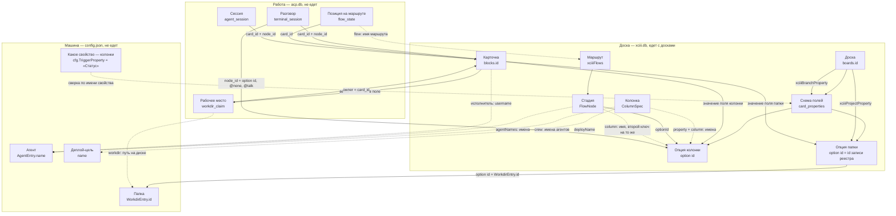
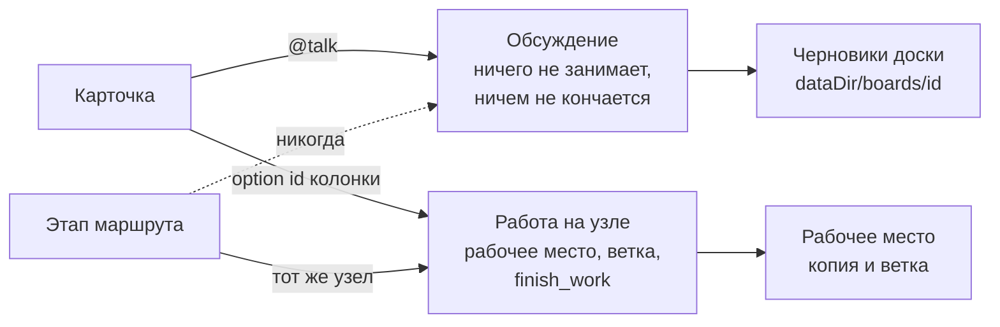

# Граф модели: чем что адресуется

`docs/db-erd.md` — что где лежит. Здесь — как одно находит другое, потому что
почти все противоречия, которые у нас были и остались, одной формы: **вещь
адресуется именем там, где должна адресоваться идентификатором**. Имя человек
меняет; ссылка по имени рвётся молча.

Читать так:

- **сплошная стрелка** — связь по идентификатору. Переименование её не трогает;
- **пунктирная стрелка** — связь по имени. Переименуйте то, на что она
  указывает, и она порвётся, ничего не сказав.

## Что на что ссылается

## Разговор и работа: два рода на одной карточке

Род объявляется тем, кто открывает разговор (`StartCardTerminal` /
`StartCardTalk`), а не выводится из того, где стояла карточка. Этап входит
только в работу и только если она стоит там же, где стадия.

## Противоречия

Пунктирные рёбра графа — и есть список. По убыванию цены.

### 1. «Какое свойство — колонки» ищется по имени, и имя русское

`cfg.TriggerProperty` — строка в конфиге **машины**, по умолчанию «Статус»;
маршрут может её переопределить своим `property`, тоже именем.
`columnMatchesCard` сверяет имя свойства и имя опции.

Это последняя и самая несущая связь по имени: на ней держится всё — какая
колонка у карточки, какой узел, какой разговор, какая стадия. И она устроена
ровно наоборот тому, как устроены папка и ветка, которые доска записывает по id
(`xciiiProjectProperty`, `xciiiBranchProperty`). Доска на английском или просто
доска, где свойство назвали «Этап», работает случайно — до первого
переименования.

Чинится так же, как папка: `xciiiColumnProperty` на доске, id вместо имени;
конфиг остаётся дефолтом для доски, которая ничего не записала.

### 2. Агент адресуется именем — везде

`AgentEntry.Name` — это и ключ реестра, и username аккаунта на доске, и элемент
`ColumnSpec.Agents`, и `FlowNode.AgentNames`, и то, по чему `resolveSessionAgent`
узнаёт исполнителя карточки. Переименование агента рвёт crew во всех маршрутах
всех досок и отвязывает уже назначенные карточки — молча.

Та же болезнь, что была у папок, и лечится тем же: `AgentEntry.ID`, crew — списки
id, аккаунт держит id в своей записи. Отличие от папок в том, что имя агента
видно на карточке (в «Кто занимается»), так что переезд надо делать вместе с
аккаунтами.

### 3. Рабочее место ключуется путём

Реестр папок уже по id, а `workdir_claim.workdir` — путь на диске. Переместили
папку — claim осиротел: карточка считается начатой (ветка на ней), а копию никто
не найдёт. Плюс это единственное, что мешает записи реестра перестать быть
папкой: у гугл-диска или ssh-машины «пути» в этом смысле нет.

Чинится сменой ключа на `WorkdirEntry.ID` — миграция одной таблицы.

### 4. Маршрут ключуется именем

`flow_state.flow` хранит имя маршрута, `AddFlow`/`RemoveFlow` работают по имени.
Переименовали маршрут — карточки, стоящие на нём, теряют позицию. У стадии внутри
маршрута id есть (`FlowNode.ID`), у самого маршрута — нет.

### 5. У стадии два ключа на одну колонку

`FlowNode` держит и `OptionID`, и `Column` (имя). Комментарий говорит «имя — чтобы
переименование ничего не меняло», но по факту это два источника правды: код
местами сверяет имя (`columnMatchesCard`), местами id. То же и у `ColumnSpec`:
`PropertyID`/`OptionID` плюс `Property`/`Column`.

### 6. Место работы можно назвать путём прямо на карточке

`resolveWorkdir` первым делом смотрит `project_path`/`repo_path` — поля с путём,
которые никто не создаёт, но которые побеждают поле «Папка». Это второй способ
сказать то же самое, он не переезжает на другую машину и он не связан с реестром
ничем, кроме whitelist'а.

### 7. Начатую работу нельзя продолжить на другой машине

`CardWork` теперь честно говорит: работа начата (`Started`), но не здесь
(`Here` — нет). А что с этим делать, приложение не предлагает: ни склонировать
ветку, ни восстановить копию. Не баг, но дыра ровно там, где карточка переезжает,
а всё остальное про работу — нет.

### 8. Деплой-цель — по имени

`ColumnSpec.DeployName` и `FlowNode.DeployName` — имена записей реестра машины.
Тот же класс, что 2 и 3, но цена меньше: целей мало и меняют их редко.

### 9. `config.json` называет колонки чужих досок

Не одно поле, а семь. `TriggerProperty` сверяется на каждом событии. Пять имён
колонок (`TriggerColumn`, `DeployColumn`, `TestColumn`, `TestPassColumn`,
`TestFailColumn`) `migratedColumns` превращает в `ColumnSpec` **без board id и
без option id** — то есть в правила, которые матчатся по имени против любой
доски, пока первая проехавшая карточка не заполнит ids. `BoardPrompts` — карта
по board id, `WorkdirEntry.Modes` — тоже.

Файл настроек машины держит ссылки в базу доски. Проверить их нечем: это не
таблицы, между ними нет и не может быть ограничений целостности, а сломанная
ссылка выглядит как «правило почему-то не сработало».

## Куда это должно приехать

Правило, которое стоит записать и дальше проверять по нему каждую новую связь:

> **Ссылка — это внешний ключ.** Всё, на что можно сослаться, лежит в одной
> базе и имеет `id`. Файл настроек хранит только то, на что не ссылается никто.
> По имени не ищется ничего.

Отсюда — переезд с четырёх хранилищ на одну базу: наши таблицы въезжают в базу
приложения, реестры перестают быть JSON и становятся таблицами с внешними
ключами, `config.json` перестаёт называть колонки чужих досок и пути к
пользовательским данным. Шесть противоречий из девяти закрываются этим. Целевая
схема, шаги, миграции и чем каждый шаг проверяется — **`docs/store-plan.md`**.

Одна причина, по которой это не просто уборка: удаление карточки в бордовой базе
— настоящий `DELETE FROM blocks`, а наши таблицы об этом не узнают никогда
(`BlockChanged` обрабатывает только `notify.Update`). Сегодня удалённая карточка
навсегда оставляет за собой разговоры, claim'ы, стоп-записи, позицию на маршруте
и очередь. Разделение по файлам это и создаёт: сослаться на `blocks(id)` неоткуда.

Пункты 4 и 5 живут целиком внутри JSON доски и хранилищ не касаются. Пункт 7
идентификаторами не чинится: чтобы продолжить работу на второй машине, там
должна оказаться та же папка.
