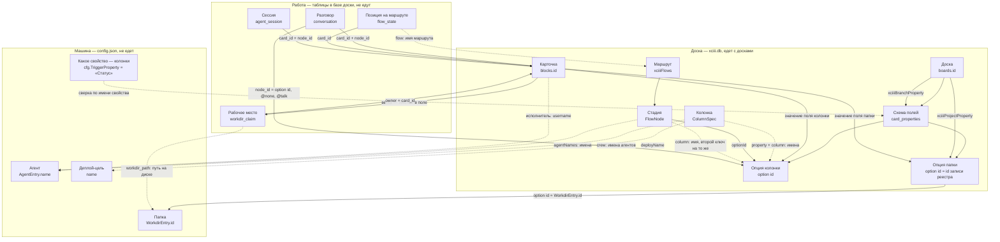
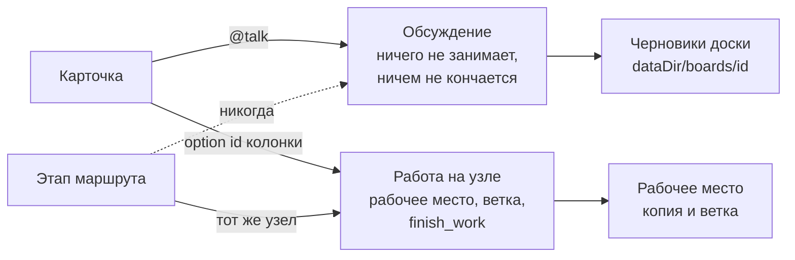

# Граф модели: чем что адресуется

`docs/db-erd.md` — что где лежит. Здесь — как одно находит другое, потому что
почти все противоречия, которые у нас были и остались, одной формы: **вещь
адресуется именем там, где должна адресоваться идентификатором**. Имя человек
меняет; ссылка по имени рвётся молча.

Читать так:

- **сплошная стрелка** — связь по идентификатору. Переименование её не трогает;
- **пунктирная стрелка** — связь по имени. Переименуйте то, на что она
  указывает, и она порвётся, ничего не сказав.

## Что на что ссылается

## Разговор и работа: два рода на одной карточке

Род объявляется тем, кто открывает разговор (`StartCardTerminal` /
`StartCardTalk`), а не выводится из того, где стояла карточка. Этап входит
только в работу и только если она стоит там же, где стадия.

## Противоречия

Пунктирные рёбра графа — и есть список. По убыванию цены.

### 1. ~~«Какое свойство — колонки» ищется по имени~~ — закрыто

`cfg.TriggerProperty` — строка в конфиге **машины**, по умолчанию «Статус»;
маршрут может её переопределить своим `property`, тоже именем.
`columnMatchesCard` сверяет имя свойства и имя опции.

Это последняя и самая несущая связь по имени: на ней держится всё — какая
колонка у карточки, какой узел, какой разговор, какая стадия. И она устроена
ровно наоборот тому, как устроены папка и ветка, которые доска записывает по id
(`xciiiProjectProperty`, `xciiiBranchProperty`). Доска на английском или просто
доска, где свойство назвали «Этап», работает случайно — до первого
переименования.

Оказалось у́же, чем читалось. Главный путь — «карточка приехала в колонку, что
теперь делать» — **уже был по id**: `matchColumn` сверяет `OptionID` и только
для записи без него падает на имена, а `learnColumnIDs` дописывает id при первом
же переезде. По именам сверялись два места, и оба теперь сначала спрашивают id:
`columnMatchesCard` («карточка ещё стоит на этой стадии») и `columnOf`, бывший
`columnByName` («на какой колонке стоит стадия маршрута»). Переименовать колонку
или свойство теперь ничего не стоит.

Отрицательный ответ — «карточка отсюда ушла» — требовал знать, какая из опций
карточки вообще колонка, и это теперь `xciiiColumnProperty` на доске: id
свойства рядом с `xciiiProjectProperty` и `xciiiBranchProperty`. Пишется не
страницей, а этой стороной, из самих колонок — они и так несут `propertyId`, —
и записывается при первом же чтении автоматики доски. Колонки на двух разных
свойствах не записывают ничего: доску, которую эта запись описать не может,
лучше не описывать, чем описать неверно.

`cfg.TriggerProperty` остался дефолтом по имени — для доски, которая ничего не
записала, то есть для доски без автоматики вовсе.

### 2. Агент адресуется именем — везде

`AgentEntry.Name` — это и ключ реестра, и username аккаунта на доске, и элемент
`ColumnSpec.Agents`, и `FlowNode.AgentNames`, и то, по чему `resolveSessionAgent`
узнаёт исполнителя карточки. Переименование агента рвёт crew во всех маршрутах
всех досок и отвязывает уже назначенные карточки — молча.

Та же болезнь, что была у папок, и лечится тем же: `AgentEntry.ID`, crew — списки
id, аккаунт держит id в своей записи. Отличие от папок в том, что имя агента
видно на карточке (в «Кто занимается»), так что переезд надо делать вместе с
аккаунтами.

### 3. ~~Рабочее место ключуется путём~~ — закрыто

`workdir_claim` ключевалась путём на диске: переместили папку — запись
осиротела, карточка считалась начатой (ветка на ней), а копию никто не находил.
И это было единственное, что мешало записи реестра перестать быть папкой: у
гугл-диска или ssh-машины «пути» в этом смысле нет.

Таблица теперь `checkout`, а ключ — `workspace_id`, настоящий внешний ключ на
`workspace` с `RESTRICT`: папку, в которой идёт работа, не удалить. Путь в
строке остался, но как запись факта, а не как то, по чему её находят.

### 4. Маршрут ключуется именем

`flow_state.flow` хранит имя маршрута, `AddFlow`/`RemoveFlow` работают по имени.
Переименовали маршрут — карточки, стоящие на нём, теряют позицию. У стадии внутри
маршрута id есть (`FlowNode.ID`), у самого маршрута — нет.

### 5. У стадии два ключа на одну колонку

`FlowNode` держит и `OptionID`, и `Column` (имя). Комментарий говорит «имя — чтобы
переименование ничего не меняло», но по факту это два источника правды: код
местами сверяет имя (`columnMatchesCard`), местами id. То же и у `ColumnSpec`:
`PropertyID`/`OptionID` плюс `Property`/`Column`.

### 6. ~~Место работы можно назвать путём прямо на карточке~~ — закрыто

`resolveWorkdir` первым делом смотрел `project_path`/`repo_path` — поля с путём,
которые никто не создаёт, но которые побеждали поле «Папка». Второй способ
сказать то же самое, не переезжающий на другую машину и не связанный с реестром
ничем, кроме whitelist'а, — который затем и существовал, чтобы карточка не могла
назвать произвольный путь. Ушли оба: карточка называет папку id записи реестра,
и другого способа нет.

### 7. Начатую работу нельзя продолжить на другой машине

`CardWork` теперь честно говорит: работа начата (`Started`), но не здесь
(`Here` — нет). А что с этим делать, приложение не предлагает: ни склонировать
ветку, ни восстановить копию. Не баг, но дыра ровно там, где карточка переезжает,
а всё остальное про работу — нет.

### 8. Деплой-цель — по имени

`ColumnSpec.DeployName` и `FlowNode.DeployName` — имена записей реестра машины.
Тот же класс, что 2 и 3, но цена меньше: целей мало и меняют их редко.

### ~~9.~~ `config.json` называл колонки чужих досок — закрыто

Было семь полей. Пять имён колонок (`TriggerColumn`, `DeployColumn`,
`TestColumn`, `TestPassColumn`, `TestFailColumn`) превращались в `ColumnSpec`
**без board id и без option id** — то есть в правила, которые матчились по
имени против любой доски, пока первая проехавшая карточка не заполнит ids;
`BoardPrompts` была картой по board id.

Файл настроек машины держал ссылки в базу доски, а проверить их было нечем: это
не таблицы, ограничений целостности между ними не бывает, и сломанная ссылка
выглядела как «правило почему-то не сработало».

Ключей нет. Колонки и маршруты живут на доске (`xciiiColumns`, `xciiiFlows`),
промпт доски — там же (`xciiiPrompt`), а `TriggerProperty` сверяет id свойства,
которое доска про себя записала (`xciiiColumnProperty`). Пять имён колонок ушли
к тому, кто доски создаёт, — к шаблонам. `WorkdirEntry.Modes` уехал в
`workspace_board`.

## Куда это должно приехать

Правило, которое стоит записать и дальше проверять по нему каждую новую связь:

> **Ссылка — это внешний ключ.** Всё, на что можно сослаться, лежит в одной
> базе и имеет `id`. Файл настроек хранит только то, на что не ссылается никто.
> По имени не ищется ничего.

Отсюда — переезд с четырёх хранилищ на одну базу: наши таблицы въезжают в базу
приложения, реестры перестают быть JSON и становятся таблицами с внешними
ключами, `config.json` перестаёт называть колонки чужих досок и пути к
пользовательским данным. Закрыты этим 1, 3, 6 и 9; остались те, где ключом всё
ещё служит имя, — агент (2), маршрут (4), деплой-цель (8) — плюс два ключа на
одну колонку у стадии (5) и невозможность продолжить работу на другой машине
(7). Целевая
схема, шаги, миграции и чем каждый шаг проверяется — **`docs/store-plan.md`**.

Одна причина, по которой это не просто уборка: удаление карточки в бордовой базе
— настоящий `DELETE FROM blocks`, а наши таблицы об этом не узнавали никогда
(`BlockChanged` обрабатывает только `notify.Update`), так что удалённая карточка
навсегда оставляла за собой разговоры, claim'ы, стоп-записи, позицию на маршруте
и очередь. Разделение по файлам это и создавало: сослаться на `blocks(id)` было
неоткуда.

**Сделано** (2026-08-17): таблицы в одной базе, ключи написаны в `CREATE TABLE`
— написать их можно было только там, `ALTER TABLE ADD CONSTRAINT` на SQLite не
существует, — и **включены**: `foreign_keys` идёт в DSN, потому что это настройка
соединения. Удалённая карточка больше ничего за собой не оставляет.

Пункты 4 и 5 живут целиком внутри JSON доски и хранилищ не касаются. Пункт 7
идентификаторами не чинится: чтобы продолжить работу на второй машине, там
должна оказаться та же папка.
