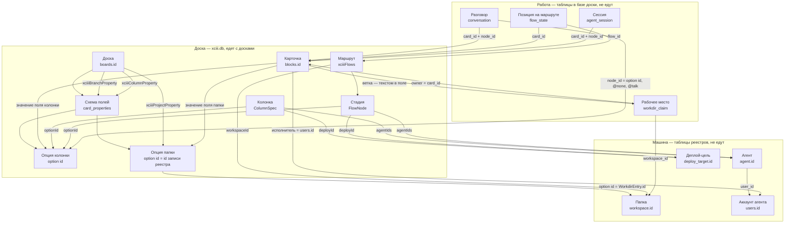
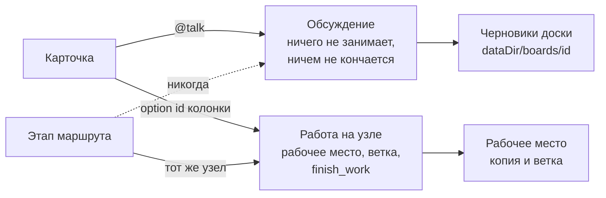

# Граф модели: чем что адресуется

`docs/db-erd.md` — что где лежит. Здесь — как одно находит другое. Все девять
противоречий, которые тут разобраны, были одной формы: **вещь адресовалась
именем там, где должна адресоваться идентификатором**. Имя человек меняет;
ссылка по имени рвётся молча. Ни одного такого ребра не осталось; документ
описывает, как устроено сейчас, и держит разбор — чтобы новую связь было по
чему проверять.

Читать так: **каждая стрелка — связь по идентификатору**. Пунктирных, то есть
связей по имени, здесь больше нет — это и была та девятка, разбор которой ниже.
Если новая стрелка не может быть сплошной, она не должна появляться.

## Что на что ссылается

## Разговор и работа: два рода на одной карточке

Род объявляется тем, кто открывает разговор (`StartCardTerminal` /
`StartCardTalk`), а не выводится из того, где стояла карточка. Этап входит
только в работу и только если она стоит там же, где стадия.

## Противоречия — закрыты, все девять

Это был список пунктирных рёбер графа, по убыванию цены. Он оставлен целиком,
а не удалён: у каждого пункта — почему так было, чем чинилось и что при этом
выяснилось, а два из них (7 и то, что вскрылось внутри 2 и 4) кончились не
кодом, а решением. Сокращать это до «сделано» значит выбросить ровно ту часть,
ради которой разбор писался.

### 1. ~~«Какое свойство — колонки» ищется по имени~~ — закрыто

`cfg.TriggerProperty` — строка в конфиге **машины**, по умолчанию «Статус»;
маршрут может её переопределить своим `property`, тоже именем.
`columnMatchesCard` сверяет имя свойства и имя опции.

Это последняя и самая несущая связь по имени: на ней держится всё — какая
колонка у карточки, какой узел, какой разговор, какая стадия. И она устроена
ровно наоборот тому, как устроены папка и ветка, которые доска записывает по id
(`xciiiProjectProperty`, `xciiiBranchProperty`). Доска на английском или просто
доска, где свойство назвали «Этап», работает случайно — до первого
переименования.

Оказалось у́же, чем читалось. Главный путь — «карточка приехала в колонку, что
теперь делать» — **уже был по id**: `matchColumn` сверяет `OptionID` и только
для записи без него падает на имена, а `learnColumnIDs` дописывает id при первом
же переезде. По именам сверялись два места, и оба теперь сначала спрашивают id:
`columnMatchesCard` («карточка ещё стоит на этой стадии») и `columnOf`, бывший
`columnByName` («на какой колонке стоит стадия маршрута»). Переименовать колонку
или свойство теперь ничего не стоит.

Отрицательный ответ — «карточка отсюда ушла» — требовал знать, какая из опций
карточки вообще колонка, и это теперь `xciiiColumnProperty` на доске: id
свойства рядом с `xciiiProjectProperty` и `xciiiBranchProperty`. Пишется не
страницей, а этой стороной, из самих колонок — они и так несут `propertyId`, —
и записывается при первом же чтении автоматики доски. Колонки на двух разных
свойствах не записывают ничего: доску, которую эта запись описать не может,
лучше не описывать, чем описать неверно.

`cfg.TriggerProperty` остался дефолтом по имени — для доски, которая ничего не
записала, то есть для доски без автоматики вовсе.

### ~~2.~~ Агент адресовался именем — закрыто

`AgentEntry.Name` был и ключом реестра, и username аккаунта, и элементом
`ColumnSpec.Agents`, и `FlowNode.AgentNames`, и тем, по чему `resolveSessionAgent`
узнавал исполнителя карточки. Переименование рвало crew во всех маршрутах всех
досок и отвязывало назначенные карточки — молча.

Теперь ссылка — `AgentEntry.ID`: `ColumnSpec.AgentIDs`, `FlowNode.AgentIDs`,
`AgentEntry.ProxyID` вместо `ProxyName`. Имя осталось подписью — на экране, в
ответе доске агенту (`crewNames`) и как то, что человек тыкает в пикере;
`SetWorkAgents` разрешает выбранное имя в id **на входе**, потому что человек
выбирает имя, а хранится id.

Исполнитель карточки — отдельная половина, и она чинится не так. Карточка и
раньше хранила **id аккаунта**, а `boardadapter` разрешал его в username, и
сверка шла строками. Теперь `CardMoved` несёт `PersonIDs`, `AgentEntry.UserID`
записывается при заведении аккаунта (`recordAgentAccounts` → `agent.user_id`,
внешний ключ на `users` был уже), и `resolveSessionAgent` сверяет их. Сверка по
username осталась вторым шагом: карточку, назначенную до того, как аккаунт был
записан, она всё ещё узнаёт.

Как и с целью деплоя, обнаружилось, что переименование было не просто lossy, а
**невозможно**: `UpdateAgent` и `UpdateProxy` искали запись по имени, то есть по
новому. Теперь — по id, с проверкой занятости нового имени.

Одно правило пришлось сделать инвариантом, а не надеждой: **у каждой записи
реестра есть id**. Стор выдаёт его при сохранении, но конфиг, отданный менеджеру
напрямую (правленый руками файл, фикстура теста), сохранения не проходил, и crew
указывал в пустоту — `bindConfigRefs` в `NewManager` закрывает это.

### 3. ~~Рабочее место ключуется путём~~ — закрыто

`workdir_claim` ключевалась путём на диске: переместили папку — запись
осиротела, карточка считалась начатой (ветка на ней), а копию никто не находил.
И это было единственное, что мешало записи реестра перестать быть папкой: у
гугл-диска или ssh-машины «пути» в этом смысле нет.

Таблица теперь `checkout`, а ключ — `workspace_id`, настоящий внешний ключ на
`workspace` с `RESTRICT`: папку, в которой идёт работа, не удалить. Путь в
строке остался, но как запись факта, а не как то, по чему её находят.

### ~~4.~~ Маршрут ключевался именем — закрыто

`flow_state.flow` хранил имя маршрута, `AddFlow`/`RemoveFlow` работали по имени.
Переименовали маршрут — карточки, стоящие на нём, теряли позицию. У стадии id
был (`FlowNode.ID`), у самого маршрута — нет.

Теперь есть: `FlowEntry.ID`, а колонка `flow` в трёх таблицах (`flow_state`,
`flow_event`, `stage_queue`) стала `flow_id`. Внешнего ключа у неё нет и быть не
может — маршруты живут в JSON доски, а не в таблице, — так что это ссылка по
правилу, а не по ограничению.

Читатели перешли на `FlowByID`. `FlowByName` осталась, но её работа сузилась до
того, чем она и была честно: карточка называет маршрут опцией, которую выбрал
человек, — это ввод, а не адресация.

Два места, где id чуть не сломал то, что имя держало. `validateFlow` выдаёт id
новому маршруту, поэтому `sameFlow` начал сравнивать id — и проверка «маршрут с
таким именем уже есть» перестала срабатывать; теперь она явная
(`flowNameTaken`), и по ней же `adoptFlows` узнаёт свой маршрут на доске,
которая ещё не несёт id. И старый перенос базы (`legacystore.go`) несёт **имя**,
а имя — не id: ссылка в индексе остаётся пустой, а id приезжает с самой
карточки, где имя тоже записано и где оно сворачивается (`boundFlowState`).
Поэтому `flow_state.flow_id` и `flow_event.flow_id` — nullable.

Заодно `FlowEntry.WorkdirName` стал `WorkspaceID`: маршрут привязывался к папке
по имени, хотя папка адресуется id с тех пор, как закрылся пункт 3. В редакторе
это перестало быть полем ввода и стало выбором из папок доски — имя папки, за
которое можно было зацепиться опечаткой, там больше не печатают.

### ~~5.~~ У стадии было два ключа на одну колонку — закрыто

`FlowNode` держал и `OptionID`, и `Column`; `ColumnSpec` — `PropertyID`/`OptionID`
плюс `Property`/`Column`. Комментарий обещал, что имя — «чтобы переименование
ничего не меняло», а на деле это были два источника правды: код местами сверял
имя, местами id.

Имя осталось, но перестало быть ключом: сверок по нему больше нет ни одной.
`matchColumn` сверяет только опцию, `columnOf` — только `OptionID` стадии,
`columnMatchesCard` отвечает «карточка ушла отсюда», найдя **свойство** колонок
по id и не заглядывая в имя опции. `ColumnSpec.Key()` и `columnKey` тоже
перестали иметь именной вариант — а с ним пропала возможность, что одна колонка
посчитается в очереди дважды под двумя написаниями.

Чтобы это стало возможно, доску надо спросить, какие у неё опции:
`BoardMeta.BoardColumnOptions`. Спрашивается **только если есть что привязывать**
— доска, чья автоматика уже с id, не платит ничего, — и результат записывается
обратно на доску тем же проходом, что и остальные доводки (`bindToBoardOptions`).
Что привязать не удалось, остаётся как есть: стадия, называющая колонку, которой
на доске нет, — это стадия, на которой никто никогда не встанет, и сказать об
этом должен редактор, а не молчаливая перезапись здесь.

Заодно исчез `learnColumnIDs`: он дописывал id спеке, найденной по имени, — а
находить по имени больше нечем.

### 6. ~~Место работы можно назвать путём прямо на карточке~~ — закрыто

`resolveWorkdir` первым делом смотрел `project_path`/`repo_path` — поля с путём,
которые никто не создаёт, но которые побеждали поле «Папка». Второй способ
сказать то же самое, не переезжающий на другую машину и не связанный с реестром
ничем, кроме whitelist'а, — который затем и существовал, чтобы карточка не могла
назвать произвольный путь. Ушли оба: карточка называет папку id записи реестра,
и другого способа нет.

### ~~7.~~ Начатую работу нельзя продолжить на другой машине — решено не строить

Единственный пункт, который идентификаторами не чинится: карточка едет, а
рабочее место — нет. `CardWork` различает «работа начата» (`Started`) и «работа
здесь» (`Here`), и на второй машине карточка говорит первое и не говорит
второго.

«Продолжить здесь» — кнопка, которая выбирает папку, подтягивает ветку и
забирает claim — **сознательно не построена**: она работает только для
запушенной ветки, а коммиты в worktree остаются локальными, пока стадия не
дошла до деплоя или ревью. Кнопка обещала бы «продолжить» и в половине случаев
отвечала бы «не могу» уже после того, как человек её нажал.

Что сделано вместо: карточка называет то, за что можно зацепиться — на какой
машине работа, в какой папке и на какой ветке. Разбор и условия, при которых к
этому стоит вернуться, — `docs/deferred.md`, «Продолжить начатую работу на
другой машине».

### ~~8.~~ Деплой-цель адресовалась именем — закрыто

`ColumnSpec.DeployName` и `FlowNode.DeployName` держали имя записи реестра
машины. Теперь `DeployID` — id записи, а имя осталось подписью в пикере.

Оказалось, что переименование не просто рвало ссылку: `UpdateDeploy` искала
запись **по имени**, то есть по новому, — так что единственная правка, ради
которой всё это, была невозможна. Теперь запись находится по id, а новое имя
проверяется на занятость. Заодно `AddDeploy` возвращает запись, прочитанную из
реестра: id выдаёт стор, и копия, сделанная до записи, его не несла — только что
зарегистрированную цель нельзя было закрепить за колонкой.

Старое имя читается один раз при чтении доски и сворачивается в id
(`bindrefs.go`), обратно именем не пишется никогда. Имя, которое эта машина
разрешить не может, **остаётся**: доска, приехавшая с другой машины, называет
цель, зарегистрированную там, и стереть имя значило бы превратить «зарегистрируй
цель» в «настрой колонку заново по памяти».

### ~~9.~~ `config.json` называл колонки чужих досок — закрыто

Было семь полей. Пять имён колонок (`TriggerColumn`, `DeployColumn`,
`TestColumn`, `TestPassColumn`, `TestFailColumn`) превращались в `ColumnSpec`
**без board id и без option id** — то есть в правила, которые матчились по
имени против любой доски, пока первая проехавшая карточка не заполнит ids;
`BoardPrompts` была картой по board id.

Файл настроек машины держал ссылки в базу доски, а проверить их было нечем: это
не таблицы, ограничений целостности между ними не бывает, и сломанная ссылка
выглядела как «правило почему-то не сработало».

Ключей нет. Колонки и маршруты живут на доске (`xciiiColumns`, `xciiiFlows`),
промпт доски — там же (`xciiiPrompt`), а `TriggerProperty` сверяет id свойства,
которое доска про себя записала (`xciiiColumnProperty`). Пять имён колонок ушли
к тому, кто доски создаёт, — к шаблонам. `WorkdirEntry.Modes` уехал в
`workspace_board`.

## Правило, по которому это проверяется дальше

> **Ссылка — это внешний ключ.** Всё, на что можно сослаться, лежит в одной
> базе и имеет `id`. Файл настроек хранит только то, на что не ссылается никто.
> По имени не ищется ничего.

Отсюда — переезд с четырёх хранилищ на одну базу, и он **сделан**: наши
таблицы въехали в базу приложения, реестры стали таблицами с внешними ключами
(`workspace`, `checkout`, `agent`, `proxy`, `deploy_target`), `config.json` не
называет ни колонок чужих досок, ни путей к пользовательским данным. Этим
закрылись 1, 3, 6 и 9; остальные — 2, 4, 5 и 8 — закрылись правкой того, что
внутри JSON доски, а 7 не закрывался кодом вовсе. Схема как она есть —
`docs/schema/erd.md`; что из плана переезда сознательно отложено — время,
JSON-колонки, уборка висячих ссылок, маршруты таблицами —
`docs/deferred.md`, «Одна база: хвосты плана».

**Правило перестало быть целью и стало проверкой.** Новая связь либо ссылается
на `id`, либо не заводится; имя остаётся тем, что человек читает и печатает, и
оно принимается **на входе** — в редакторе, в мастере, в шаблоне — где
разрешается в id один раз (`bindrefs.go`). Из этого следует и то, чего в правиле
не написано, но что вылезло четыре раза подряд: **пока ключом было имя,
переименовать вещь было нельзя** — `UpdateAgent`, `UpdateProxy`, `UpdateDeploy` и
`RemoveFlow` искали запись по новому имени и не находили её. Связь по имени
ломала не только ссылки, но и саму возможность переименования, ради которого
имя и держали.

Одна причина, по которой это не просто уборка: удаление карточки в бордовой базе
— настоящий `DELETE FROM blocks`, а наши таблицы об этом не узнавали никогда
(`BlockChanged` обрабатывает только `notify.Update`), так что удалённая карточка
навсегда оставляла за собой разговоры, claim'ы, стоп-записи, позицию на маршруте
и очередь. Разделение по файлам это и создавало: сослаться на `blocks(id)` было
неоткуда.

**Сделано** (2026-08-17): таблицы в одной базе, ключи написаны в `CREATE TABLE`
— написать их можно было только там, `ALTER TABLE ADD CONSTRAINT` на SQLite не
существует, — и **включены**: `foreign_keys` идёт в DSN, потому что это настройка
соединения. Удалённая карточка больше ничего за собой не оставляет.

Что осталось от имён, и осталось намеренно: имя — подпись. Оно на экране, в
том, что доска рассказывает агенту (`crewNames`, `BoardToolColumn.Agents`), и в
том, что человек печатает. Уникальность имён тоже осталась там, где она
что-то значит для человека: два маршрута, названные одинаково, — вопрос, на
который никто не ответит, поэтому имя маршрута проверяется на занятость, хотя
ключом уже не служит.
