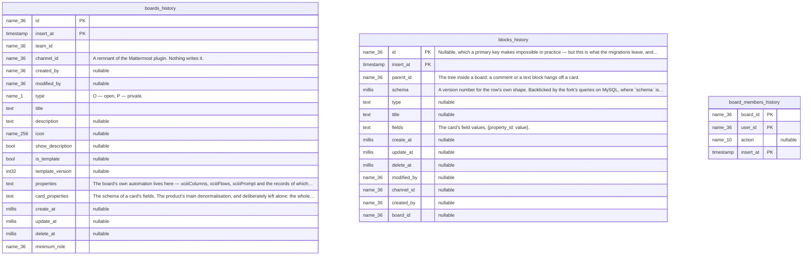
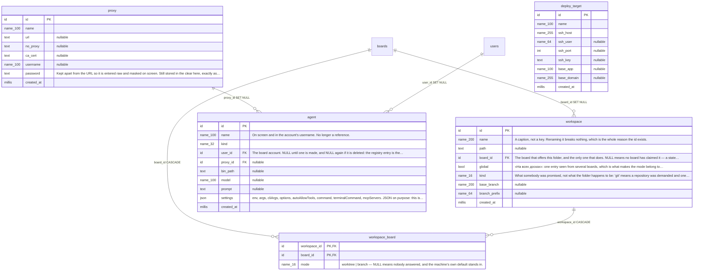
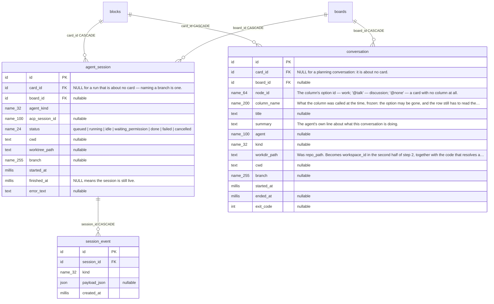
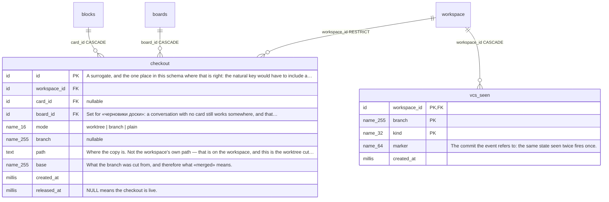
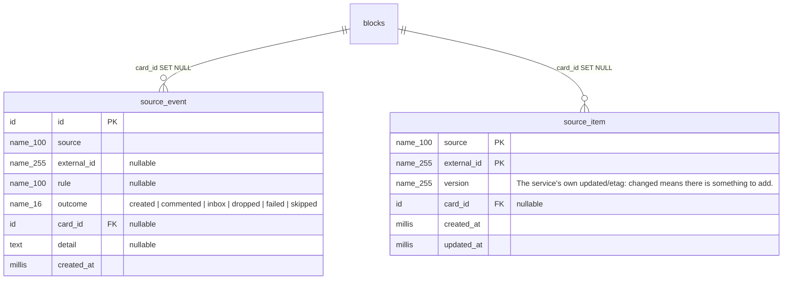
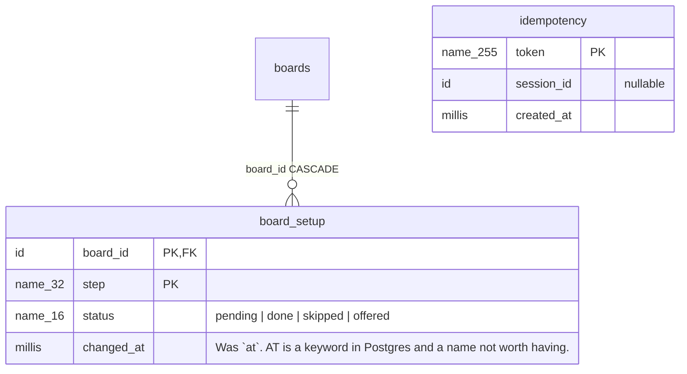

<!-- Generated by tools/schemagen. Do not edit by hand:
     change the schema in tools/schemagen and run `go generate ./tools/schemagen`. -->

# Схема базы, картинкой

Одна база — `xciii.db` — и в ней всё: таблицы доски (форк Focalboard) и
таблицы этого приложения. Схему держит `tools/schemagen` как Go-данные;
оттуда же и миграция для трёх диалектов, и эта страница, так что разойтись им
негде.

Читается это словами в `docs/db-erd.md` (что где лежит, чем что
адресуется и почему) и `docs/db-schema-review.md` (разбор решений).

Типы на схеме — не типы SQL, а то, что в колонке: `id`, `millis`
(момент в unix-миллисекундах), `name_36` (короткая техническая строка),
`json`, `text`. Как это ложится на SQLite, MySQL и Postgres — в
`tools/schemagen/types.go`.

Подписи у колонок английские, потому что это цитата: они взяты из
`tools/schemagen` слово в слово, а перевод был бы вторым описанием —
ровно тем, что эта страница и заводится, чтобы не заводить.

Где у колонки закрытый набор значений, он написан вместо подписи: это `CHECK` в
схеме, а не соглашение. Ставится он только там, где набор закрыт **моделью**
(три способа работать с папкой, жизненный цикл сессии), и не ставится там, где
это список, который растёт, — вид агента, имя события.

На стрелках написано, что происходит со строкой, когда исчезает то, на что она
смотрит. Ради этого таблицы и съехались в одну базу: пока их было три файла,
удаление карточки не могло убрать за собой ничего.

## Доска

Форк Focalboard. Всё содержимое доски — строки `blocks`: карточка,
вид, комментарий, вложение; дерево внутри доски — через `parent_id`.
Наша автоматика лежит в `boards.properties` (`xciiiColumns`,
`xciiiFlows`, `xciiiPrompt`, …) и в `blocks.fields` карточки, своих
таблиц у неё нет — потому и едет с доской при экспорте и переезде.

Внешних ключей здесь нет, и намеренно: у форка наследный soft-delete,
так что настоящий ключ сработал бы ровно на тех путях, где удаление
настоящее.

```mermaid
erDiagram

    boards {
        name_36 id PK
        timestamp insert_at
        name_36 team_id
        name_36 channel_id "A remnant of the Mattermost plugin. Nothing writes it."
        name_36 created_by "nullable"
        name_36 modified_by "nullable"
        name_1 type "O — open, P — private."
        text title
        text description "nullable"
        name_256 icon "nullable"
        bool show_description "nullable"
        bool is_template "nullable"
        int32 template_version "nullable"
        text properties "The board's own automation lives here — xciiiColumns, xciiiFlows, xciiiPrompt and the records of which…"
        text card_properties "The schema of a card's fields. The product's main denormalisation, and deliberately left alone: the whole…"
        millis create_at "nullable"
        millis update_at "nullable"
        millis delete_at "nullable"
        name_36 minimum_role
    }
    blocks {
        name_36 id PK "Nullable, which a primary key makes impossible in practice — but this is what the migrations leave, and…"
        timestamp insert_at
        name_36 parent_id "The tree inside a board: a comment or a text block hangs off a card."
        millis schema "A version number for the row's own shape. Backticked by the fork's queries on MySQL, where `schema` is…"
        text type "nullable"
        text title "nullable"
        text fields "The card's field values, {property_id: value}."
        millis create_at "nullable"
        millis update_at "nullable"
        millis delete_at "nullable"
        name_36 modified_by "nullable"
        name_36 channel_id "nullable"
        name_36 created_by "nullable"
        name_36 board_id "nullable"
    }
    board_members {
        name_36 board_id PK
        name_36 user_id PK
        name_64 roles "nullable"
        bool scheme_admin "nullable"
        bool scheme_editor "nullable"
        bool scheme_commenter "nullable"
        bool scheme_viewer "nullable"
    }
    users {
        name_100 id PK "nullable"
        name_100 username "nullable"
        name_255 email "nullable"
        name_100 password "nullable"
        name_100 mfa_secret "nullable"
        name_20 auth_service "nullable"
        name_255 auth_data "nullable"
        text props "nullable"
        millis create_at "nullable"
        millis update_at "nullable"
        millis delete_at "nullable"
    }
    sessions {
        name_100 id PK "nullable"
        name_100 token "nullable"
        name_100 user_id "nullable"
        text props "nullable"
        millis create_at "nullable"
        millis update_at "nullable"
        name_20 auth_service "nullable"
    }
    categories {
        name_36 id PK
        name_100 name
        name_36 user_id
        name_36 team_id
        name_36 channel_id "nullable"
        millis create_at "nullable"
        millis update_at "nullable"
        millis delete_at "nullable"
        bool collapsed "nullable"
        name_64 type "nullable"
        millis sort_order "nullable"
    }
    category_boards {
        name_36 id PK
        name_36 user_id
        name_36 category_id
        name_36 board_id
        millis create_at "nullable"
        millis update_at "nullable"
        millis sort_order "nullable"
        bool hidden "nullable"
    }
    sharing {
        name_36 id PK "nullable"
        bool enabled "nullable"
        name_100 token "nullable"
        name_36 modified_by "nullable"
        millis update_at "nullable"
    }
    subscriptions {
        name_10 block_type "nullable"
        name_36 block_id PK "nullable"
        name_10 subscriber_type "nullable"
        name_36 subscriber_id PK "nullable"
        millis notified_at "nullable"
        millis create_at "nullable"
        millis delete_at "nullable"
    }
    notification_hints {
        name_10 block_type "nullable"
        name_36 block_id PK "nullable"
        name_36 modified_by_id "nullable"
        millis create_at "nullable"
        millis notify_at "nullable"
    }
    file_info {
        name_36 id "Widened from the 26 the ladder declared, and the one place this schema deliberately differs from it. It was…"
        millis create_at
        millis delete_at "nullable"
        text name
        name_50 extension
        millis size
        bool archived "nullable"
        name_512 path "nullable"
    }
    preferences {
        name_36 userid PK
        name_32 category PK
        name_32 name PK
        text value "nullable"
    }
    teams {
        name_36 id PK "nullable"
        name_100 signup_token
        text settings "nullable"
        name_36 modified_by "nullable"
        millis update_at "nullable"
    }
    system_settings {
        name_100 id PK "nullable"
        text value "nullable"
    }
```

## История доски

Каждая правка дописывает строку. Механизм апстрима: undo этого
продукта живёт на странице (`webapp/src/undomanager.ts`), экрана
истории нет. `insert_at` — часть первичного ключа, и приходит он из
Go (`utils.NextInsertAt`), а не из часов базы: внутри транзакции
часы базы отдают всем строкам один и тот же момент.

## Реестры

Что знает эта машина: где работать, кем и куда публиковать. Были
массивами в `config.json`, где у записи не было id и ссылаться на
неё можно было только по имени — то есть нельзя было переименовать.

## Разговоры и сессии

Ось — карточка (`blocks.id`) и нода: id опции колонки, на которой
карточка стоит. Разговор переживает процесс, который его рисовал
(`claude --continue`), сессия — это один запуск и один вердикт;
поэтому таблицы две.

## Маршруты

Где карточка на маршруте, как она туда попала и почему стоит.
`card_stall` — одна текущая причина, а не журнал: «в колонке нет
места» верно только пока верно, и комментарий пережил бы её шумом.

```mermaid
erDiagram
    blocks ||--o{ card_stall : "card_id CASCADE"
    blocks ||--o{ flow_event : "card_id CASCADE"
    blocks ||--o{ flow_state : "card_id CASCADE"
    blocks ||--o{ stage_queue : "card_id CASCADE"
    boards ||--o{ flow_state : "board_id CASCADE"
    boards ||--o{ stage_queue : "board_id CASCADE"

    flow_state {
        id card_id PK, FK
        id board_id FK "nullable"
        id flow_id "The route the card is on. An id rather than the route's name, so renaming a route does not lose the place of…"
        name_64 node_id
        name_255 branch "nullable"
        text workdir_path "nullable"
        millis entered_at
    }
    flow_event {
        id id PK
        id card_id FK
        id flow_id "nullable"
        name_64 from_node "nullable"
        name_64 to_node
        name_32 on_kind
        text detail "nullable"
        text said "The agent's closing words: what a conversation is told instead of its task when the card comes back to it."
        millis created_at
    }
    card_stall {
        id card_id PK, FK
        name_64 node_id "nullable"
        name_32 kind "'conversation' is the one kind with somewhere to go: open the terminal. The rest have no button, which is why…"
        text reason
        millis created_at
    }
    stage_queue {
        id card_id PK, FK
        id board_id FK "nullable"
        name_128 column_key "board|option — the queue belongs to one column of one board."
        id flow_id "nullable"
        name_64 node_id "nullable"
        millis queued_at
    }
```

## Работа в папке

`checkout` — git-состояние: где копия, какая ветка, от чего
отрезана. Владелец — карточка либо доска («черновики доски»), ровно
одна из двух колонок заполнена; обычная папка не пишет строки вовсе.

## Входящие

Дедуп и журнал. `card_id` здесь `SET NULL`, а не `CASCADE`: решение
источника переживает карточку, которая из него вышла.

## Защёлки

Не сущности, а ответы «это уже сделано»: событие обработано, шаг
мастера пройден. Связей между собой у них нет.

