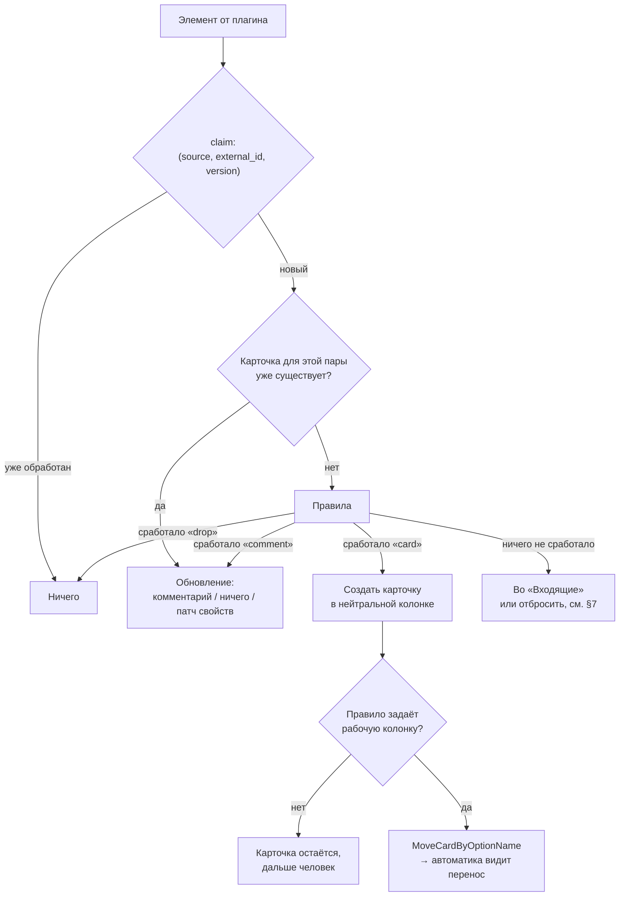

# Источники данных для карточек

Проект подсистемы, которая превращает внешние события в карточки: письма, issue,
уведомления с телефона. Кода по нему нет — это проектное решение до реализации.

Основное решение: **источник реализуется плагином, а не веткой в нашем коде**.
Между приложением и плагином — задокументированный протокол, поэтому плагин
можно написать на Go или на TypeScript, и не обязательно нам.

Смежные документы: [flows.md](flows.md) — что происходит с карточкой дальше,
[spec-acp.md](spec-acp.md) — ограничения на запись в доску.

## 1. Цель

Карточки создаются только вручную. Внешнее событие уже содержит заголовок,
текст, время и ссылку — то есть почти всё, что нужно карточке, и перенос делает
человек.

Второе: доска запускает агентов. Карточка из источника попадает в ту же
автоматику колонок и маршрутов, отдельного механизма для неё не нужно.

Основной сценарий — уведомление с телефона на бытовую доску. Приложение возит
шаблоны `home-chores` и `shopping-and-meals`
(`internal/boardadapter/templates/`), и на них подсистема нужна без пояснений:
пришло «Доставка приедет завтра с 10 до 14» — появилась карточка.

## 2. Термины

- **Источник** (source) — запись реестра, принадлежащая доске: почтовый ящик,
  телефон, репозиторий.
- **Элемент** (`Item`) — единица данных источника: одно письмо, одно
  уведомление, один issue.
- **Правило** (rule) — что делать с элементом: создать карточку, добавить
  комментарий, отбросить.
- **Плагин** — отдельный процесс, добывающий элементы одного вида.
- **Приложение** — сторона XCIII: реестр, правила, запись в доску, секреты,
  OAuth. В протоколе — `host`.

## 3. Вне области

- Обратная запись во внешний сервис (закрытие карточки не закрывает issue).
  Место в протоколе предусмотрено, реализации нет — см. §14.
- Хранение переписки. Элемент либо становится карточкой, либо нет;
  промежуточного хранилища сообщений не заводим.
- Маршруты. Подсистема доводит карточку до колонки, дальше действует
  [flows.md](flows.md).

## 4. Элемент

Всё входящее приводится к одному типу до обработки. Он же — словарь протокола.

```go
type Item struct {
    ExternalID string            // устойчивый id в пространстве имён источника
    Version    string            // etag/updated_at/хэш — меняется вместе с ним
    Title      string
    Body       string            // markdown, станет текстом карточки
    URL        string            // ссылка на оригинал
    At         time.Time
    Props      map[string]string // имена свойств карточки, в нижнем регистре
    Labels     []string          // для сопоставления в правилах
    Raw        json.RawMessage   // исходный payload
}
```

`ExternalID` идентифицирует объект, `Version` — его состояние. Та же схема
работает в наблюдателе за репозиториями: `vcs.Event.Marker` и комментарий над
ним — событие срабатывает повторно только при смене маркера. Источник отдаёт
**состояние**, а не изменение, поэтому без этой пары каждый опрос создавал бы
дубликаты.

Пара хранится в таблице `source_item(source, external_id, version, card_id, …)`.
Она же служит отображением «элемент → карточка», поэтому обновление элемента
попадает в ту же карточку.

`Raw` нужен для разбора инцидентов: когда формат источника изменится,
единственный способ понять, что пришло, — посмотреть исходный payload.

## 5. Запись реестра источника

```go
type SourceEntry struct {
    Name    string `json:"name"`    // ключ реестра
    Plugin  string `json:"plugin"`  // какой плагин её обслуживает
    BoardID string `json:"boardId,omitempty"`
    Global  bool   `json:"global,omitempty"`
    Enabled bool   `json:"enabled"`

    Config          map[string]string `json:"config,omitempty"` // поля плагина
    IntervalSeconds int               `json:"intervalSeconds,omitempty"`
    SecretRef       string            `json:"secretRef,omitempty"` // имя ключа
    Rules           []Rule            `json:"rules,omitempty"`
}
```

Структура повторяет `ProjectEntry` (`internal/acp/config.go`): реестр хранится
на машине, но запись принадлежит доске, на которой создана, и предлагается
только ей. Обоснование там же: каталог домашних заметок не нужен на доске про
код. Для источников то же самое — телефон с бытовыми уведомлениями не должен
появляться в списке доски разработки. `Global` — явное «предлагается на всех
досках»; доску запись всё равно называет, потому что карточку надо куда-то
писать, и глобальная запись без доски приходила в `CreateCard` с пустым id и
падала на каждом элементе, который брала.

Следствие: **вопрос «на какую доску создавать карточку» снимается**. Доска
задана записью источника, правило выбирает только колонку внутри неё. Иначе
понадобился бы перечень досок на стороне Go, которого сейчас нет, и указание
доски в каждом правиле.

**Исключение — когда человек стоит рядом.** Запись может разрешить элементу
назвать доску самому (`PickBoard`, `Item.BoardID`); по умолчанию нельзя, и
элемент, назвавший доску без разрешения, отклоняется, а не пишется молча на
доску источника. Разрешено это ровно для системного «Поделиться» (§24): там
доска — это и есть вопрос, который задают человеку, и он на него отвечает в
диалоге. Смысл правила «доску решает реестр» от этого не страдает: оно защищает
от плагина — чужого кода, — а не от человека, который смотрит на список досок.

CRUD — по образцу `agents.go` и `projects.go`: снимок под `cfgMu`, `Validate` с
нормализованной копией, запись файла через `persistConfigLocked`.

## 6. Конвейер обработки

Один путь независимо от источника элемента:



Весь конвейер выполняется на стороне приложения. Плагин в нём не участвует.

**Создание карточки не запускает автоматику.** Триггер реагирует только на
`notify.Update` с непустым `BlockOld` (`internal/boardadapter/events.go`); то же
записано в [flows.md](flows.md). Поэтому карточка создаётся в нейтральной
колонке и сразу переносится `MoveCardByOptionName` в рабочую — это настоящий
перенос с предыдущим состоянием, как это делает движок маршрутов
(`internal/acp/flowengine.go`).

Альтернатива — сформировать `CardMoved` из `notify.Add` — отклонена: наши записи
идут с `disableNotify=true`, чтобы агент не запускался на собственные правки;
понадобился бы отдельный путь записи с уведомлением и отдельное пространство
ключей идемпотентности, ради результата, который достигается двумя вызовами.

**Политика обновления** (элемент изменился, карточка существует):

- `comment` — по умолчанию: изменение добавляется комментарием, согласно
  [spec-acp.md](spec-acp.md) §7 («писать только комментариями, никогда не в
  описание карточки»);
- `ignore` — карточка создана один раз, дальше её ведёт человек;
- `patch` — перечитать отображение свойств (issue закрыт → свойство изменилось).

Описание карточки не перезаписывается никогда: его мог изменить человек.

## 7. Правила

Список на источник, по порядку, применяется первое совпавшее:

```go
type Rule struct {
    Name   string            `json:"name"`
    When   Match             `json:"when"`   // regexp по title, body, labels
    Then   string            `json:"then"`   // "card" | "comment" | "drop"
    Column string            `json:"column,omitempty"` // колонка своей доски
    Props  map[string]string `json:"props,omitempty"`  // "{{.URL}}"
    Agent  string            `json:"agent,omitempty"`
}
```

Подстановки — `text/template` по `Item`, намеренно без вычислений: правило
должно читаться через месяц после написания. Что не выражается правилом,
выражается агентом на карточке.

Правила выполняются приложением, а не плагином: иначе каждый автор плагина
определял бы свой синтаксис фильтров.

**Поведение по умолчанию различается по типу потока.**

Для API-источников несовпавший элемент попадает **во «Входящие»**. Молчаливое
отбрасывание делает подсистему неотлаживаемой: по пустой доске нельзя отличить
«источник молчит» от «источник отдаёт, но всё отбрасывается».

Для уведомлений — обратное: **всё несовпавшее отбрасывается**. Поток уведомлений
в основном шум, и доска из карточек «WhatsApp: 2 новых сообщения» бесполезна.
Здесь правило — подписка, а не фильтр.

Режим объявляет плагин через флаг `noisy` в capabilities, а не человек в
настройках: это свойство потока, а не предпочтение.

**«Входящие» — умолчание и для сработавшего правила.** Правило, не назвавшее
колонку, тоже отправляет карточку туда. Иначе свойство колонки осталось бы
незаполненным, карточка встала бы вне всех колонок доски, и нашёл бы её только
тот, кто догадался туда посмотреть, — та же потеря, ради которой инбокс и
заведён. Правило решает, **опознан** ли элемент, а не показан ли он.

Свойство, в котором живут колонки, у источника не задано по умолчанию: его
спрашивают у доски (`BoardWriter.ColumnProperty`). Константа тут была `Status`,
а все доски приложения называют это свойство «Статус», и несовпадение означало,
что по умолчанию не срабатывал ни один перенос. Поле `property` записи остаётся
— оно закрепляет ответ на доске, где догадка неверна.

## 8. Разделение приложение / плагин

Плагин делает одно: **отдаёт элементы**. Он не знает про доски, колонки,
карточки, правила и агентов, не пишет в БД и не обращается к `frontdoor.go`.

Три причины провести границу здесь.

1. **Плагин должен писаться не нами и не только на Go.** Это исходное
   требование, и оно исключает интерфейс Go как контракт: его нельзя
   реализовать на TypeScript. Контрактом может быть только протокол.
2. **Плагин не должен иметь доступа к записи в доску.** Элементы возвращает
   плагин, карточки создаёт приложение по правилам, которые видит человек. Тот
   же принцип действует у MCP-сервера деплоя: всё, к чему инструмент имеет
   доступ, передаётся через окружение, а не аргументом.
3. **Плагин не должен видеть лишние секреты.** OAuth ведёт приложение: у него
   браузер, слушатель редиректа и keychain. Плагин получает только access token
   своего источника — без refresh-токена и без чужих.

Чего разделение не даёт: песочницы нет, плагин — обычный процесс пользователя.
Установка плагина означает доверие ему в отношении машины, как сейчас настройка
MCP-сервера агенту. Ограничен доступ к доске, а не к машине.

## 9. Протокол плагина

Транспорт — **JSON-RPC 2.0 построчно по stdio**, как в ACP и MCP. Причина —
готовая инфраструктура: `procgroup.Spawn` (группа процессов, инъекция и удаление
переменных окружения, гарантированное завершение), реестр прокси
(`NetworkSettings`, `spawnEnv` — плагин за корпоративным прокси решается так же,
как агент), `tracepipe.go` — запись обмена в файл, без которой чужой плагин не
отладить. Отдельный HTTP-порт на плагин потребовал бы всего этого заново.

### 9.1. Инициализация

```
→ {"jsonrpc":"2.0","id":1,"method":"initialize","params":{
     "protocolVersion": 1,
     "source": {"name": "почта", "config": {"label": "INBOX"}},
     "credentials": {"accessToken": "…", "expiresAt": "2026-08-06T12:00:00Z"},
     "host": {"name": "XCIII", "version": "…"}}}

← {"jsonrpc":"2.0","id":1,"result":{
     "protocolVersion": 1,
     "capabilities": {"poll": true, "push": false, "cursor": true,
                      "noisy": false, "auth": "oauth2"}}}
```

`protocolVersion` — целое, как в ACP: приложение отказывается работать с
плагином, запросившим версию выше известной, и сообщает об этом пользователю.

`capabilities` определяют дальнейшее поведение: невыставленные возможности не
используются. `push` без `poll` — постоянно работающий процесс (например,
подписка на DBus); `poll` без `push` — опрос по расписанию; оба — и то, и
другое.

### 9.2. Методы, вызываемые приложением

| Метод | Результат | Когда |
|---|---|---|
| `initialize` | `{protocolVersion, capabilities}` | один раз при запуске |
| `poll` | `{items, cursor?, retryAfterSeconds?}` | по расписанию, если `poll` |
| `credentials/update` | `{}` | приложение обновило токен |
| `shutdown` | `{}` | завершение работы |

`poll` принимает `{"cursor": "…"}` — значение, возвращённое в прошлый раз.
**Курсор непрозрачен для приложения**, оно только хранит его. Плагин без
курсора (`cursor: false`) каждый раз отдаёт всё, что видит; от дубликатов
защищает `Version`.

`retryAfterSeconds` позволяет плагину переопределить расписание, когда сервис
ответил `429`.

### 9.3. Уведомления от плагина

| Уведомление | Параметры | Назначение |
|---|---|---|
| `items` | `{items}` | push-источник получил новые элементы |
| `log` | `{level, message}` | строка в журнал источника |
| `needsReauth` | `{reason}` | токен недействителен, нужен пользователь |

`items` содержит то же, что вернул бы `poll`, и обрабатывается тем же кодом.
Поэтому push и pull не расходятся в две подсистемы: они различаются только тем,
какая сторона инициирует обмен.

### 9.4. Ошибки

Стандартные коды JSON-RPC плюс `data.kind` из закрытого набора:

- `retryable` — сеть, `5xx`, таймаут: приложение удваивает паузу и повторяет;
- `needs_reauth` — то же, что уведомление, но в ответе на вызов;
- `bad_config` — неверное значение поля; `data.field` называет поле, UI его
  подсвечивает. Повтор бессмысленен до вмешательства пользователя.

Остальное трактуется как дефект плагина: источник останавливается с сообщением.

### 9.5. Манифест плагина

Плагин описывается одним JSON, который вставляется целиком — как MCP-сервер
агенту, где запись копируется из README сервера:

```json
{"name": "gmail",
 "title": "Почта Gmail",
 "protocolVersion": 1,
 "command": "npx",
 "args": ["-y", "@example/xciii-source-gmail"],
 "auth": {"type": "oauth2",
          "authorizationUrl": "https://accounts.google.com/o/oauth2/v2/auth",
          "tokenUrl": "https://oauth2.googleapis.com/token",
          "scopes": ["https://www.googleapis.com/auth/gmail.readonly"]},
 "fields": [{"key": "label", "title": "Ярлык", "type": "string",
             "default": "INBOX"}]}
```

`fields` — основное назначение манифеста: **по нему строится форма настройки**.
Без этого каждый источник требовал бы отдельного диалога в вебаппе, то есть
сторонний плагин был бы невозможен. Типы полей — закрытый набор (`string`,
`number`, `bool`, `select`, `secret`), как закрыт набор шагов мастера настройки
в `internal/acp/setup.go`; иначе манифест становится программой, а форма —
непредсказуемой.

`auth` описывает требования плагина, но авторизацию выполняет приложение: у
плагина нет ни браузера, ни keychain, ни слушателя редиректа.

## 10. SDK

Один протокол, две библиотеки; обе только сериализуют JSON-RPC, чтобы автор
плагина этим не занимался.

**Go** — пакет `sources/sdk` этого репозитория; плагин собирается в один бинарь
без внешних зависимостей:

```go
sdk.Serve(sdk.Source{
    Capabilities: sdk.Capabilities{Poll: true, Cursor: true},
    Poll: func(ctx context.Context, r sdk.PollRequest) (sdk.PollResult, error) {
        // r.Config, r.Credentials.AccessToken, r.Cursor
    },
})
```

**TypeScript** — пакет `@xciii/source-sdk` (`sources/sdk-ts`), запускаемый через
`npx`. Без зависимостей и без сборки: автору достаётся один файл, а `npx` должен
уметь запустить его пакет, ничего не собирая.

```ts
serve({
  capabilities: {poll: true, cursor: true},
  async poll({config, credentials, cursor}) {
    return {items: [...], cursor: next}
  },
})
```

Запуск через `npx` уже используется для ACP-адаптеров: сначала установленный
бинарь, иначе `npx --yes <пакет>` (`internal/acp/session.go`). Node.js для них
всё равно нужен, так что TS-плагин не добавляет нового класса зависимостей;
Go-плагину не нужно и этого.

## 11. Встроенные источники

Интерфейс на стороне приложения — точное отражение протокола, поэтому
встроенный источник реализует его в процессе, а внешний выглядит так же, но за
ним стоит подпроцесс. Логика переносится наружу и обратно без изменений.

## 12. Тесты на соответствие протоколу

В комплект входит отладочный клиент: программа, которая запускает плагин,
проводит его через инициализацию, опрос, обновление токена и завершение и
сообщает о несоответствиях теми же сообщениями, что и приложение.

Она же — наш тест протокола. Проверка со стороны автора плагина и проверка с
нашей стороны должны быть одной программой, иначе они разойдутся.

## 13. Ingest — встроенный источник

Первый источник реализуется без протокола плагинов: HTTP-эндпоинт для всего, у
чего нет своего плагина — скриптов, вебхуков через туннель, телефона.

```
POST /sources/ingest/{source}
Authorization: Bearer <токен источника>
Content-Type: application/json
```

Маршрут регистрируется в `newFrontDoor` (`frontdoor.go`) рядом с `/acp/` — это
единственное место регистрации маршрутов. В `sameOrigin` он **не**
оборачивается: вызывают его не со страницы, `Origin` будет чужой или
отсутствовать.

Кто именно вызывает, зависит от того, через какую дверь пришёл запрос, и защита
у них разная:

- **петлевая дверь** — локальные скрипты. Опознания там нет вообще, потому что
  до неё дотягивается только эта машина; токен источника нужен, так как
  дотянуться может любой процесс пользователя. Источник без токена не принимает
  ничего: пустой токен — это ненастроенный источник, а не открытый;
- **tailnet-дверь** (`tsnetdoor.go`) — телефон и всё, что вне машины. Она уже
  знает, кто звонит: `WhoIs` даёт идентичность в tailnet, и пропускается
  владелец узла плюс те, кого называет `allowedLogins`. Токен источника там —
  второй фактор, а не единственный.

Конверт — тот же `Item`, версионированный, так как клиентов пишем не только мы:

```json
{"v": 1,
 "id": "0|1234|com.example.delivery",
 "version": "2026-08-06T09:12:00Z",
 "title": "Доставка приедет завтра с 10 до 14",
 "body": "Заказ №123, курьер позвонит за час",
 "url": "https://…",
 "at": "2026-08-06T09:12:00Z",
 "props": {"app": "com.example.delivery", "channel": "delivery"},
 "labels": ["доставка"],
 "raw": {}}
```

Пакетная форма — `{"v": 1, "items": [ … ]}`: телефон, восстановивший связь,
отправляет накопленное одним запросом.

`id` необязателен: без него вычисляется хэш `title + body + at`. Это защита от
повторной отправки при потере ответа в мобильной сети — без устойчивого ключа
повтор создал бы вторую карточку. Ту же роль в ACP играет `ClaimIdempotency`.

### 13.1. Телефон

Своего сетевого механизма подсистема не заводит: путь с телефона уже есть и он
единственный поддерживаемый — tailnet-дверь. Приложение поднимается узлом
собственного tailnet пользователя и публикует там ту же входную дверь по TLS
(`tsnetdoor.go`), а `mobile/` — приложение для iOS и Android, которое является
окном в эту доску. Ingest едет по тому же адресу, что и страница.

Отдельный слушатель на своём порту в этом проекте был, и он отклонён — по
причинам, записанным в [plan.md](plan.md): порт доступен всему, что может до
машины дорутиться, и на нём нет ни идентичности, ни сертификата, ни постоянного
адреса, поэтому он потребовал бы собственного механизма привязки устройства. У
tailnet-двери всё это уже есть, и её пропуск — список идентичностей, которым
пользователь и так управляет, а не наш парный код.

Что остаётся подсистеме: **каждое устройство — отдельная запись реестра**, чтобы
отзыв одного телефона не отключал остальные и чтобы в журнале было видно
отправителя. Настраивается это в панели tailnet (`tailnetDialog.tsx`), а не
отдельным экраном привязки.

Собственный клиент отправки в этом заходе не пишется — фиксируется протокол. С
ним уже работают `curl`, iOS Shortcuts и Tasker.

### 13.2. Уведомления ОС

Конверт тот же, соглашение об именах отдельное: `props.app` — идентификатор
приложения (bundle id или package), `props.channel` и `props.category` —
группировка средствами ОС, `id` — ключ уведомления, чтобы его обновление не
создавало вторую карточку.

На настольных ОС сбор выполняет плагин, по одному на платформу. Стоимость
различается: на Linux — DBus, дёшево; на Windows — `UserNotificationListener` с
согласием пользователя; на macOS программного доступа к уведомлениям нет, только
обходные пути через хелпер с полным доступом к диску. Это дополнительный довод
за плагины: три платформы — три разные программы, которым нечего делать в одном
бинаре с доской.

На телефоне плагина быть не может — там нет наших процессов, кроме приложения из
`mobile/`. Значит уведомления Android собирает оно само
(`NotificationListenerService`) и отправляет на ingest по тому же адресу, куда
уже ходит за страницей. На iOS доступа к чужим уведомлениям нет ни у какого
приложения, поэтому там источник ограничен тем, что пользователь отправит сам
(Shortcuts, кнопка «поделиться»).

## 14. Привязка источника к доске

Три точки расширения, все существуют.

**Свойство доски `acpSources`** рядом с `acpColumns` и `acpFlows`
(`internal/acp/boardseed.go`). Шаблон объявляет нужные ему источники и приезжает
вместе с ними. Правило то же, что для колонок и маршрутов: это **исходное
заполнение, а не второй источник правды** — импортируется один раз, дальше
действует реестр. `shopping-and-meals` запрашивает телефон, `developer-tasks` —
нет.

**Шаг мастера настройки.** В закрытый набор `SetupStepDefs`
(`internal/acp/setup.go`) добавляется `{Kind: SetupStepSource, Registry:
"sources", Optional: true}`. Тогда вопрос про подключение телефона задаётся
только доске, которая его объявила. Обоснование записано в самом `setup.go`:
невозможный вопрос воспринимается как сломанная функция.

**Колонка «Входящие»** приезжает в шаблоне доски **и** доводится из Go до
досок, которые уже существуют. Здесь было записано, что хватит одного шаблона,
раз у шаблонов есть версия и маркер (`TemplateVersion`, `xciiiTemplate`), — это
неверно: `importTemplates` заменяет **шаблонную доску** в глобальной команде и
не трогает доски, из неё созданные. Колонка только в шаблоне была бы колонкой
для новых досок и ни для кого больше, то есть ровно для тех досок, у которых
источника ещё нет.

Поэтому `boardadapter.Writer.EnsureColumn` добавляет опцию, если доска её не
знает: при заведении источника — чтобы человек сразу видел, куда всё будет
падать, — и ещё раз перед записью, потому что именно эта запись обязана дойти.
Только добавление, без удаления, по той же причине, что и синхронизация свойств
реестра проектов: карточки ссылаются на опции по id, и снятая опция — это
карточка, потерявшая колонку.

**На канбане этой колонки не видно, и это намеренно.** Колонка обязана
существовать — карточка стоит в колонке, и автоматика срабатывает на смену
свойства, — но читают пришедшее не там, а в виде. Столбец непрочитанного
посреди работы — ровно то, вместо чего вид и заведён. Опция, которой нет ни в
`visibleOptionIds`, ни в `hiddenOptionIds`, рисуется (`webapp/src/
boardUtils.ts`), поэтому спрятать — значит назвать её в `hiddenOptionIds` и
убрать из `visibleOptionIds`: в шаблонах это записано прямо, на уже
существующих досках делает `hideFromKanban` при заведении инбокса.

**Человек же видит инбокс отдельным видом доски, а не колонкой.** Вместе с
колонкой заводится вид «Входящие» — таблица с фильтром по этой колонке
(`EnsureInbox`). Сайдбар и так перечисляет виды доски подпунктами под ней, рядом
с календарным и табличным, — то есть инбокс оказывается там, где человек ищет
часть доски, и непрочитанное не лежит посреди работы. На доске без источника нет
ни колонки, ни вида: туда ничего не приходит.

**Во «Входящих» карточки сгруппированы по тому, что их принесло.** Отдельного
свойства «Источник» для этого нет — карточку *создаёт* источник: у него есть
аккаунт на доске, ровно как у агента (`EnsureSourceUser`, тот же приём и то же
обоснование, что в `users.go` для агентов), поэтому «кто создал» — это ответ
самой доски, и группировать по нему она умеет из коробки
(`boardUtils.getPersonGroups` по `createdBy`, `CreatedByProperty.canGroup`).
Свойство `createdBy` заводится на доске, если его нет, — по тому же правилу
«только добавление» (`ensureAuthorProperty`, «Автор»).

Отсюда §17 меняется: свойство «Источник» (select) не нужно и не заводится —
это был бы второй ответ на тот же вопрос, да ещё и с синхронизацией опций с
реестром. «Ссылка» остаётся: это другой факт.

Аккаунт источника называется именем источника, а не «source-почта»: доска
показывает логин везде, где называет автора, в том числе в заголовках групп.
Плата — источник и агент с одним именем разделят личность; поэтому неудача с
аккаунтом не роняет запись карточки, она просто остаётся без автора.

Вид узнаётся по заголовку. Переименовали — следующая проверка заведёт второй; та
же плата, что и у всех остальных имён здесь, а альтернатива — поле-маркер в
блоке, о котором серверный модуль ничего не знает.

**Уйти из «Входящих» можно и на другую доску** — меню карточки, «Переместить на
доску…», и то же самое с телефона: у `/m` есть вкладка «Входящие», где карточка
переносится на доску и в колонку (`ListInbox`, `ListBoards`, `MoveCardToBoard` —
биндинги, потому что странице на телефоне не даётся собственный API доски). Это настоящий перенос: карточка сохраняет свой id, поэтому с ней
переезжают комментарии, а `source_item` продолжает указывать на неё, и
обновление того же письма комментирует переехавшую карточку. Свойства
переносятся **по именам**, чего у целевой доски нет — отбрасывается. Реализация
в серверном модуле (`MoveBlocksToBoard`, `app.MoveCardToBoard`, маршрут
`POST /cards/{cardID}/move`): через `InsertBlock` это не делается, его ветка
обновления привязана к паре `id AND board_id` и молча не находит строк.

## 15. OAuth

Реализации OAuth в репозитории сейчас нет, поэтому ниже — решения. Авторизацию
выполняет приложение; плагин объявляет требования в манифесте и получает готовый
токен.

**Десктоп** — по RFC 8252: PKCE, системный браузер (`OpenInBrowser` уже есть),
loopback-редирект. Слушатель редиректа поднимается **отдельный и только на время
авторизации**, не на `frontdoor.go`: её порт меняется при каждом запуске, и
пришлось бы делать исключения в `sameOrigin` и `hostGuard`.

Где провайдер поддерживает device flow (GitHub) — используется он: redirect URI
не нужен, случайный порт не мешает.

**Server-сборка** — редирект `<origin>/sources/oauth/callback`, адрес постоянный
и опубликованный. Это же единственное место, где отсутствие аутентификации
пользователя становится существенным: ingest без токена там не работает.

Защита в обоих случаях — `state` и PKCE.

**Обновление токена** — заблаговременно и однократно по `401`. Новый токен
передаётся плагину уведомлением `credentials/update`, без перезапуска процесса.
Неудача переводит источник в `needs-reauth`: опрос останавливается, пользователь
получает уведомление (§18).

## 16. Хранение секретов

Секреты у подсистемы двух разных видов, и хранятся они по-разному.

**Входящий токен ingest** приложение только проверяет — предъявлять его некому.
Поэтому в записи источника лежит не секрет и не ссылка на него, а `tokenHash`:
SHA-256 от токена. Файл реестра тогда не может утечь вместе с доступом, и
мигрировать при смене хранилища нечего. Хэш быстрый, а не bcrypt, потому что
токен — 256 бит из `crypto/rand`: перебирать нечего, а медленный хэш нужен там,
где пароль придумал человек. Сам токен показывается один раз, когда его выдали.

**Исходящие секреты** — то, что приложение предъявляет чужому сервису (токен
OAuth). Их приходится хранить как есть. В `SourceEntry` лежит `secretRef` — имя
ключа; значение — в хранилище:

```go
type Store interface {
    Get(key string) (string, error)
    Set(key, value string) error
    Delete(key string) error
}
```

Основная реализация — keychain ОС (macOS Keychain, Windows Credential Manager,
Secret Service на Linux). Запасная — файл `<dataDir>/secrets.json` с правами
`0600`, для headless-Linux, где Secret Service отсутствует. **Сейчас сделана
только запасная** (`internal/secrets`): keychain требует новой зависимости, а
её нельзя добавить, пока `replace` в `go.mod` указывает на отсутствующий
модуль. Интерфейс под неё уже тот, что нужен, — добавляется реализацией и
строчкой в цепочке.

Цепочка читается по порядку: сначала окружение, потом файл. Значение, положенное
в окружение, выигрывает намеренно — это осознанное действие и единственный
способ вообще не отдавать секрет приложению.

Запасной вариант хранит значения открытым текстом, и это указывается явно.
Шифрование ключом, лежащим на том же диске, защиты не даёт; `config.json`
сегодня так же хранит пароли прокси и `githubToken` и переводится в `0600`
явным `Chmod`.

Дополнительно — значение из окружения `XCIII_SOURCE_<NAME>_TOKEN`, по образцу
`GithubTokenValue()`: настроенное значение, иначе значение из среды.

Плагин секретов не хранит: получает токен в `initialize` и
`credentials/update`, держит в памяти, теряет вместе с процессом.

Побочный эффект `secretRef`: конфигурацию снова можно показывать, прикладывать
к отчёту об ошибке и смотреть в diff.

## 17. Изменения в `boardadapter`

`internal/boardadapter` — единственный пакет, импортирующий обе стороны; весь
новый доступ к доске идёт через него.

- **`CreateCard(ctx, boardID string, spec CardSpec) (string, error)`** — сейчас
  отсутствует: writer умеет комментировать, переносить и прикреплять файл, но не
  создавать. Реализация — `app.CreateCard` серверного модуля плюс блок
  `model.TypeText` для тела и правка `contentOrder`; двухшаговая запись уже
  реализована в `AttachFile`/`appendContent`.
- **Свойства «Источник» (select) и «Ссылка» (url)** — только добавление, без
  удаления, как в синхронизации реестра проектов: на опции могут ссылаться
  карточки.
- **`ColumnProperty(ctx, boardID) (string, error)`** — как доска называет
  свойство своих колонок: то, по чему группирует её вид, иначе первое
  select-свойство. Спрашивается, а не предполагается: константы «Статус» и
  "Status" обе неверны — каждая ровно для половины досок, какие бывают.
- **`EnsureColumn(ctx, boardID, property, option) (optionID, error)`** —
  добавляет колонку, если доски её не знает. Ради «Входящих» на доске, созданной
  до того, как инбокс появился: шаблоны до таких досок не доходят (§14).
- Перечень досок не нужен: доска задана записью источника.

Связь карточки с элементом хранится в `source_item`; свойства на карточке —
отображение для пользователя (видно происхождение, работают фильтры и
группировка). Конвейер их не читает, поэтому пользователь может их менять.

## 18. Размещение кода

- `internal/sources` — сторона приложения: реестр, БД (`sources.db` рядом с
  ACP-шной, той же структуры — `OpenStore` и идемпотентный `migrate()` без
  версий), конвейер, правила, расписание.
- `sources/protocol` — сами сообщения. Вне `internal` не по вкусу, а по
  необходимости: автор плагина обязан уметь назвать эти типы, а Go запрещает
  импортировать `internal` снаружи. Одно объявление на оба конца — иначе они
  разъедутся, и это ровно та поломка, ради которой пакет и выделен.
- `internal/sources/plugin` — запуск плагина: подпроцесс и разговор с ним, плюс
  проверяющий (`Check`).
- `sources/sdk` — библиотека для авторов Go-плагинов, и `sources/sdk/example` —
  плагин, который можно запустить.
- `cmd/sourcecheck` — проверяющий как программа: `go run ./cmd/sourcecheck --
  <команда плагина>`.
- `@xciii/source-sdk` — то же для TypeScript, отдельным пакетом и репозиторием.
- `docs/source-plugin-api.md` — спецификация протокола, когда он
  стабилизируется. До тех пор — §9 этого документа.

Не внутри `acp.Config` — основное решение после протокола. Источники должны
работать при **выключенной** агентской интеграции: карточки с телефона нужны и
без агентов.

## 19. UI

По образцу остальных реестров: `webapp/src/components/acp/sourcesDialog.tsx` из
меню доски, локальные сигналы, feature-detect биндингов, вызовы
`ListSources`/`AddSource`/`UpdateSource`/`RemoveSource`/`ConnectSource`. Слайс
стора не заводится: экраны этой части в сторе не живут.

Форма настройки источника **строится по `fields` манифеста**, а не пишется под
каждый источник. Новый источник не требует изменений в вебаппе.

Редактор правил — таблица «условие → действие». Правил на источник единицы.

Своего экрана привязки телефона нет: доступ с телефона настраивается в панели
tailnet (`tailnetDialog.tsx`), а диалог источника только показывает адрес, по
которому его ждут.

Строка состояния источника: последний опрос, последняя ошибка, `needs-reauth`,
состояние процесса плагина. Без неё неработающая интеграция диагностируется
только по логам.

Отдельный канал оповещения не заводится: `acp:attention` и
`attentionNotifications.tsx` уже существуют и доводят событие до уведомления;
`needs-reauth` — ровно этот случай. Новое событие подсистемы доставляется тем же
способом, что и события агентов, — сокетом `/acp/events/ws` (`agentEvents.ts`),
а не шиной Wails: шина доходит только до окон десктопного приложения, а доска,
открытая с телефона, не услышала бы ничего.

## 20. Журнал и обработка ошибок

Таблица `source_event`: что получено, какое правило сработало, в какую карточку
записано, какая ошибка — с ограниченным сроком хранения. Отвечает на вопрос
«почему ничего не произошло»; для маршрутов ту же роль выполняет `flow_event`.

Обмен с плагином пишется в файл по тому же переключателю, что и обмен ACP
(`tracepipe.go`).

Ошибки: `retryable` — в журнал, удвоить паузу; `needs_reauth` — остановиться и
уведомить пользователя; `bad_config` — не повторять, подсветить поле; аварийное
завершение плагина — перезапуск с той же паузой и отказ после нескольких подряд;
некорректный конверт на ingest — `400` с текстом, поскольку клиента пишет
человек.

## 21. Тестирование

Точки внедрения: протокол (фальшивый плагин в тестах приложения и отладочный
клиент в тестах плагина), `secrets.Store`, инъекция `*http.Client` и `BaseURL` —
по образцу `internal/vcs/github.go`, где тесты используют `httptest` и не ходят
в сеть.

Фальшивый плагин отвечает заготовленными сообщениями по образцу
`fakeagent_test.go`, который делает то же для ACP.

Правила — табличные тесты чистых функций. Маршрут — по образцу
`frontdoor_test.go`, включая запрос с чужого origin и запрос без токена. Новых
переменных окружения ради тестируемости не вводится.

## 22. Открытые вопросы

- **Автор или всё-таки свойство «Источник».** Сейчас происхождение карточки —
  это её автор: у источника аккаунт на доске, «кто создал» отвечает сама доска, и
  по нему же группируются «Входящие» (§14). Решение не окончательное, у него две
  настоящие цены. Первая: аккаунт — это участник доски, а участники попадают в
  выбор людей, поэтому «почта» видна там, где выбирают исполнителя, — а назначить
  на неё карточку нельзя. Вторая: `createdBy` доступен только для чтения, так что
  человек не может поправить происхождение, если оно записано неудачно; плюс
  источник и агент с одним именем разделят личность.

  Свойство-select «Источник» всех трёх не имеет, но заводит своё: опции надо
  синхронизировать с реестром и только добавлять — то есть на доске навсегда
  остаются источники, которых больше нет. Оба варианта одинаково переживают
  перенос на другую доску: карточка сохраняет id, а свойства едут по именам.

  Решать по тому, что окажется хуже на живой доске: лишнее имя в выборе людей
  или список мёртвых опций. Пока живём с автором — он не потребовал ни строчки
  новой машинерии.
- ~~**Мост в MCP.**~~ Решено, см. §25: адаптером оказался не плагин, а
  **манифест** — «какой инструмент считать списком» действительно нет откуда
  взять, поэтому это говорит манифест, и нового кода на сервис не пишется вовсе.
- **Доверие к плагину.** Сейчас его нет: сторонний процесс с правами
  пользователя. Нужны ли подпись, список разрешённых команд запуска или
  предупреждение при добавлении — открыто.
- **Обратная запись.** Закрытие карточки → закрытие issue, снятие уведомления. В
  протоколе есть место под обратный метод, но до появления нескольких плагинов
  неясно, что у них общего.
- **Вложения.** У элемента бывает изображение; `AttachFile` есть, политики
  размера и происхождения нет, плюс вопрос кодирования в протоколе.
- **Может ли необработанный элемент задать вопрос пользователю.** Механизм
  вопросов (`internal/acp/question.go`) доводит вопрос до уведомления.
  Альтернатива «Входящим», но легко вырождается в поток вопросов.
- **Шаблон карточки.** Нужно ли новой карточке получать значения свойств доски
  по умолчанию.
- **Удалённая доска.** Что делать с источником, чья доска удалена: отключать,
  откреплять (как открепляются проекты) или удалять.

## 23. Этапы

1. `CreateCard` в `boardadapter` — без него не работает ничего.
2. Сторона приложения: реестр, БД, конвейер, правила. Проверяется встроенным
   фальшивым источником.
3. Ingest — первый рабочий источник, без протокола плагинов.
4. UI и шаг мастера. С этого момента подсистема применима.
5. Протокол плагинов и запуск подпроцесса; первый плагин — уведомления Linux.
6. Отладочный клиент и `sources/sdk`.
7. Секреты и первый OAuth-плагин; `@xciii/source-sdk` вместе с ним.

## 24. Системное «Поделиться»

Сценарий: в Safari (или в любом приложении, которое умеет делиться ссылкой)
человек жмёт «Поделиться», выбирает XCIII, видит небольшое окно с списком
досок, выбирает доску — карточка появляется во «Входящих» этой доски.

Цепочка, снизу вверх:

1. **Расширение общего доступа** — `.appex` внутри `XCIII.app`
   (`build/darwin/share-extension/`). Оно ничего не знает про доски и не ходит
   в сеть: берёт URL и заголовок из `NSExtensionItem` и открывает
   `xciii://share?url=…&title=…`. Так сделано не для простоты, а потому что
   расширение — отдельный песочный процесс: чтобы показать список досок, ему
   понадобился бы адрес и токен приложения, то есть общий контейнер (App Group)
   и подпись командой разработчика. Открыть URL умеет любое расширение и без
   всего этого.

   Собирается `swiftc`, а не проектом Xcode: расширение — один файл, и
   .xcodeproj ради него означал бы вторую систему сборки в репозитории. Точка
   входа у расширения не своя — `-e _NSExtensionMain`, ровно то, что делает
   Xcode для extension-таргета. Подписывается **до** приложения: подпись
   покрывает вложенное, поэтому обратный порядок либо потерял бы entitlements
   расширения, либо сломал бы печать самого бандла (поэтому же у приложения
   больше нет `--deep`).
2. **Схема `xciii://`** — Wails v3 уже ловит запуск по URL и передаёт его
   первому экземпляру (`SingleInstance`, URL приходит в `Args`). Приложение
   открывает маленькое окно на своей же странице `/share?url=…&title=…`.
3. **Страница `/share`** — выбор доски, заголовок и заметка. Она же работает
   на телефоне и в браузере: страница обычная, а данные берёт через биндинги,
   как `/m`.
4. **`App.ShareItem`** — заводит при первом использовании источник
   «Поделиться» (`EnsureSource`) и отдаёт элемент в конвейер.

Почему через источники, а не прямой записью карточки: во «Входящие» ведёт
ровно один путь, и на нём уже есть колонка, вид, автор-источник, журнал и
запись `source_item`, из-за которой повторная отправка той же ссылки — не
вторая карточка. Плюс «Входящие» на телефоне перечисляют только доски, у
которых есть источник (§14), — карточка, записанная в обход, туда бы не попала.

Тождество элемента — пара «доска и ссылка»: та же ссылка на ту же доску
пропускается, и диалог об этом говорит («уже во Входящих»), а не делает вид,
что создал. Та же ссылка на другую доску — другой элемент: человек сделал это
намеренно, для того и выбирал доску.

## 25. MCP как источник

Существующих MCP-серверов много, и часть из них ходит ровно туда, куда ходил бы
источник: трекер, почта, календарь. §22 предполагал плагин-адаптер на каждый
такой сервер; на деле хватило **манифеста**.

Не хватает в MCP ровно одного: понятия «поток». Инструменты там описаны для
модели, и ничто не говорит, какой из них — список новых элементов. Зато это
прекрасно говорится в манифесте, который и так есть:

```json
{
  "name": "kaiten", "kind": "mcp",
  "command": "bun", "args": ["run", "server.ts"], "dir": "/путь/к/серверу",
  "tokenEnv": "KAITEN_TOKEN",
  "mcp": {
    "tool": "list_my_cards",
    "arguments": {"boardId": "{{.Config.boardId}}"},
    "itemsAt": "cards",
    "item": {"id": "{{.id}}", "version": "{{.updated}}", "title": "{{.title}}",
             "url": "{{.url}}", "props": {"Ссылка": "{{.url}}"}}
  }
}
```

Отображение — `text/template` по строке ответа, тот же язык, что у свойств
правила, и намеренно не больше: то, что умеет вычислять, — это программа в
конфиге, а размечается строка JSON с именами. Поля, которых нет, дают пусто, а
не `<no value>`: у чужого сервиса поля отсутствуют постоянно.

Дальше **ничто не знает, что это был MCP**: `dialPlugin` ветвится по виду
манифеста, а раннер, конвейер, правила и журнал видят один и тот же плагин.
Отсюда три вещи, которые мост делает сам, потому что MCP их не делает:

- **проверяет инструмент при подключении**, а не при первом опросе: манифест
  пишут руками, и «у kaiten нет list_my_cards, есть get_card, get_columns…» —
  это ответ, а опрос, падающий раз в пять минут, — нет;
- **читает отказ инструмента из успешного вызова** (`isError`): в MCP ошибка
  протокола — это ошибка протокола, а отказ инструмента — нормальный ответ,
  который должна прочитать модель;
- **передаёт токен переменной окружения, которую называет манифест**: места под
  credential в MCP нет, а имя переменной у каждого сервера своё.

Манифесты лежат в `<dataDir>/sources/manifests/*.json` и читаются при старте.
Не вкомпилированы: манифест называет абсолютный путь на этой машине (MCP-сервер
— файл здесь, и `bun run server.ts` из другого каталога ничего не найдёт,
отсюда `dir`), то есть машинно-независимого нечего возить. Битый файл —
сообщение в журнале и пропуск: приложение обязано подняться, чтобы было чем
сказать, что с ним не так.

Что из этого следует для добавления второго MCP-источника: положить JSON рядом
с первым. Кода — ноль.

**Kaiten** (`kaiten/`) — первый такой источник. У сервера не было инструмента,
возвращающего список, поэтому добавлен `list_my_cards`: он спрашивает Kaiten
дважды — где я ответственный и где я участник — и склеивает по id, потому что в
Kaiten это разные поля, а «назначено на меня» для человека одно.

## 26. Агент как источник

§25 — отображение: дёшево, детерминированно и работает, когда у сервиса есть
инструмент, возвращающий список. Когда его нет (только `search` и `get`), или
ответ меняет форму, или нужно суждение («только то, что реально требует меня»),
тот же MCP-сервер отдаётся **агенту**: `kind: "agent"`, и в манифесте вместо
`mcp` — `agent` с именем агента и задачей словами.

Ключевое: **агент не пишет в доску**. Ему дают ровно один наш инструмент,
`inbox/file_item` (`internal/sources/inbox`), который постит в ingest-маршрут
этого же источника. То есть всё, из-за чего инбоксу можно доверять, остаётся на
пути: правила, «Входящие», журнал и пара (source, external_id, version).

Из этой пары следует главное послабление: **агенту разрешено быть глупым**.
Промпт велит складывать всё подряд, а не решать, что новое, — потому что
«новое ли это» он как раз и определит неверно, а конвейер это знает точно.
Второе правило промпта — никогда не выдумывать id: выдуманный id это новая
карточка на каждый опрос.

Цена — сессия на каждый опрос, поэтому расписание задаёт человек, таймаут хода
десять минут (а не две, как у плагина), и по умолчанию реже, чем у плагина.
Токен приёма выдаётся на один ход (`IssueToken`), потому что открытым текстом
он уходит в чужой процесс.

Связь с `internal/acp` — один интерфейс `AgentRunner`, реализуемый в `main.go`:
пакет источников по-прежнему собирается и работает с выключенной агентской
интеграцией, а «поднять агента и провести ход» живёт там, где живут агенты
(`acp.Manager.RunInbox` — ход без карточки, без worktree и без комментариев).

## 27. Что дальше по манифестам

**Билдер манифеста в интерфейсе.** Сейчас манифест — файл, который человек
пишет руками; это нормально для второго MCP-сервера и плохо для десятого.
Задуманный ход:

1. человек вводит команду запуска MCP-сервера (и переменные окружения);
2. приложение поднимает его и показывает `tools/list` — что сервер умеет;
3. человек выбирает инструмент, который отдаёт карточки, и заполняет его
   аргументы (форма строится по `inputSchema` инструмента);
4. приложение вызывает инструмент и показывает **ответ** — как JSON-схему,
   выведенную из полученного, плюс сам пример;
5. человек размечает: какое поле — id, какое — заголовок, ссылка, версия. Здесь
   же решается, чем выражать разметку: сегодня это `text/template` по строке,
   и для «взять поле» этого хватает, но для «взять первый элемент массива» или
   «склеить два поля» язык вроде **JSONata** выразительнее — и он же
   декларативен, то есть не превращает конфиг в программу;
6. на выходе — тот же самый файл манифеста, который сегодня пишут руками.

Пункты 2–4 стоят дёшево: клиент MCP уже есть (`internal/sources/mcp`), он умеет
`tools/list` и `tools/call`. Дорогой и спорный — пятый: выбор языка разметки
менять потом будет больно, потому что на нём будут написаны все существующие
манифесты.

Смежное: **поля источника вместо констант в манифесте**. Уже сделано —
`env` манифеста и аргументы инструмента разворачиваются шаблоном по записи
источника, поэтому адрес чьего-то Kaiten, доска и пространство спрашиваются в
диалоге, а манифест один на всех.
