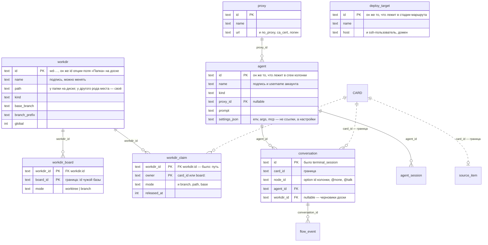

# Одно хранилище вместо четырёх

> План работ от 2026-08-16. Разбор, из которого он вырос, — `docs/model-graph.md`
> (граф связей и девять противоречий); что где лежит сегодня — `docs/db-erd.md`.
>
> Это план, а не описание. По мере выполнения шаги вычёркиваются отсюда и
> переписываются как описание в `model-graph.md`; когда вычеркнут последний,
> файл удаляется.

## Кратко

Сегодня данные лежат в четырёх местах: база доски, `acp.db`, `sources.db` и
`config.json`. Ссылки идут во все стороны, половина — по именам, и проверить их
нечем: между JSON-файлом и базой ограничений целостности не бывает.

Правило, к которому идём:

> **Хранилище ссылается внутрь себя.** Граница ровно одна и она объявлена: наши
> таблицы ссылаются на доску и карточку по id, а доска хранит наши id как
> непрозрачные значения и не толкует их. Ни одна ссылка ни в одну сторону не
> идёт по имени.

Работы четыре, и первые две друг от друга не зависят:

1. **Реестры перестают быть JSON** — папки, агенты, прокси и деплой-цели
   становятся таблицами с настоящим `id` и внешними ключами. Закрывает
   противоречия 2, 3, 8.
2. **`config.json` перестаёт называть колонки** — свойство колонок записывает
   доска, по id. Закрывает 1, 6, 9.
3. **`sources.db` въезжает в ту же базу** — один файл вместо трёх.
4. **Включить внешние ключи** — и решить правила удаления.

Не входит: перенос наших таблиц в базу доски. Почему — в конце.

## Целевая схема

Таблицы, которых это не касается и которые остаются как есть: `agent_session`,
`session_event`, `flow_state`, `flow_event`, `card_stall`, `stage_queue`,
`board_setup`, `vcs_seen`, `idempotency`, `source_event`.

Что **не** переезжает в таблицы: колонки, маршруты и стадии. Они живут в JSON
доски намеренно — едут вместе с доской, с её экспортом и с шаблоном
(`docs/templates.md`). Меняется только то, что внутри них лежит: вместо имён
агентов и целей — их id.

## Шаг 1. Реестры перестают быть JSON

**Что меняется.** `Workdirs`, `Agents`, `Proxies`, `Deploys` уходят из
`Config` (`internal/acp/config.go`) в таблицы (`internal/acp/store.go`).
Читатели переключаются на стор: `workdirs.go` (`Workdirs`,
`WorkdirsForBoard`, `AddWorkdir`, `WorkdirAt`, `resolveNamedWorkdir`,
`cardWorkdir`), `agents.go`, `deploys.go`, `workmode.go`, `proxy` в `agents.go`.
`persistConfigLocked` перестаёт быть способом сохранить запись реестра.

`workdir_claim` меняет ключ с пути на `workdir_id` — это единственное изменение
существующей таблицы, и оно же **закрывает противоречие 3**: перенесённая папка
не теряет claim'ы, а запись реестра перестаёт быть обязана быть каталогом на
диске.

`WorkdirEntry.Modes` (карта по board id) становится `workdir_board`.

**Составы колонок.** `ColumnSpec.Agents` и `FlowNode.AgentNames` начинают
хранить **id агентов**. Это правка JSON доски, значит: разовая переписка при
открытии доски — тем же приёмом, что `narrowWorkdirProperty` и
`retireAgentProperty` (`centerPanel.tsx`), — плюс редактор
(`automationEditor.tsx`, `automation.ts`) и `resolveSessionAgent`. Имя агента
по-прежнему показывается на экране и по-прежнему username аккаунта; ссылкой
быть перестаёт. **Закрывает 2 и, тем же движением, 8** (`DeployName` →
`deploy_target_id`).

**Миграция.** При старте: если в `config.json` есть непустые реестры, а таблицы
пусты — перенести строки и оставить ключи в файле нетронутыми (одна версия на
случай отката), затем удалить их следующим релизом. Тот же приём, что
`moveAutomationToBoards`. Первый шаг лестницы `PRAGMA user_version` (сегодня
проштамповано `1`, см. `docs/db-schema-review.md`).

**Чем проверяется.** Тест, что папка, у которой сменили путь, сохраняет claim.
Тест, что переименование агента не рвёт crew. Тест переноса из файла в таблицы
на конфиге прошлой версии.

## Шаг 2. `config.json` перестаёт называть колонки

**Что меняется.** Доска записывает `xciiiColumnProperty` — id свойства, на
котором живут её колонки, рядом с `xciiiProjectProperty` и
`xciiiBranchProperty`. Брать его есть откуда: у каждой записи `xciiiColumns`
уже есть `propertyId`, и шаблоны его везут. `columnMatchesCard`
(`internal/acp/terminal.go`), `triggerProperty` и `FlowEntry.PropertyOr`
(`flowengine.go`) сверяют id вместо имени. **Закрывает 1.**

`TriggerColumn`, `DeployColumn`, `TestColumn`, `TestPassColumn`,
`TestFailColumn` — не ссылки, а заготовки для создания доски, и жить им у того,
кто доски создаёт: у шаблонов, которые свои колонки и так называют.
`migratedColumns` (`columns.go`) становится разовым импортом старых установок и
удаляется вместе с ключами. **Закрывает 9.**

`BoardPrompts` (карта по board id) снимается после того же переноса — на доске
это уже есть как `xciiiPrompt`.

Когда поле «Папка» останется единственным способом сказать, где работать,
уходят `project_path`/`repo_path` из `cardWorkdirPathProps` (`workdirs.go`).
**Закрывает 6.**

**Миграция.** Доска без `xciiiColumnProperty` получает его при первом открытии
из `xciiiColumns[0].propertyId`; доска, у которой и колонок нет, не получает
ничего и остаётся доской без автоматики — что уже сегодня верно для
большинства досок.

**Чем проверяется.** Тест, что доска, у которой свойство колонок названо не
«Статус», работает. Тест, что переименование свойства ничего не ломает.
`templates_test.go` — что каждый шаблон везёт `xciiiColumnProperty`.

## Шаг 3. `sources.db` въезжает в ту же базу

`internal/sources/store.go` перестаёт открывать файл сам (`OpenStore(path)`) и
принимает готовый `*sql.DB`; `main.go` открывает одну базу и раздаёт хендл
обоим пакетам. Независимость `internal/sources` от `internal/acp` — это
независимость пакетов, а не файлов: таблицы у него свои, импортов между ними
по-прежнему нет.

Файл переименовывается `acp.db` → `app.db`: он давно не только про acp. Разово,
при старте, если старого имени файл есть, а нового нет.

## Шаг 4. Включить внешние ключи

`PRAGMA foreign_keys = ON` — в SQLite это настройка **соединения**, так что она
идёт в DSN рядом с `_busy_timeout` и `_journal_mode` (`store.go:52`). Если к
этому моменту уже случился переезд на `modernc.org/sqlite` (`docs/sql-plan.md`,
пункт 3), параметр называется иначе — проверить.

Правила удаления — вопрос продукта, а не техники, и сейчас его некому задать:

- удаление папки, в которой карточка работает, должно **отказывать**
  (`RESTRICT`), а не оставлять осиротевший claim;
- отпущенный claim уходит вместе с папкой (`CASCADE`);
- удаление агента, на которого ссылается разговор, — `SET NULL`: разговор
  состоялся, и запись о нём переживает того, кто его вёл.

## Чего в плане нет

**Переезда наших таблиц в базу доски**, хотя «одна база» звучит именно так.
`internal/boardadapter` — единственный пакет, импортирующий обе стороны, и этот
шов существует затем, чтобы доску можно было заменить. Настоящий FK из наших
таблиц в `blocks(id)` его сваривает, а наша схема уезжает в лестницу миграций
форка. Поэтому одна база **наша**, а доска остаётся чужой системой, к которой мы
обращаемся по id, — это же то, что позволяет карточке переезжать между машинами
и досками.

**Противоречий 4 и 5** (маршрут ключуется именем; у стадии два ключа на одну
колонку). Они целиком внутри JSON доски, хранилищ не касаются и делаются когда
угодно.

**Противоречия 7** (начатую работу нельзя продолжить на другой машине).
Идентификаторами оно не чинится: чтобы продолжить, на второй машине должна
оказаться та же папка. Разговор об этом имеет смысл начинать после шага 1,
когда «папка» перестанет означать «путь».

## Побочная выгода, которую стоит назвать

Сегодня «сделать бэкап работы» — это три файла базы плюс JSON, и согласованными
между собой они бывают только случайно. После шага 3 это один файл.
