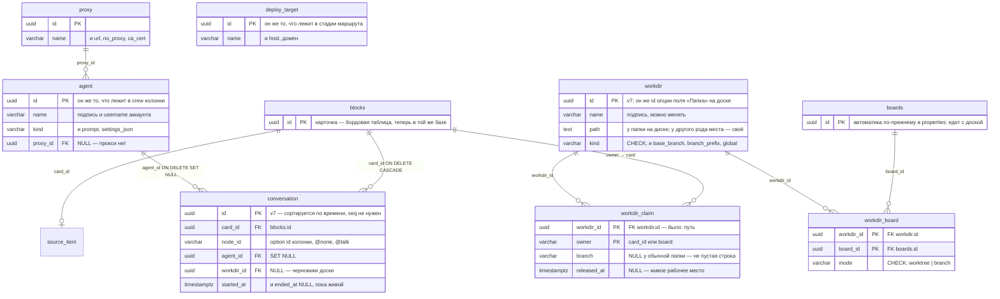

# Одна база

> План работ от 2026-08-16, переписан в тот же день после возражения «при чём
> тут форк». Разбор, из которого он вырос, — `docs/model-graph.md` (граф связей
> и девять противоречий); что где лежит сегодня — `docs/db-erd.md`.
>
> Это план, а не описание. По мере выполнения шаги вычёркиваются отсюда и
> переписываются как описание в `model-graph.md`; когда вычеркнут последний,
> файл удаляется.
>
> **Сделано 2026-08-17: шаг 1** — наши таблицы въехали в базу приложения
> (миграция `000041_app_tables`), с внешними ключами в `CREATE TABLE`. Вместе с
> ним: движок миграций (ниже), переливка старых файлов и три решения по именам.
> Шаг 0 отделён от шага 1 — почему, сказано там же.

## Что уже сделано

**Шаг 1 — наши таблицы в базе приложения.** `internal/acp/store.go` и
`internal/sources/store.go` больше не открывают файлов: `NewStore(db, prefix)`
принимает готовый `*sql.DB` — тот же, что держит бордовый стор, и на SQLite это
буквально одно соединение (`SetMaxOpenConns(1)`). DDL — миграция
`000041_app_tables`, рунга на бордовой лестнице, а не лестница своя. Старые
`acp.db` и `sources.db` читаются один раз при старте
(`acp.ImportLegacyStore`, `sources.ImportLegacyStore`) и переименовываются в
`*.migrated`; удаляет их человек.

Заодно то, что дальше было бы дороже:

- `terminal_session` → **`conversation`**: понятие переименовалось давно, теперь
  и таблица;
- `idempotency.key` → `token` (в MySQL `key` зарезервировано),
  `board_setup.at` → `changed_at` (в Postgres `AT` — ключевое слово),
  `repo_path` → `workdir_path`, `vcs_seen.project` → `workdir_path`,
  `workdir_claim.workdir` → `workdir_path`;
- **автоинкрементов не осталось**: `session_event`, `flow_event` и
  `source_event` получают UUIDv7 текстом, и `ORDER BY id` по-прежнему значит
  «по порядку». `session_event.seq` ушёл вместе с ними — это был тот же факт
  вторым способом;
- **отсутствие — это NULL**, а не пустая строка, у всего, на что смотрит
  внешний ключ: `card_id` разговора-планирования, `board_id`. Читается через
  `COALESCE(...,'')` — формат хранения и формат Go не обязаны совпадать.

Чего шаг 1 **не** сделал: внешние ключи написаны, но не включены. Это шаг 4, и
он отдельный ровно потому, что до него надо перевести на NULL остальные пустые
строки и решить про `PRAGMA foreign_keys` в DSN (имя параметра зависит от
драйвера, см. `docs/sql-plan.md`, пункт 3).

## Движок миграций: Atlas генерирует, golang-migrate исполняет

Вопрос был: можно ли взять движок, чтобы не писать различия диалектов руками.
Ответ разложился на два разных вопроса, и у них разные ответы.

**Кто исполняет — остаётся golang-migrate.** Он уже здесь и уже умеет три вещи,
которые не бесплатно переписать: перенос записи от прошлого движка
(`db_migrations` → `schema_migrations`), снятие «грязной» пометки без человека —
здесь некого спросить, это доска на столе, — и вклинивание форковых
data-миграций на конкретных версиях (14, 20, 35).

**goose тут ничего не решает, и это стоит записать, потому что вопрос
возвращается.** Да, в goose можно писать миграции на Go:
`AddMigrationContext(up, down func(ctx, *sql.Tx) error)`. Но Go — это только
язык, на котором ты зовёшь `tx.Exec`: goose не разбирает и не переводит строку,
которую ты ему дал. Весь его диалектный слой — это интерфейс `database.Store` из
семи методов (`Tablename`, `CreateVersionTable`, `Insert`, `Delete`,
`GetMigration`, `GetLatestVersion`, `ListMigrations`), и все семь про **его
собственную таблицу версий**, а не про твою схему. `SetDialect("mysql")`
выбирает реализацию этого интерфейса и не трогает ни байта DDL.

Нагляднее всего это видно в самом goose: ему нужна одна таблица
`goose_db_version` в четыре колонки — и он пишет её руками двенадцать раз, в
`internal/dialects/{sqlite3,mysql,postgres,…}.go`, потому что абстракции, которая
сделала бы это за него, у него нет. То есть «три диалекта на Go» в goose — это
`switch` по диалекту у каждого `CREATE TABLE`: те же три ответа руками, просто
переехавшие из шаблона в Go.

**Кто пишет DDL — `ariga.io/atlas`, через Go SDK.** `tools/schemagen` держит
схему один раз, как Go-данные с абстрактными типами (`ID()`, `Name(n)`,
`Text()`, `JSON()`, `Millis()`), и рендерит `000041_app_tables.{up,down}.sql` для
всех трёх. Atlas берёт на себя ровно то, что руками пишут неправильно: кавычки
(бэктики / двойные), `character varying` в Postgres, индексы **внутри**
`CREATE TABLE` у MySQL и рядом с ней у остальных, синтаксис внешних ключей,
`CHARSET utf8mb4 COLLATE utf8mb4_general_ci`, без которого кириллица
превращается в вопросительные знаки. Различий остаётся ровно одно место — таблица
типов на диалект, и она в `render.go`.

Сгенерированный SQL **лежит в репозитории**: его видно в ревью, на него ругается
миграция, когда падает, и `go test ./tools/schemagen` не даёт ему разойтись со
схемой. Приложение atlas не линкует — это зависимость сборки, не рантайма
(11 модулей в графе).

То есть `tools/schemagen` — это и есть «описать схему на Go и получить три
диалекта», о чём и был вопрос про goose. Разница не в языке, а в том, что знание
про диалект лежит в одной таблице типов, а не в `switch` у каждого
`CREATE TABLE`.

**Генерировать на старте, а не в файл — можно, и goose для этого тоже не нужен.**
`migrationSource.renderMigration` уже собирает тело миграции в Go (сейчас
`text/template`); туда же можно позвать планировщик atlas с живым диалектом. Не
сделано по трём причинам: atlas стал бы зависимостью **рантайма** и приехал бы в
десктопный бинарник (hcl, go-cty, 36 модулей); то, что исполняется, перестало бы
быть видно в ревью; и упавшая миграция называла бы оператор, которого никто не
записывал. Сгенерированный SQL в репозитории — это то, что читает человек, у
которого база не открылась.

**Что это стоит в зависимостях, в пакетах на сборку** (замерено 2026-08-17,
`go list -deps` на модуле, импортирующем только нужные подпакеты):

| | пакетов | где |
|---|---|---|
| golang-migrate (наши шесть подпакетов) | 221 | **рантайм** |
| atlas (`sql/{migrate,schema,sqlite,mysql,postgres}`) | 170 | сборка |
| goose | — | не берём |
| bun (три диалекта) | 150 | не берём, см. ниже |

Из чего следует неприятное: **самая тяжёлая из трёх — та, что уже стоит, и
стоит в рантайме.** golang-migrate тянет драйверы ко всему на свете, а нам нужны
три. Разговор «зачем нам ещё и atlas» на самом деле должен звучать наоборот:
зачем нам golang-migrate — и ответ у него есть только до шага 0. После
схлопывания миграция одна, вклинивать между версиями нечего, а «перенести запись
прошлого движка» превращается в «отказаться открывать базу старой схемы» — то
есть исполнитель сжимается до «если таблица версий пуста, выполнить один
скрипт». Это либо `migrate.Executor` у самого atlas (он есть:
`NewExecutor(drv, dir, rrw)`), либо ~80 строк своих. В обоих случаях 221 пакет
уходит из дерева. Записано здесь, чтобы шаг 0 не забыл про это: он не только
про типы.

**Почему не bun** (проверено спайком, а не по документации). bun умеет
`NewCreateTable().Model(...)` и типы по диалектам — на SQLite он выдаёт
осмысленный `CREATE TABLE`. Дальше две стены. Внешний ключ у него — **сырая
строка** (`ForeignKey(\`("card_id") REFERENCES "blocks" ("id") …\`)`), то есть
кавычки пишет человек, и на MySQL они уже неверные: ровно то различие, от
которого уходим. И главное: `mysqldialect.Init` делает `SELECT VERSION()` на
живой базе, поэтому **сгенерировать MySQL-DDL без запущенного MySQL нельзя** —
`bun.NewDB(nil, mysqldialect.New())` падает с nil pointer. Для генератора,
который должен работать в CI и на ноутбуке, это дисквалификация. (`pgdialect`
офлайн работает, `sqlitedialect` тоже.)

**Атлас окупается второй раз на шаге 0.** План требует не писать конечный DDL
руками, а «снять с базы, прогнанной по всем 40 шагам, и сравнить схему свежую
против прогнанной». Atlas умеет и `Inspect` живой базы, и `Diff` двух схем —
это ровно та проверка, и своего эмиттера на 250 строк она бы не дала.

**Почему не свой эмиттер на 250 строк** — вариант живой, и он единственный с
нулём зависимостей. Против него один довод, зато решающий: MySQL и Postgres мы
здесь не запускаем и проверить на них нечем, а писать различия для баз, которых
у тебя нет, — это в точности та ошибка, ради которой всё затевалось. Если
диалекты когда-нибудь выкинут (приложение и так `DBType: "sqlite3"`
намертво), довод исчезает вместе с ними, и тогда генератор не нужен вовсе.

**Почему не ent.** `docs/schema/ent.md` уже взвесил: он не заменит бордовый стор
(squirrel, три диалекта, две сотни запросов), значит получается **два слоя
доступа к одной базе** плюс ~30 тыс. сгенерированных строк. За это покупается
типизированный слой для наших пятидесяти методов — не сделка. `docs/sql-plan.md`
пункт 4 отказал ORM по тем же цифрам.

**Почему не HCL как источник.** `docs/schema/app.hcl` остаётся снимком для
чтения: HCL у Atlas диалектно-зависим (там тоже `blob` против `uuid`), так что
одним файлом три базы не описать, а три файла — это те же различия руками, только
в другом синтаксисе. Go-описание типов абстрактно, а конкретика живёт в одном
`switch` на диалект.

## Три решения по именам

**`workdir` пока остаётся `workdir`, но имя уже решено — применяется в шаге 2.**

Сначала переименование было отвергнуто: `workspace` занят соседним понятием
(`Workspace` в `workspace.go` — то, что папка **выдаёт**), и обмен двух
устоявшихся терминов местами сделал бы неверным каждый комментарий про них.
Возражение снялось, когда нашлось имя для второго понятия, и оно не «место», а
**VCS**: `Cwd`, `Branch`, `Base`, `Mode` — это git-состояние, а не адрес.

Решение на шаг 2:

- **`workspace`** — запись реестра, названное место, где может идти работа.
  Сегодня папка, завтра репозиторий для клонирования, диск, машина по ssh. На
  ней же лежат git-**настройки**: `kind` (plain|git), `base_branch`,
  `branch_prefix`, режим по доскам (worktree|branch);
- **`checkout`** — то, что workspace выдаёт одному владельцу: каталог, ветка,
  база, режим. git-**состояние**. Таблица `checkout` вместо `workdir_claim`.

Что делает `checkout` не натяжкой, а описанием: **у обычной папки строки нет
вообще.** `ClaimWorkspace` при `WorkModePlain` ничего не создаёт и ничего не
записывает, так что в таблице всегда и только git-копии — это уже сказано в
комментарии к `WorkspaceClaim`, просто имя об этом молчало.

Почему не `project`, хотя стореджи уже так и говорят (`config.json` → `projects`,
доска → `xciiiProjectProperty`, карточка → `project_path`): слово убрано
сознательно и по продуктовой причине — папка с домашними заметками не проект, и
от этого слова каждая доска со списком покупок выглядела так, будто ей чего-то
не хватает (CLAUDE.md). Причина была про **экран**, а экран в любом случае
говорит «папка»; но код и экран должны звать вещь одинаково, иначе разработчик
читает два разных продукта.

**Переименование делается внутри шага 2, а не отдельным проходом**: там эти
колонки и так переписываются (`workdir_claim.workdir_path` → `workspace_id`,
`vcs_seen.workdir_path` → `workspace_id`), так что имя меняется один раз, а не
два. Колонки, которые врали *сейчас*, уже переименованы: `project`, `repo_path` и
`workdir` в ключе — все стали `workdir_path`, потому что путь там и лежит.

**`conversation` и `agent_session` не сливаются.** Общего у них — карточка, узел,
агент, каталог, ветка, начало и конец; различие одно, и оно несущее:
**разговор переживает любой процесс, который его рисовал** (его возобновляют,
`--continue`, `restartFresh`), а сессия — это один запуск и вердикт. То есть
`conversation : процесс = 1 : N`, а `agent_session : процесс = 1 : 1`. Слияние
дало бы шесть колонок, заполненных у одной половины строк, и статус, который у
разговора ничего не значит. Настоящее направление другое и оно уже идёт:
агентские стадии стали терминалами (`stageRunsInTerminal`), и `agent_session`
сжимается до того, что и правда протокол — деплой, тест, именование ветки.
Записано в `docs/deferred.md`.

**Шаг 0 отделён от шага 1.** План говорил делать их вместе, и довод был верный:
внешний ключ на SQLite пишется только в `CREATE TABLE`. Но наши таблицы в
миграции 000041 **и так создаются заново**, так что их ключи написались без
всякого схлопывания; схлопывание нужно только ключам *между бордовыми*
таблицами, которых сегодня нет и которые не про утечку.

А вот что схлопывание требует по-настоящему — это чтобы **типы совпали**: MySQL
отказывает во внешнем ключе между колонками разных типов, поэтому `card_id` у
нас обязан быть тем же `VARCHAR(36)`, что `blocks.id`. Значит переход на UUIDv7
и на настоящий timestamp — это одна неделимая правка бордового стора (154
упоминания `create_at`/`update_at` в 27 файлах), webapp (`Utils.createGuid`) и
history-таблиц. Делать её «заодно» нельзя, и делать её раньше, чем починена
утечка, незачем.

## Кратко

Данные лежали в четырёх местах: база доски, `acp.db`, `sources.db` и
`config.json`. Ссылки шли во все стороны, половина по именам, и проверить их
было нечем.

Целимся в **одну базу** и один файл настроек, который ни на что не ссылается и
на который ничто не ссылается.

Правило:

> **Ссылка — это внешний ключ.** Всё, на что можно сослаться, лежит в одной
> базе и имеет `id`. Файл настроек хранит только то, на что не ссылается никто.
> По имени не ищется ничего.

Работы, по порядку:

1. ~~**Наши таблицы въезжают в базу приложения**~~ — сделано 2026-08-17:
   миграция `000041_app_tables`, ключи на `blocks` и `boards` написаны, старые
   файлы перелиты. Осталось три базы → две (доска и `config.json`).
2. **Реестры перестают быть JSON** — папки, агенты, прокси, деплой-цели
   становятся таблицами с `id`. Закрывает противоречия 2, 3, 8.
3. **`config.json` перестаёт называть колонки и пути** — свойство колонок
   записывает доска, по id. Закрывает 1, 6, 9.
4. **Включить внешние ключи** — включая ссылку на карточку. Сами ключи уже в
   DDL; здесь — `PRAGMA foreign_keys` и перевод оставшихся пустых строк в NULL.
0. **Схлопнуть миграции в одну и переназначить типы** — последним, а не первым:
   `ALTER TABLE ADD CONSTRAINT` на SQLite не существует, но наши таблицы и так
   создаются заново, так что ключи это не блокирует. Здесь id становятся
   UUIDv7, а время — настоящим timestamp, **у нас и у доски одновременно**.

## Почему одна, хотя в прошлой редакции было две

Прошлая редакция оставляла нашу базу отдельно от бордовой и объясняла это швом
`internal/boardadapter`: он единственный импортирует обе стороны, и это затем,
чтобы доску можно было заменить. Аргумент не выдержал двух проверок.

**Заменить доску нельзя, и никто не собирается.** Форк — это не только
`server/`: webapp тот же форк. «Заменить бордовый бэкенд» означает заменить
продукт. Это не требование, это фраза, оставшаяся от времени, когда доска была
чужим репозиторием рядом.

**Границы модулей Go — про импорты, а не про схему.** То, что
`internal/sources` не импортирует `internal/acp`, ничего не говорит о том, в
одном ли файле лежат их таблицы. Таблицы могут принадлежать модулям логически и
жить в одной базе; я это уже признал для `sources.db` и не довёл мысль до конца.

**И есть довод против разделения, который я не привёл, потому что не проверил.**
Удаление карточки в бордовой базе — настоящий `DELETE FROM blocks` (копия
уезжает в `blocks_history`), а не мягкий флаг. Наши таблицы об этом не узнают
никогда: `EventsBackend.BlockChanged` обрабатывает только `notify.Update`. То
есть **сегодня удалённая карточка навсегда оставляет за собой** строки в
`terminal_session`, `workdir_claim`, `card_stall`, `flow_state`, `stage_queue` и
`source_item`. Это не гипотетическая целостность — это текущая утечка, и
разделение на файлы её и создаёт. `blocks` имеет `PRIMARY KEY (id)` с миграции
000025, так что `ON DELETE CASCADE` возможен и сработает.

## Типы: раз уж схема пишется заново

Схлопывание миграций — это единственный момент, когда типы можно переназначить
целиком, включая бордовые таблицы. Дальше он не повторится.

### Идентификаторы

Сегодня это `VARCHAR(36)`, а внутри — одна буква рода (`c` карточка, `b` доска,
`a` блок) плюс base32 от шестнадцати случайных байт: 27 символов
(`server/utils/utils.go`, `Utils.createGuid`). Букву никто не разбирает, она
досталась от Mattermost.

**Важное свойство, которое нельзя потерять: id выдаёт клиент.** Страница создаёт
карточку с уже готовым id и отправляет её на сервер; на этом стоит и оптимистичный
рендер, и undo (`createPatchesFromBoardsAndBlocks` шлёт патчи по id). Поэтому
**целочисленный суррогатный ключ — неправильный ответ**, каким бы «нормальным»
он ни выглядел: `BIGINT AUTO_INCREMENT` знает только база, а значит появляется
круг «вставь → узнай id → дорисуй», которого сейчас нет. Это была бы переделка
webapp, а не схемы.

Правильный ответ — **UUIDv7**. Это ровно то, что там уже лежит (128 бит от
клиента), только в общепринятом виде и с одним добавленным свойством:

- **упорядочен по времени** — индекс не разъезжается при вставке, и, что важнее
  для нас, `flow_event` и `session_event` можно сортировать по id, как они
  сортируются сейчас. Значит **три спеллинга автоинкремента просто исчезают**
  вместе с самими автоинкрементами;
- глобально уникален по-настоящему, а не по договорённости, — карточка,
  переехавшая на другую машину, не может столкнуться;
- у него есть тип: Postgres `uuid`, MySQL `BINARY(16)`, SQLite `BLOB`.

**Чем хранить.** Native там, где тип есть: Postgres `uuid`. Где типа нет —
**двоичные 16 байт**: MySQL `BINARY(16)`, SQLite `BLOB`.

Первая редакция предлагала текст, потому что «база десктопного приложения — это
файл, который открывают в `sqlite3` и читают глазами». Аргумент слабый:
смотрелку поставить можно, а вот чего смотрелка не чинит — это **запрос по
вставленному откуда-то id**. В MySQL для этого есть `UUID_TO_BIN()`, в Postgres
ничего и не нужно, а в SQLite придётся руками превращать `0192f3a1-…` в
`x'0192f3a1…'`. Это и есть настоящая цена, и лечится она одной вьюхой на
таблицу (`hex(id)` с расстановкой дефисов), написанной один раз.

А выигрыш не в двадцати байтах на строку — при наших объёмах это ничто, — и не
в локальности индекса: текстовая каноническая форма UUIDv7 сортируется ровно
так же, как байты, потому что hex лексикографически упорядочен. Выигрыш в том,
что **колонка перестаёт принимать что попало**: `VARCHAR(36)` спокойно съест
`hello`, а два написания одного id (`0192F3A1-…` и `0192f3a1-…`) станут двумя
разными строками. Это ровно тот класс ошибок, ради которого весь этот план и
затеян.

Решение к тому же дешёвое в обе стороны: в Go тип один (`uuid.UUID` из
`google/uuid` умеет и `Scan`, и `Value`, и текст, и байты), так что различие
живёт в DDL и в одном конверторе. Передумать — это правка одной миграции.

На стороне страницы id придётся начать выдавать как UUIDv7 вместо
`Utils.createGuid` — пятнадцать строк на `crypto.getRandomValues` плюс
миллисекунды, либо маленькая зависимость.

Буква рода уходит. Если она где-то полезна глазами — это колонка `type`,
которая у блоков и так есть.

### Время

Сегодня везде `BIGINT` с unix-миллисекундами, и только в history-таблицах —
настоящий `insert_at` (`TIMESTAMPTZ` / `DATETIME(6)` / `DATETIME`). То есть
правильный способ в схеме уже есть, просто применён к одной колонке из
тридцати.

Правильно — **настоящий timestamp везде**: `TIMESTAMPTZ` в Postgres,
`DATETIME(6)` в MySQL, в SQLite типа нет, поэтому ISO-8601 в UTC фиксированной
ширины (`YYYY-MM-DD HH:MM:SS.SSS`) — он сортируется как строка и читается
глазами. Драйвер отдаёт `time.Time`, если колонка объявлена датой, так что в Go
это `time.Time`, а не `int64`.

Что это даёт, кроме опрятности: диапазоны и группировку по дням в SQL вместо
арифметики в Go; и невозможность перепутать секунды с миллисекундами — сейчас
это ловится только глазами.

**Что при этом не меняется: провод.** API отдаёт `create_at` числом, страница
ждёт число. Конвертация — на границе стора, и это правильное место: формат
хранения и формат обмена не обязаны совпадать.

### Заодно, пока пишется заново

**Перечисления — `CHECK`.** `status`, `mode`, `kind`, `action`, `outcome` —
свободные строки, куда опечатка кладётся молча. `CHECK (mode IN ('worktree',
'branch','plain'))` работает во всех трёх (MySQL — с 8.0.16).

**NULL вместо пустой строки.** У нас `TEXT NOT NULL DEFAULT ''` почти везде, в
том числе там, где пусто означает настоящее отсутствие: `workdir_claim.branch`
пуст у обычной папки, `terminal_session.card_id` пуст у планирования. Пустая
строка — это значение, отсутствие — это NULL, и внешний ключ умеет только со
вторым.

**Мёртвое — убрать.** `team_id`, всегда равный `'0'`, есть в каждой бордовой
таблице; `workspace_id` — остаток ещё более ранний. Схема, которую пишут заново,
не обязана их нести.

### Чего я в этот заход не предлагаю

**Разложить свойства карточки по строкам.** Сегодня значения полей карточки
лежат JSON-объектом в `blocks.fields`, а схема полей — JSON-массивом в
`boards.card_properties`. Это и есть главная ненормализованность продукта: из-за
неё «поле папки» приходится вычислять в Go (`SelectedOptions`), а не спрашивать
джойном, и из-за неё все девять противоречий вообще возможны. Правильно было бы
`board_property` + `board_property_option` + `card_property(card_id,
property_id, value)`, и тогда папка карточки — настоящий внешний ключ на
`workdir` через опцию.

Но на этом JSON стоит весь webapp: фильтры, сортировки, группировки считаются на
клиенте по `card.fields.properties`, и API отдаёт блоки как есть. Это переделка
доски, а не миграция, и её нельзя протащить внутри «схлопнуть миграции». Пишу
сюда, чтобы направление было названо: то, что мы делаем сейчас — «доска
записывает, какое поле чем является, по id» — это шаг в ту же сторону, только
дешёвый.

## Схлопнуть 81 миграцию в одну

> Это шаг 0, и он теперь идёт **последним**, а не первым. Почему — в «Трёх
> решениях по именам»: наши ключи уже написаны, а типы у нас и у доски обязаны
> меняться одной правкой. Наши таблицы сегодня рунга 000041, и схлопывание
> заберёт её вместе с остальными.

Релиза не было, значит можно — и лучше так. Весь `migrations/` заменяется
**одним** `000001_init`, в котором сразу конечная схема: бордовые таблицы, наши
таблицы, внешние ключи между ними и типы из раздела выше. Писать его руками не
надо: `tools/schemagen` уже держит наши таблицы как Go-данные и рендерит три
диалекта — сюда добавляются бордовые, и `000041_app_tables` растворяется в
`000001_init`.

Что это снимает:

- 81 файл шаблонов и археологию внутри них — `{{if doesColumnExist "boards"
  "minimum_role"}}`, `ALTER TABLE blocks DROP PRIMARY KEY`, добивки данных вроде
  `populate_category_blocks`. Всё это шаги, которые ведут к текущей схеме, и
  ничего не значат для базы, создаваемой с нуля;
- **невозможность добавить внешний ключ на SQLite** — но только между бордовыми
  таблицами. `ALTER TABLE` там умеет RENAME, ADD COLUMN и DROP COLUMN и не умеет
  ADD CONSTRAINT; ключ добавляется только пересозданием таблицы в двенадцать
  шагов. Нашим таблицам это уже не нужно: они создаются заново в 000041, и ключи
  написаны там;
- `CREATE TABLE IF NOT EXISTS` и `CREATE INDEX IF NOT EXISTS` из нашего
  `migrate()` — миграция и так исполняется один раз, а MySQL второго и не умеет.

Условие ровно одно и оно с датой: **пока нет релиза**. День, когда появится
установка не у нас, это закрывает навсегда.

Как делать безопасно: конечный DDL не писать руками, а **снять с базы,
прогнанной по всем 81 шагу**, отдельно для каждого из трёх диалектов, и сравнить
схему «свежая по одной миграции» против «прогнанной по 81» — они должны
совпасть. И поставить на старте отказ с внятным текстом, если в
`schema_migrations` версия старого вида: молча ничего не сделать хуже, чем
сказать «эта база от прошлой схемы, удалите её».

## Что это стоит: три диалекта

Наши таблицы сегодня SQLite-only и написаны как SQLite. Вот всё, что разойдётся.

Большая часть этого раздела уже не «стоит», а «стоило»: `000041_app_tables`
проходит на всех трёх, потому что различия пишет `tools/schemagen`, а не
человек. Оставлено как список того, обо что споткнулись бы.

**`TEXT PRIMARY KEY` на MySQL просто запрещён** — «BLOB/TEXT column used in key
specification without a key length». Так был объявлен каждый наш ключ. Сегодня
ключи — `VARCHAR(36)` у идентификаторов и `VARCHAR(n)` у коротких технических
строк (`node_id`, `kind`, `status`, `mode`); свободный текст (`title`,
`summary`, `said`, `detail`) — `TEXT` и в ключ не попадает, что проверяет
`TestNoKeyIsWiderThanMySQLAllows`. На UUID (`uuid` / `BINARY(16)` / `BLOB`) это
перейдёт в шаге 0.

**И следом — предел длины ключа** (после перехода на двоичные id он перестаёт
жать, но проверить стоит). У InnoDB это 3072 байта, а в utf8mb4 символ
занимает четыре, так что в составной ключ помещается около 750 символов на все
колонки вместе. Наши составные ключи сегодня: `workdir_claim(workdir, owner)` —
путь; `vcs_seen(project, branch, kind)` — тоже путь. **MySQL просто не даст
держать путь в ключе**, и это тот же вывод, к которому шаг 2 приходит с другой
стороны: `workdir_claim` переходит на `workdir_id`, а `vcs_seen.project` —
либо туда же, либо на хеш.

**`INTEGER` для времени сломался бы на MySQL сразу.** Там это 32 бита, а
unix-мс сегодня ≈ 1.7·10¹², то есть переполнение в тысячу раз; работает это
только потому, что в SQLite INTEGER — до восьми байт. Вопрос снимается вместе с
самими unix-мс: время становится настоящим timestamp.

**`AUTOINCREMENT` пишется по-разному** — SQLite `INTEGER PRIMARY KEY
AUTOINCREMENT`, MySQL `BIGINT AUTO_INCREMENT`, Postgres `BIGSERIAL`. Было три
таких ключа (`session_event.id`, `flow_event.id`, `source_event.id`), а в
бордовой схеме ни одного. **Снято**: все три — UUIDv7, пока текстом; `ORDER BY
id` в журналах по-прежнему значит «по порядку», а трёх веток не осталось.
`session_event.seq` ушёл вместе с ними.

**`DEFAULT ''` у `TEXT` на MySQL нельзя** (до 8.0.13). У нас так объявлено почти
всё. Уходит вместе с переводом коротких колонок в `VARCHAR`.

**`key` — зарезервированное слово в MySQL.** Это была колонка `idempotency.key`.
Можно бэктиками, как доска делает с `` `schema` ``, но пока нет релиза проще
переименовать — **сделано**, теперь `token`. И `board_setup.at` → `changed_at`:
не зарезервировано, но `AT` — ключевое слово в Postgres, и такое имя стоит не
заводить.

**JSON** — сегодня `TEXT` во всех трёх, потому что писатели ещё кладут в
`payload_json` пустую строку, а `''` — не JSON-документ. Переназначить его на
`json`/`jsonb` — шаг 0, и там же писателей заставляют говорить `null`.

**`DEFAULT CHARACTER SET utf8mb4`** в конце каждого `CREATE` для MySQL — иначе
кириллица и эмодзи. У доски так в семнадцати местах; у нас это одна строка в
`render.go`, и atlas ставит её сам.

**Upsert — единственное расхождение в запросах.** У нас их семь: `flow_state`,
`card_stall`, `workdir_claim`, `board_setup`, `vcs_seen`, `source_item` и ещё
один. SQLite и Postgres пишут `ON CONFLICT (…) DO UPDATE`, MySQL —
`ON DUPLICATE KEY UPDATE`. Остальные наши запросы — выборка и запись по ключу,
переносимы как есть.

**Регистр.** MySQL по умолчанию сравнивает строки без учёта регистра, Postgres —
с учётом, SQLite — с учётом, кроме ASCII в `LIKE`. Нас это пока не касается,
потому что сравнение имён живёт в Go (`strings.EqualFold`), и после шага 2
поиска по имени не остаётся вовсе. Важно не завести его заново в SQL.

**Транзакционный DDL.** В Postgres и SQLite миграция либо применилась, либо нет;
в MySQL DDL делает неявный коммит, так что упавшая миграция оставляет схему
наполовину, а golang-migrate помечает версию грязной. С одной collapsed-миграцией
это означает: на MySQL восстановление — только пересоздание базы.

## Целевая схема

Полностью — в `docs/schema/`: `app.hcl` (Atlas HCL, все ~30 таблиц с ключами,
индексами и `CHECK`) и `ent.md` (то же сущностями ent, с разбором, что из этого
ent не умеет). Здесь — только связи, ради которых всё затевалось.

Остальные наши таблицы переезжают как есть: `agent_session`, `session_event`,
`flow_state`, `flow_event`, `card_stall`, `stage_queue`, `board_setup`,
`vcs_seen`, `idempotency`, `source_event`.

Что **не** переезжает в таблицы: колонки, маршруты и стадии. Они остаются в
`boards.properties` намеренно — едут вместе с доской, с её экспортом и с
шаблоном (`docs/templates.md`). Меняется только то, что внутри них лежит: вместо
имён агентов и целей — их id.

## ~~Шаг 1.~~ Наши таблицы въехали в базу приложения

Сделано 2026-08-17. Как это устроено — выше, «Что уже сделано»; здесь остаётся
то, что стоит помнить дальше.

**Один `*sql.DB` на всё приложение.** `server.NewStore` отдаёт и стор, и ручку
под ним; `runServerWithLogger` заворачивает их в `board{srv, db, tablePrefix}`, и
`acp.NewStore`/`sources.NewStore` получают ту же ручку. На SQLite пул уже
ограничен одним соединением (`SetMaxOpenConns(1)`, `server.go`) — второе
соединение было бы вторым писателем, — так что наши запросы теперь стоят в той
же очереди, что бордовые. Они мелкие, и это цена за то, что составная операция
может стать одной транзакцией.

**Префикс таблиц наш тоже.** Имена таблиц в запросах пишутся `{в фигурных
скобках}` и раскрываются `Store.sql`, с кэшем: запросы — константы. Скобки — не
SQL, поэтому забытая скобка падает на базе, а не читает молча не ту таблицу.

**Тестам нужна схема, и копии DDL у них нет.** `internal/appschema` рендерит ту
же миграцию из того же embed'а на файл, который тест выбрасывает. Копия DDL
рядом с тестами разъезжается — ровно тот класс ошибок, ради которого базы и
съехались.

**Перелив выбрасывает висячие ссылки, и это не мелочь.** Старый файл полон
карточек, которых на доске давно нет — это ровно та утечка, ради которой базы и
съезжались: удаление карточки было настоящим `DELETE FROM blocks`, и наша
сторона о нём не узнавала. Занести такие строки внутрь значило бы своими руками
написать те самые висячие ссылки, которые ключи запрещают, и шаг 4 упал бы на
выходе перелива. Поэтому перелив спрашивает доску: строка про исчезнувшую
карточку не переносится (то, что сделал бы `ON DELETE CASCADE`), а в журнале
источника ссылка обнуляется (`SET NULL`, потому что решение источника переживает
карточку). Обнаружено запуском на живом старте, а не тестом, — тест написан
после.

**Чем проверено.** `internal/acp/legacystore_test.go` и
`internal/sources/legacystore_test.go` строят базу прошлой версии, переливают её
и проверяют, что всё дошло — включая порядок журналов (автоинкремент → UUIDv7) и
то, что разговор без карточки приезжает NULL'ом, а не пустой строкой. Миграция
проверена на настоящей базе с данными (`PRAGMA foreign_key_check` чист).
Серверный набор прогнан целиком; `server/integrationtests` флакает — тот же
набор падений и на HEAD до правки.

## Шаг 2. Реестры перестают быть JSON

**Что меняется.** `Workdirs`, `Agents`, `Proxies`, `Deploys` уходят из `Config`
(`internal/acp/config.go`) в таблицы. Читатели переключаются на стор:
`workdirs.go` (`Workdirs`, `WorkdirsForBoard`, `AddWorkdir`, `WorkdirAt`,
`resolveNamedWorkdir`, `cardWorkdir`), `agents.go`, `deploys.go`, `workmode.go`.
`persistConfigLocked` перестаёт быть способом сохранить запись реестра.

`workdir_claim` меняет ключ с пути на `workdir_id` — **закрывает
противоречие 3**: перенесённая папка не теряет claim'ы, а запись реестра
перестаёт быть обязана быть каталогом на диске. `WorkdirEntry.Modes` (карта по
board id) становится таблицей `workdir_board`.

**Составы колонок** начинают хранить id агентов вместо имён
(`ColumnSpec.Agents`, `FlowNode.AgentNames`, `DeployName` →
`deploy_target_id`). Это правка JSON доски: разовая переписка при открытии доски
тем же приёмом, что `narrowWorkdirProperty` и `retireAgentProperty`
(`centerPanel.tsx`), плюс редактор (`automationEditor.tsx`, `automation.ts`) и
`resolveSessionAgent`. Имя агента по-прежнему на экране и по-прежнему username
аккаунта; ссылкой быть перестаёт. **Закрывает 2 и 8.**

**Миграция.** При старте: если в `config.json` реестры непусты, а таблицы пусты
— перелить и оставить ключи в файле на одну версию, затем удалить.

**Чем проверяется.** Папка, у которой сменили путь, сохраняет claim.
Переименование агента не рвёт crew. Перелив на конфиге прошлой версии.

## Шаг 3. `config.json` перестаёт называть колонки и пути

**Колонки.** Доска записывает `xciiiColumnProperty` — id свойства, на котором
живут её колонки, рядом с `xciiiProjectProperty` и `xciiiBranchProperty`. Брать
его есть откуда: у каждой записи `xciiiColumns` уже есть `propertyId`, и шаблоны
его везут. `columnMatchesCard` (`terminal.go`), `triggerProperty` и
`FlowEntry.PropertyOr` (`flowengine.go`) сверяют id вместо имени. **Закрывает 1.**

`TriggerColumn`, `DeployColumn`, `TestColumn`, `TestPassColumn`,
`TestFailColumn` — не ссылки, а заготовки для создания доски, и жить им у того,
кто доски создаёт: у шаблонов, которые свои колонки и так называют.
`migratedColumns` (`columns.go`) становится разовым импортом и удаляется вместе
с ключами. `BoardPrompts` снимается — на доске это уже есть как `xciiiPrompt`.
**Закрывает 9.**

**Пути.** `ProjectWhitelist` уходит: он существовал, чтобы карточка не могла
назвать произвольный путь через `repo_path`, а вместе с реестром в базе уходит и
сам `repo_path` из `cardWorkdirPathProps` (`workdirs.go`). **Закрывает 6.**
Никаких путей к пользовательским данным в файле настроек не остаётся вовсе:
папки живут в таблице.

**Что в файле остаётся.** Только то, на что никто не ссылается: собственные
каталоги приложения (`worktreeDir`, `artifactsDir`), пределы и таймауты
(`maxConcurrent`, `testTimeoutMinutes`, `vcsPollSeconds`), переключатели
(`enabled`, `agentNamedBranches`, `worktreeMode` как умолчание), тексты
промптов по умолчанию. Файл остаётся тем, чем он полезен, — местом, которое
правят руками (CLAUDE.md: «часть настроек агентов в окно не вынесена»). Токены
(`githubToken`) стоит увести в `internal/secrets` тем же движением.

**Миграция.** Доска без `xciiiColumnProperty` получает его при первом открытии
из `xciiiColumns[0].propertyId`; доска без колонок не получает ничего и остаётся
доской без автоматики — что уже верно для большинства досок.

**Чем проверяется.** Доска, у которой свойство колонок названо не «Статус»,
работает. Переименование свойства ничего не ломает. `templates_test.go` — что
каждый шаблон везёт `xciiiColumnProperty`.

## Шаг 4. Включить внешние ключи

Сами ключи уже написаны в `CREATE TABLE` (`000041_app_tables`, иначе на SQLite
их не добавить), так что этот шаг — включить проверку и договориться о правилах.

Перед включением надо закрыть **две** вещи, и обе — про ссылки, которые уже
никуда не ведут.

**Доски, которых нет.** `workspace.board_id` и `workspace_board.board_id`
приезжают из `config.json`, а доску могли удалить, пока приложение не работало.
Перелив реестров это специально **не** чинит на лету: занулять `board_id` по
догадке — значит молча переписывать чужой реестр, и если ответ неверен, папка
пропадает со своей доски. Правильное место — разовая уборка в шаге 4, рядом с
включением проверки, где это видно и обратимо.

**Пустые строки там, где ключ смотрит на блок или доску.** У `card_id` и `board_id` это уже сделано — пишется NULL,
читается `COALESCE(...,'')`, — а вот старые строки, легшие до перехода, надо
пересмотреть, и остальные `''` (`session_id` у `idempotency`, `card_id` у
`source_*`) тоже. Пустая строка — это идентификатор, которого нет, и ключ на ней
падает.

На SQLite `foreign_keys` — настройка **соединения**, так что она идёт в DSN.
Имя параметра зависит от драйвера, а драйвер здесь выбирается тегом сборки
(`sqlite.go`: cgo mattn под `sqlite3`, иначе modernc), поэтому одной строки в
DSN не хватит — либо ветка по драйверу там, где DSN собирается
(`server.NewStore`), либо `PRAGMA` сразу после открытия, что на SQLite надёжно
только потому, что пул ограничен одним соединением. Проверить оба.

Правила удаления — вопрос продукта, а не техники:

- `conversation.card_id → blocks.id ON DELETE CASCADE`, и так же
  `card_stall`, `flow_state`, `stage_queue`, `source_item`. **Это чинит утечку,
  описанную выше**: удалённая карточка перестаёт оставлять за собой хвост;
- `workdir_claim` при удалении карточки — тоже `CASCADE`, но только для
  отпущенных; живой claim означает копию на диске, и её надо сначала свернуть,
  так что удаление карточки с живым claim'ом стоит **отказывать**;
- удаление папки, в которой карточка работает, **отказывает** (`RESTRICT`);
- удаление агента, на которого ссылается разговор, — `SET NULL`: разговор
  состоялся, и запись о нём переживает того, кто его вёл.

## Направление: граф — одна форма, но не одна таблица

Не объём этого плана; записано, чтобы решать это, когда дойдут руки, а не
заново.

**Маршрут уже граф, только в JSON.** `FlowEntry{Nodes, Edges}` в
`boards.properties`. Разложенный на `flow`, `flow_node`, `flow_edge` он даёт
неожиданно много: **противоречия 4 и 5 умирают структурно** — у маршрута
появляется id вместо имени, а у стадии остаётся один ключ вместо трёх
(`ID`/`OptionID`/`Column` схлопываются во внешний ключ на опцию доски). Циклы и
достижимость становятся рекурсивным запросом (`WITH RECURSIVE` есть во всех
трёх), а проверка «на это свойство ни одна стадия не пишет»
(`unwrittenConditions`) — джойном вместо обхода в Go.

**Цена ровно одна, и она та самая, из-за которой автоматику когда-то положили на
доску:** так она едет вместе с доской — в экспорт, в шаблон, в
`saveBoardAsTemplate`. Став строками, она перестаёт ехать сама: экспорт должен
её собрать, а шаблон — это уже не чистый архив доски, а доска плюс наши строки.
Работа не огромная, но настоящая, и взвешивать надо именно её.

**Универсальная таблица графа — нет; универсальная форма — да.** Одна пара
`node(id, kind, payload_json)` + `edge(from_id, to_id)` на все случаи — это
ровно та полиморфная каша, которую этот план и убирает: у `edge.from_id` не
может быть внешнего ключа, если он смотрит то на стадию, то на карточку. А
внешний ключ здесь и есть смысл. Переиспользуется не таблица, а **форма**:
`*_edge(from, to, kind)` с настоящими ключами в каждом случае, плюс общий код
обхода, поиска циклов и общий редактор.

**Карточки — три разных отношения, и они не одно.**

- **Зависимости.** По `docs/card-deps.md` они уже спланированы как свойства
  доски типа `relation` (массив id в `blocks.fields`, «хранится у зависимого»).
  Став таблицей `card_link(from_card_id, to_card_id, kind)` с двумя внешними
  ключами, этап 1 того плана делается **дешевле**: обратный веер («кто зависит
  от меня») — это индекс, а не обход всех карточек доски; циклы отбиваются
  запросом, а не проверкой на каждой записи; а вопрос 4 из «решить до кода»
  («висячая ссылка») просто не возникает — его отвечает `ON DELETE CASCADE`.
- **Вложенность.** Один родитель — это **колонка**, а не ребро:
  `parent_card_id` со ссылкой на себя. Осторожно: `blocks.parent_id` уже
  существует и означает «этот текстовый блок принадлежит этой карточке»;
  вешать на него ещё и «карточка внутри карточки» — это два разных отношения в
  одной колонке.
- **Порядок.** `next`/`prev` — интуитивный ответ и неправильный. Связный список
  тяжело переставлять (одно перетаскивание переписывает две строки и умеет
  зацикливаться), а главное — порядок здесь принадлежит **виду**, а не
  карточке: одна карточка лежит в нескольких видах сразу. Сегодня это
  `view.fields.cardOrder`, JSON-массив. Правильно —
  `card_order(view_id, card_id, position)` с дробной позицией (lexorank), где
  перетаскивание пишет одну строку.

## Чего в плане нет

**Противоречий 4 и 5** (маршрут ключуется именем; у стадии два ключа на одну
колонку). Они целиком внутри JSON доски, хранилищ не касаются и делаются когда
угодно.

**Противоречия 7** (начатую работу нельзя продолжить на другой машине).
Идентификаторами оно не чинится: чтобы продолжить, на второй машине должна
оказаться та же папка. Разговор об этом имеет смысл начинать после шага 2, когда
«папка» перестанет означать «путь».

## Объём

Оценка от 2026-08-16, в строках Go. Точность — плюс-минус половина; числа, на
которых она стоит, приведены рядом, чтобы её можно было пересчитать, а не
поверить.

| Шаг | Правится | Пишется | Удаляется |
|---|---|---|---|
| ~~1 переехать в общую базу~~ (сделано) | ~350 | ~700 (генератор, перелив, тесты) | ~180 |
| 0 схлопнуть и переназначить типы | 1500–2500 | — | ~200 |
| 2 реестры в таблицы | 300–500 | 600–800 | ~200 |
| 3 конфиг перестаёт называть колонки | ~150 | ~130 | ~250 |
| 4 внешние ключи | ~50 | — | — |
| тесты (при нынешнем соотношении 0,68) | — | 1500–2500 | — |

**Итого 4000–6000 строк Go**, из них около тысячи — удаление. Это 5–8% кодовой
базы (52,9 тыс. строк не-тестового Go), но сосредоточенных в самом нагруженном
месте. Не-Go сверху: ~900 строк DDL и ~200 строк TypeScript (генератор UUIDv7
вместо `Utils.createGuid`, составы колонок по id в редакторе).

На чём стоит оценка:

- **типы — самое дорогое, и дороже всего в чужом коде.** `GetMillis()` — 82
  места в `server/`, `create_at`/`update_at` — 154 упоминания в 27 файлах
  `sqlstore` (16,3 тыс. строк, которые никто из нас не писал). У нас — 31 место
  на `UnixMilli`. Плюс граница API: наружу время по-прежнему уходит числом,
  значит нужны `MarshalJSON` или DTO;
- **id из `string` в `uuid.UUID`** — почти везде это прокидывание, меняются
  объявления структур, сигнатуры экспортируемых методов и точки разбора; на
  границе с webapp — конверсия в `app.go`;
- **реестры — 80 мест чтения** (`cfg.Workdirs` 33, `cfg.Agents` 22,
  `cfg.Deploys` 15, `cfg.Proxies` 10) плюс ~24 новых метода стора на четыре
  таблицы;
- **колонки из конфига — 48 мест**, и половина работы там — удаление
  (`migratedColumns`, `ProjectWhitelist`, `repo_path`);
- наши сторы сегодня — 50 методов на 1138 строк (`acp` 42 на 953, `sources` 8
  на 185); они не переписываются, а перетипизируются.

Чего в оценке нет: ent. Он не добавляет к этим числам, а замещает — примерно
1,5 тыс. строк схемы и переписанные 50 методов вместо ручного SQL, плюс ~30
тыс. сгенерированных строк, которые никто не пишет и не читает. Решено не брать,
см. «Движок миграций» выше.

Шаг 1 обошёлся дешевле оценки, и понятно почему: сторы правда только
перетипизировались, а DDL — 300 строк генератора вместо 900 строк SQL руками.

## Порядок

Прошлая редакция ставила шаг 0 вместе с шагом 1 — на том основании, что
схлопывание и есть тот момент, когда наши таблицы попадают в общую схему. Это
оказалось неверно: таблицы попали в общую схему обычной миграцией, а ключи
написались там же, потому что `CREATE TABLE` у них новая в любом случае.

Порядок теперь такой:

1. ~~наши таблицы в базу приложения~~ — сделано;
2. реестры в таблицы, и 3. конфиг перестаёт называть колонки — независимы друг
   от друга, закрывают шесть противоречий из девяти;
4. включить внешние ключи — после 2, потому что `workdir_claim` до него не может
   сослаться ни на карточку, ни на папку;
0. схлопнуть и переназначить типы — последним. Это единственный шаг, который
   трогает бордовый стор целиком, и единственный, который нельзя разбить: типы
   у наших колонок и у бордовых меняются одной правкой или никак.
