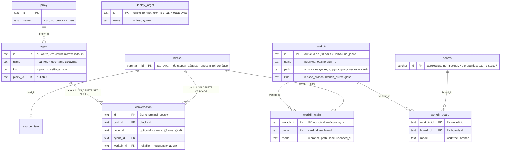

# Одна база

> План работ от 2026-08-16, переписан в тот же день после возражения «при чём
> тут форк». Разбор, из которого он вырос, — `docs/model-graph.md` (граф связей
> и девять противоречий); что где лежит сегодня — `docs/db-erd.md`.
>
> Это план, а не описание. По мере выполнения шаги вычёркиваются отсюда и
> переписываются как описание в `model-graph.md`; когда вычеркнут последний,
> файл удаляется.

## Кратко

Сегодня данные лежат в четырёх местах: база доски, `acp.db`, `sources.db` и
`config.json`. Ссылки идут во все стороны, половина по именам, и проверить их
нечем.

Целимся в **одну базу** и один файл настроек, который ни на что не ссылается и
на который ничто не ссылается.

Правило:

> **Ссылка — это внешний ключ.** Всё, на что можно сослаться, лежит в одной
> базе и имеет `id`. Файл настроек хранит только то, на что не ссылается никто.
> По имени не ищется ничего.

Четыре работы:

1. **Наши таблицы въезжают в базу приложения** — один файл, одна лестница
   миграций, одна транзакция.
2. **Реестры перестают быть JSON** — папки, агенты, прокси, деплой-цели
   становятся таблицами с `id`. Закрывает противоречия 2, 3, 8.
3. **`config.json` перестаёт называть колонки и пути** — свойство колонок
   записывает доска, по id. Закрывает 1, 6, 9.
4. **Включить внешние ключи** — включая ссылку на карточку.

## Почему одна, хотя в прошлой редакции было две

Прошлая редакция оставляла нашу базу отдельно от бордовой и объясняла это швом
`internal/boardadapter`: он единственный импортирует обе стороны, и это затем,
чтобы доску можно было заменить. Аргумент не выдержал двух проверок.

**Заменить доску нельзя, и никто не собирается.** Форк — это не только
`server/`: webapp тот же форк. «Заменить бордовый бэкенд» означает заменить
продукт. Это не требование, это фраза, оставшаяся от времени, когда доска была
чужим репозиторием рядом.

**Границы модулей Go — про импорты, а не про схему.** То, что
`internal/sources` не импортирует `internal/acp`, ничего не говорит о том, в
одном ли файле лежат их таблицы. Таблицы могут принадлежать модулям логически и
жить в одной базе; я это уже признал для `sources.db` и не довёл мысль до конца.

**И есть довод против разделения, который я не привёл, потому что не проверил.**
Удаление карточки в бордовой базе — настоящий `DELETE FROM blocks` (копия
уезжает в `blocks_history`), а не мягкий флаг. Наши таблицы об этом не узнают
никогда: `EventsBackend.BlockChanged` обрабатывает только `notify.Update`. То
есть **сегодня удалённая карточка навсегда оставляет за собой** строки в
`terminal_session`, `workdir_claim`, `card_stall`, `flow_state`, `stage_queue` и
`source_item`. Это не гипотетическая целостность — это текущая утечка, и
разделение на файлы её и создаёт. `blocks` имеет `PRIMARY KEY (id)` с миграции
000025, так что `ON DELETE CASCADE` возможен и сработает.

## Что это стоит

Честно, чтобы решение принималось с ценой на руках.

**Три диалекта.** Схема доски templated: одна миграция на шаг, внутри
`{{if .sqlite}}` / `{{if .mysql}}` / `{{if .postgres}}` — 81 файл. Наши DDL
становятся миграциями 000082+ в том же стиле. Это механическая работа на десяток
таблиц, не архитектурная. Решение держать три диалекта принято 2026-08-11
(`docs/sql-plan.md`) — и принималось оно, когда наши данные лежали отдельно;
если окажется дорого, пересматривать надо то решение, а не это.

**Запросы.** Наши простые — выборка и запись по ключу, время везде `INTEGER`
unix-мс, то есть переносимо. Единственное место, где диалекты разойдутся, —
`INSERT … ON CONFLICT` (SQLite и Postgres) против `ON DUPLICATE KEY UPDATE`
(MySQL); либо через squirrel, либо руками в трёх ветках.

**Лестница уходит.** `PRAGMA user_version` (сегодня проштамповано `1`,
`docs/db-schema-review.md`) не нужна: миграции ведёт golang-migrate.

**Префикс таблиц.** Бордовые таблицы называются с `{{.prefix}}` — наши тоже
должны, иначе установка «сервер как плагин Mattermost» получит наши таблицы без
префикса в чужой базе.

**Риск.** Наша неудачная миграция теперь может уронить базу, в которой лежат
доски. Это настоящая цена, и покрывается она тем же, чем покрывается лестница
доски: миграция проверяется тестом, и на неё есть `down`.

## Целевая схема

Остальные наши таблицы переезжают как есть: `agent_session`, `session_event`,
`flow_state`, `flow_event`, `card_stall`, `stage_queue`, `board_setup`,
`vcs_seen`, `idempotency`, `source_event`.

Что **не** переезжает в таблицы: колонки, маршруты и стадии. Они остаются в
`boards.properties` намеренно — едут вместе с доской, с её экспортом и с
шаблоном (`docs/templates.md`). Меняется только то, что внутри них лежит: вместо
имён агентов и целей — их id.

## Шаг 1. Наши таблицы въезжают в базу приложения

**Что меняется.** `internal/acp/store.go` и `internal/sources/store.go`
перестают открывать файлы (`OpenStore(path)`) и принимают готовый `*sql.DB` —
тот же, что держит бордовый стор. DDL из `migrate()` переезжает в
`server/services/store/sqlstore/migrations/` как шаги 000082+ в templated стиле,
с `{{.prefix}}` в именах. `main.go:212` и `main.go:273` перестают открывать по
файлу.

Независимость `internal/sources` от `internal/acp` — это независимость пакетов,
а не файлов: таблицы у каждого свои, импортов между ними по-прежнему нет.

**Миграция данных.** Оба старых файла читаются один раз при старте и построчно
переливаются в новые таблицы, после чего переименовываются в `*.migrated`.
Удаляет их человек.

**Что это сразу даёт**, ещё до внешних ключей: бэкап — один файл; составная
операция (карточка переехала, `flow_state` записан, стоп-запись снята) может
стать одной транзакцией — при условии, что уже сделан пункт 1 из
`docs/sql-plan.md`, потому что на SQLite транзакции в бордовом сторе сегодня не
работают.

**Чем проверяется.** Тест перелива со старых файлов прошлой версии. Прогон всего
серверного набора на новой лестнице миграций.

## Шаг 2. Реестры перестают быть JSON

**Что меняется.** `Workdirs`, `Agents`, `Proxies`, `Deploys` уходят из `Config`
(`internal/acp/config.go`) в таблицы. Читатели переключаются на стор:
`workdirs.go` (`Workdirs`, `WorkdirsForBoard`, `AddWorkdir`, `WorkdirAt`,
`resolveNamedWorkdir`, `cardWorkdir`), `agents.go`, `deploys.go`, `workmode.go`.
`persistConfigLocked` перестаёт быть способом сохранить запись реестра.

`workdir_claim` меняет ключ с пути на `workdir_id` — **закрывает
противоречие 3**: перенесённая папка не теряет claim'ы, а запись реестра
перестаёт быть обязана быть каталогом на диске. `WorkdirEntry.Modes` (карта по
board id) становится таблицей `workdir_board`.

**Составы колонок** начинают хранить id агентов вместо имён
(`ColumnSpec.Agents`, `FlowNode.AgentNames`, `DeployName` →
`deploy_target_id`). Это правка JSON доски: разовая переписка при открытии доски
тем же приёмом, что `narrowWorkdirProperty` и `retireAgentProperty`
(`centerPanel.tsx`), плюс редактор (`automationEditor.tsx`, `automation.ts`) и
`resolveSessionAgent`. Имя агента по-прежнему на экране и по-прежнему username
аккаунта; ссылкой быть перестаёт. **Закрывает 2 и 8.**

**Миграция.** При старте: если в `config.json` реестры непусты, а таблицы пусты
— перелить и оставить ключи в файле на одну версию, затем удалить.

**Чем проверяется.** Папка, у которой сменили путь, сохраняет claim.
Переименование агента не рвёт crew. Перелив на конфиге прошлой версии.

## Шаг 3. `config.json` перестаёт называть колонки и пути

**Колонки.** Доска записывает `xciiiColumnProperty` — id свойства, на котором
живут её колонки, рядом с `xciiiProjectProperty` и `xciiiBranchProperty`. Брать
его есть откуда: у каждой записи `xciiiColumns` уже есть `propertyId`, и шаблоны
его везут. `columnMatchesCard` (`terminal.go`), `triggerProperty` и
`FlowEntry.PropertyOr` (`flowengine.go`) сверяют id вместо имени. **Закрывает 1.**

`TriggerColumn`, `DeployColumn`, `TestColumn`, `TestPassColumn`,
`TestFailColumn` — не ссылки, а заготовки для создания доски, и жить им у того,
кто доски создаёт: у шаблонов, которые свои колонки и так называют.
`migratedColumns` (`columns.go`) становится разовым импортом и удаляется вместе
с ключами. `BoardPrompts` снимается — на доске это уже есть как `xciiiPrompt`.
**Закрывает 9.**

**Пути.** `ProjectWhitelist` уходит: он существовал, чтобы карточка не могла
назвать произвольный путь через `repo_path`, а вместе с реестром в базе уходит и
сам `repo_path` из `cardWorkdirPathProps` (`workdirs.go`). **Закрывает 6.**
Никаких путей к пользовательским данным в файле настроек не остаётся вовсе:
папки живут в таблице.

**Что в файле остаётся.** Только то, на что никто не ссылается: собственные
каталоги приложения (`worktreeDir`, `artifactsDir`), пределы и таймауты
(`maxConcurrent`, `testTimeoutMinutes`, `vcsPollSeconds`), переключатели
(`enabled`, `agentNamedBranches`, `worktreeMode` как умолчание), тексты
промптов по умолчанию. Файл остаётся тем, чем он полезен, — местом, которое
правят руками (CLAUDE.md: «часть настроек агентов в окно не вынесена»). Токены
(`githubToken`) стоит увести в `internal/secrets` тем же движением.

**Миграция.** Доска без `xciiiColumnProperty` получает его при первом открытии
из `xciiiColumns[0].propertyId`; доска без колонок не получает ничего и остаётся
доской без автоматики — что уже верно для большинства досок.

**Чем проверяется.** Доска, у которой свойство колонок названо не «Статус»,
работает. Переименование свойства ничего не ломает. `templates_test.go` — что
каждый шаблон везёт `xciiiColumnProperty`.

## Шаг 4. Включить внешние ключи

На SQLite `foreign_keys` — настройка **соединения**, так что она идёт в DSN
рядом с `_busy_timeout` и `_journal_mode` (`store.go:52`). Если к этому моменту
приехал `modernc.org/sqlite` (`docs/sql-plan.md`, пункт 3), параметр называется
иначе — проверить.

Правила удаления — вопрос продукта, а не техники:

- `conversation.card_id → blocks.id ON DELETE CASCADE`, и так же
  `card_stall`, `flow_state`, `stage_queue`, `source_item`. **Это чинит утечку,
  описанную выше**: удалённая карточка перестаёт оставлять за собой хвост;
- `workdir_claim` при удалении карточки — тоже `CASCADE`, но только для
  отпущенных; живой claim означает копию на диске, и её надо сначала свернуть,
  так что удаление карточки с живым claim'ом стоит **отказывать**;
- удаление папки, в которой карточка работает, **отказывает** (`RESTRICT`);
- удаление агента, на которого ссылается разговор, — `SET NULL`: разговор
  состоялся, и запись о нём переживает того, кто его вёл.

## Чего в плане нет

**Противоречий 4 и 5** (маршрут ключуется именем; у стадии два ключа на одну
колонку). Они целиком внутри JSON доски, хранилищ не касаются и делаются когда
угодно.

**Противоречия 7** (начатую работу нельзя продолжить на другой машине).
Идентификаторами оно не чинится: чтобы продолжить, на второй машине должна
оказаться та же папка. Разговор об этом имеет смысл начинать после шага 2, когда
«папка» перестанет означать «путь».

## Порядок

Шаг 1 первый и он один такой: остальные три от него зависят — реестрам нужна
база, внешним ключам нужны обе стороны в одном файле. Шаги 2 и 3 друг от друга
независимы и закрывают шесть противоречий из девяти. Шаг 4 последний, потому что
до него нечего связывать.
